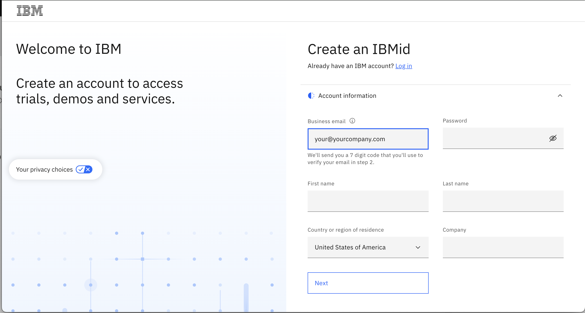

# Create your IBMid

**Note:**  Follow these brief instructions to create an IBMID. These are specifically for our Business Partners and clients who may not have accessed a TechZone environment previously. 

1. Start by accessing the [IBMid Registration Page](https://www.ibm.com/account/reg/signup?formid=urx-19776&)
2. Enter the required information in the fields provided.
(Email address, name, company, and country.)
[!IMPORTANT] 
Your email address becomes your IBMid, which you will use to access the class environment!

4. Select Next. You will receive an email containing a one-time verification code.
5. In the Verification field, enter the code that provided in the email.
6. Click Create account.
7. An email will be sent indicating that your IBMid account creation was successful, and that your account is activated.    
