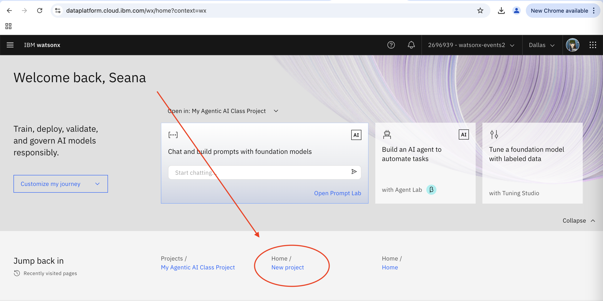
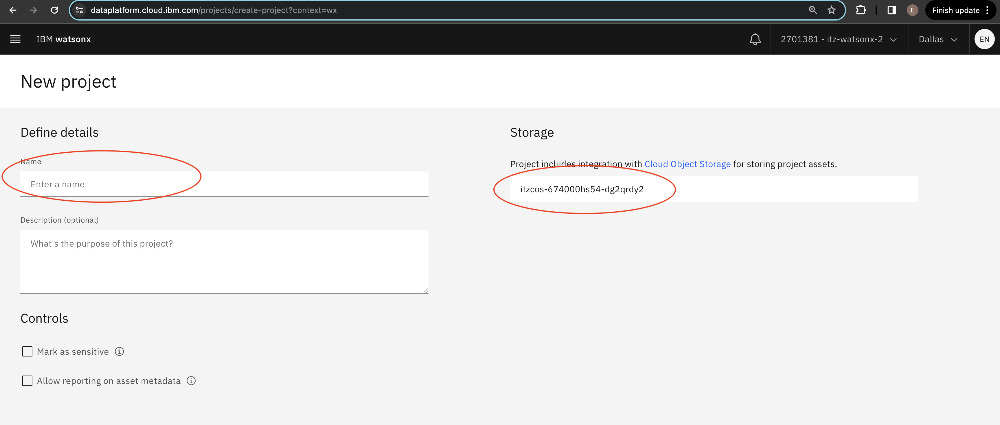
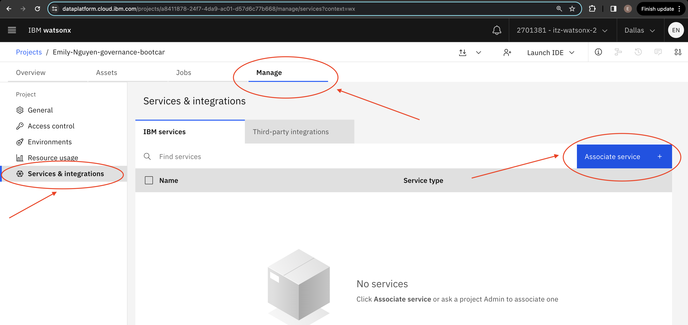

# Lab 0: Project Setup - New Project
---
## Summary
Before stating lab 1, we will be walking through how to create your own project to get familiar with watsonx.ai and ensure you have accessed your environment for the class. 

It is important we create a project in the right environment, or else it will cause issues down the line!

## Table of Contents

  1. [Log in to watsonx](#log-in-to-watsonx)
  2. [Check that you are in the right instance](#check-instance)
  3. [Create a new project](#new-project) 
  4. [Associate the correct runtime instance](#runtime-instance)

### 1. Log in to watsonx
---
Next, follow this link to log in to watsonx: https://dataplatform.cloud.ibm.com/wx/home?context=wx

Please accept the Terms & Conditions!

### 2. Check that you are in the right instance
---
You should now be taken to the watsonx home screen. Check at the top right that you are in the right instance. If it does not show the right name of the instance, you can select it in the dropdown. For the entirety of the bootcamp, you will be working in that same instance!

If you do not know yous instance, go to your techzone reservations list https://techzone.ibm.com/my/reservations. Look for your recently created reservation and click on "Open this environment". Scroll down and look for a reservation name that looks similar to this:  ITZ-WATSONX-21. 

**Note:** The instance at the top right tends to change to your default personal account every time you switch/go back to a new page. Thus, it's always good to check the top right corner every time you switch to a new page.

### 3. Create a new project
---
Now, we can go ahead and create a new project. In the **Projects** section at the bottom, click the "+" symbol next to it to create a new project.

Enter a **unique name** for your project, include both your first and last name and any other information you would like.

### Cloud Object Storage (COS)
It is likely there is also already a Cloud Object Storage instance selected for you, with a name that starts with "itzcos-..." If so, you don't have to do anything! 

Otherwise you may be prompted to select from multiple instances. Please consult with your bootcamp lead which COS instance to select.

### Click Create
Now go ahead and click Create. It may take a few seconds to officially be created.

### 4. Associate the correct runtime instance
---
With the project created, you should be directed to the project home page. Go ahead and select the "Manage" tab.

Click on "Services and Integrations" in the left side-bar. Then click on "Associate service."

Select the service listed with "Type" = "watsonx.ai Runtime" and click **Associate**. 

**Note:** If you can't find the service, remove all filters from the "Locations" dropdown. If you see 2+ Watson Machine Learning services, select the one where "Group" = the same *environment* name of the instance. The *environment* name can be found on https://techzone.ibm.com/my/reservations. 

Time to get to get started with Lab 1!
