# Setup for the Retail use case lab

This document contains the documentation for the setup of the environment to prepare for the step-by-step walkthrough of the [Retail use case](../usecases/retail/).

## Introduction

The use case takes you through the creation of tools and agents using the [IBM watsonx Orchestrate Agent Development Kit (ADK)](https://developer.watson-orchestrate.ibm.com/). This toolkit can be installed on a local machine and brings with it the core components of watsonx Orchestrate, as container images that are running in a container runtime like Docker or Rancher. It also installs a CLI that can be used to manage a locally running instance as well as remote instances running in the cloud.

## Environments

To run this lab end to end, you need a number of environments.

### watsonx.ai

For the lab, as well as for the install of the Developer's Edition of watsonx Orchestrate, you will need access to an IBM watsonx.ai Runtime instance, and specifically, a `deployment space ID` for that instance as well as an `API key` for the IBM Cloud account the instance is running in. 

Your instructor should have given you access to the instances of watsonx Orchestrate and watsonx.ai that you will use throughout the bootcamp. To access them, you start out by logging into your IBM Cloud account at https://cloud.ibm.com. You can find the resources that you have access to in that account when going to the so-called "hamburger menu" on the top left of the page and click on `Resource list`.

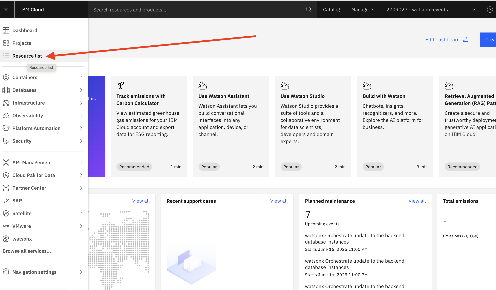

On the page with all your resources, you can find your watsonx.ai Runtime instance in the `AI / Machine Learning` section. The instance will have `watsonx Runtime in the Product column. Click on the name of the instance.

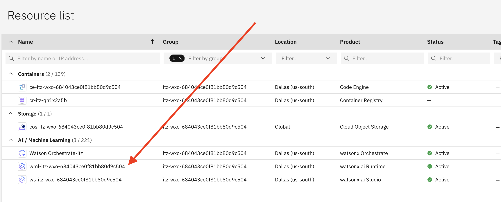

This will open the details page for the resource. Expand the `Launch in` drop down list and click on `IBM watsonx`.

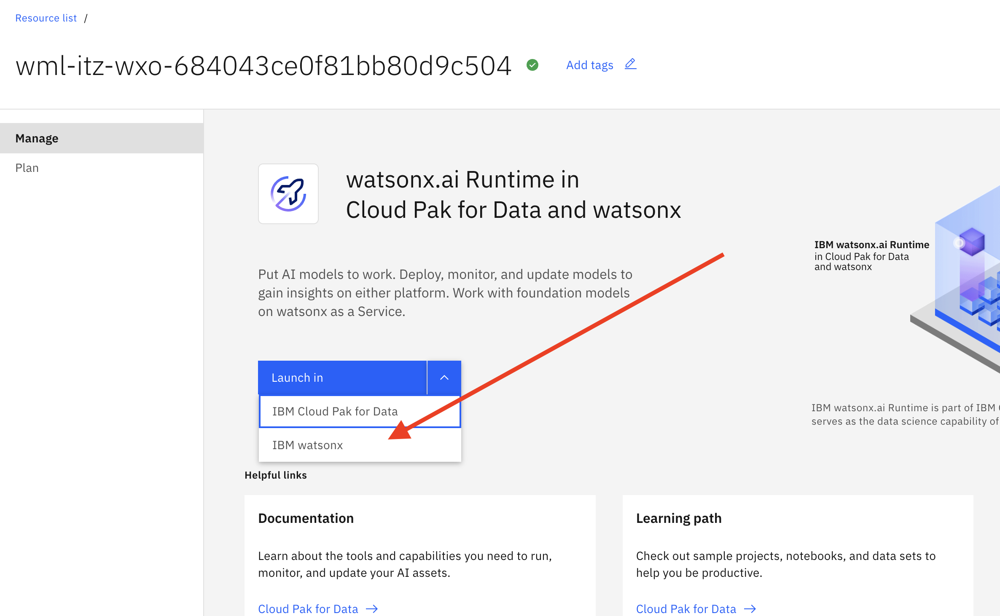

After opening the watsonx console, you can close both the Welcome and the Dive deeper popup windows. Now click the 'hamburger menu' on this page, again at the top left of the page, and select `View all deployment spaces`.

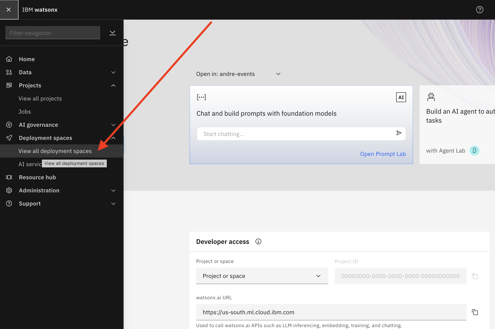

In the following view, depending on whether you already ran a different lab, you may or may not see any deployment spaces listed. However, here we will just create a new one. Click on the `New deployment space` button.

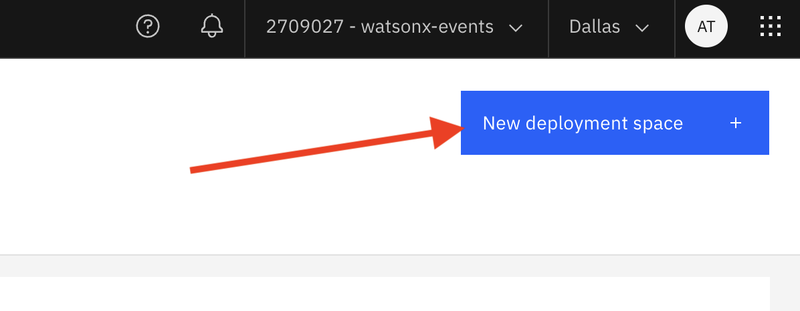

Give the new space a descriptive name. All other fields are optional. The `Storage` field should be already filled in. Click on `Create`.

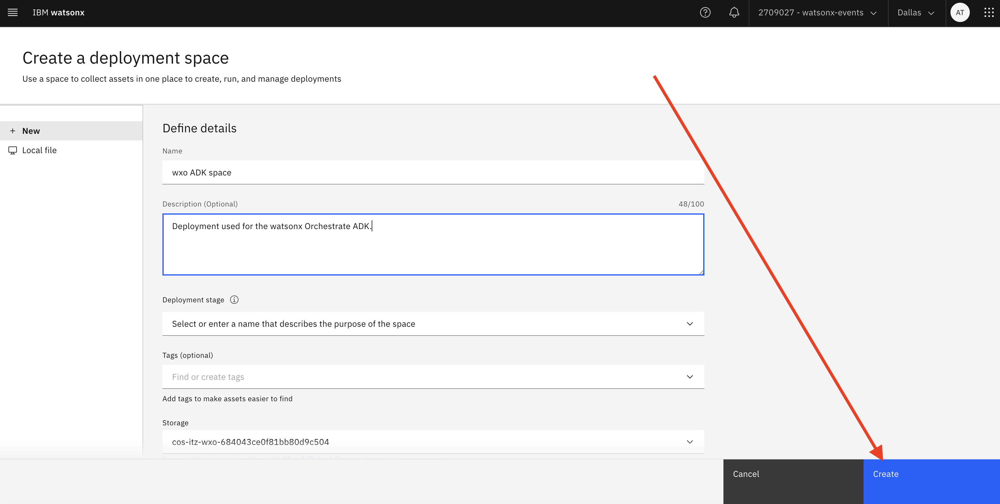

Once the space is ready, click on `View new space`. 

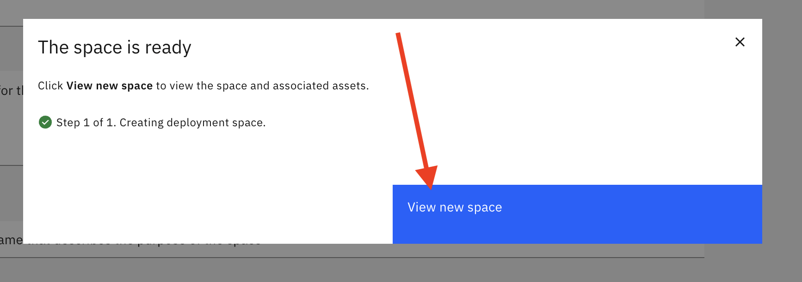

On the details page for the new space, select the `Manage` tab.

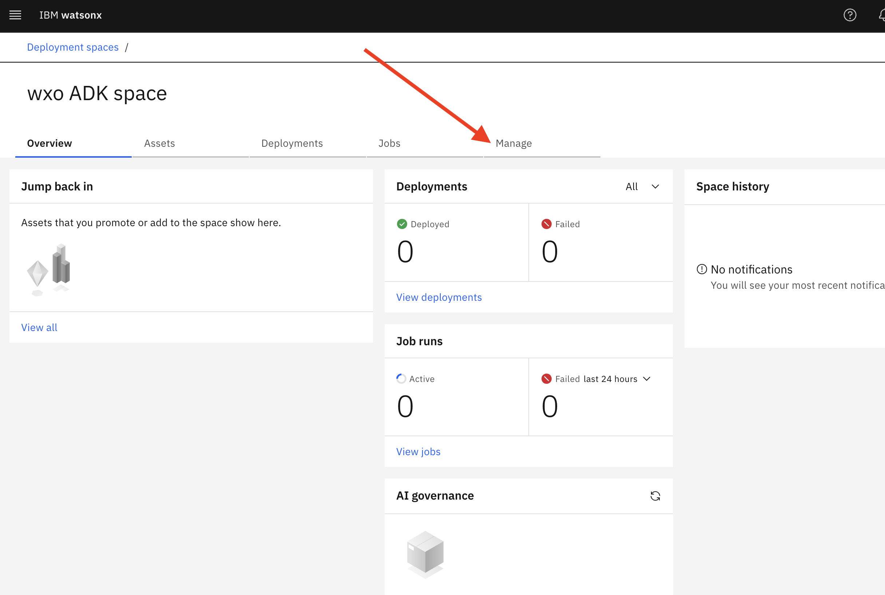

On the Manage page, make sure the space is associated with your watsonx.ai Runtime instance, and set it if it is not. (Hit Save if you need to set it).

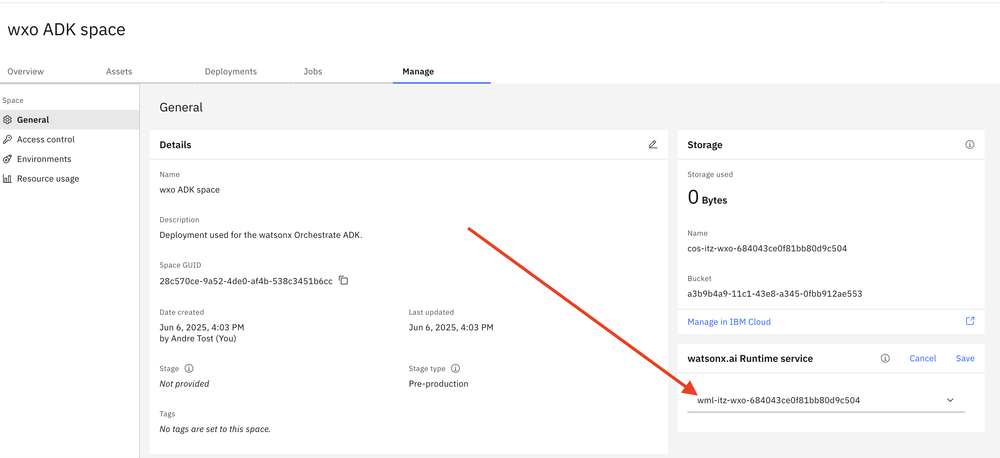

The last step here is that we need to capture the Space GUID. You can find the GUID also on the Manage tab. Simply click on the icon next to it to copy it to your clipboard.

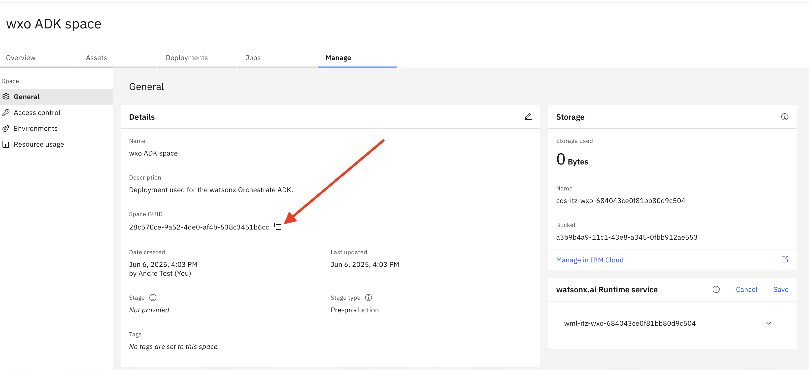

The Sapce GUID goes into a file called .env. You can create and edit this file with an editor of your choosing, or simply run the following command on the command line:
```
echo 'WATSONX_SPACE_ID=[paste the Space GUID from your clipboard here]' >> .env
```
#### API key

You also need an API key for the IBM Cloud account that your watsonx.ai instance is on. To obtain one, open the IBM Cloud console (https://cloud.ibm.com) as before and select `Access (IAM)` option from the `Manage` dropdown at the top of the page.

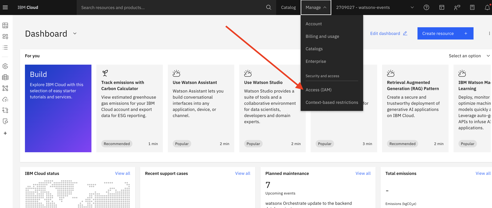

on the following page, select `API keys` from the menu on the left.

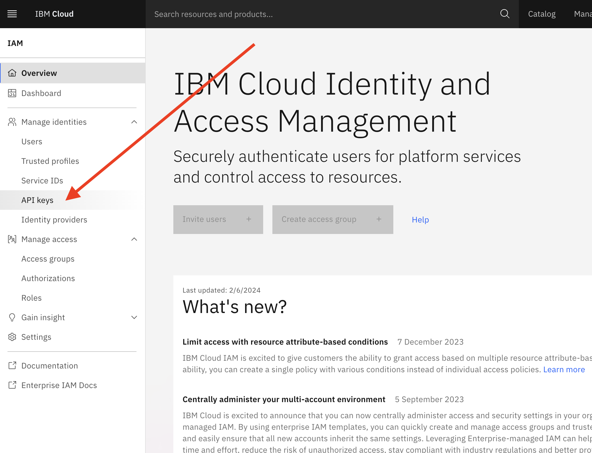

You may or may not already have an API key listed, and if so, feel free to use it (note that you cannot see the value of an existing API key after you initially created it). Or you can simply create a new one by clicking on the `Create` button.

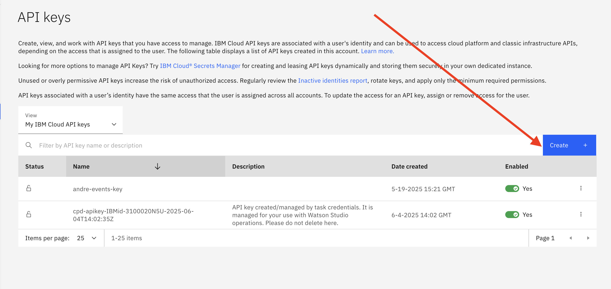

Give the new key a descriptive name, and click on `Create`.

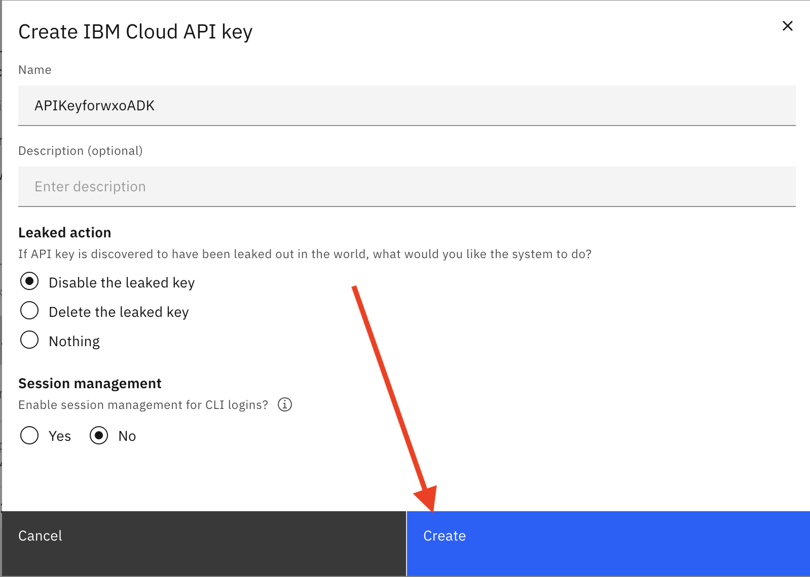

Once the key has been successfully created, make sure you copy its value to the clipboard by clicking on the `Copy` link. As mentioned above, you won't be able to retrieve this value later.

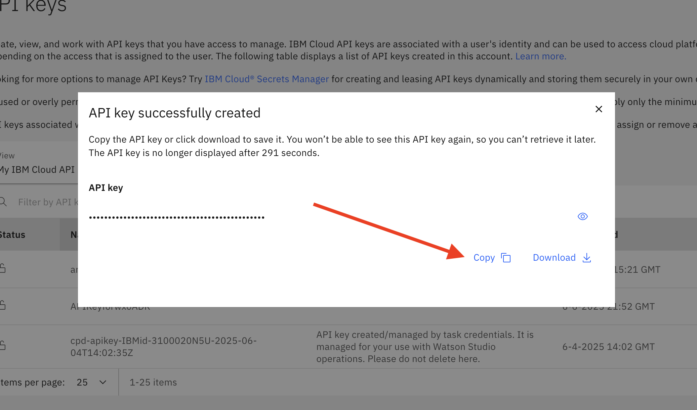

The API key also goes into the .env file, and you can add it via editor or command line:
```
echo 'WATSONX_APIKEY=[paste the API key from your clipboard here]' >> .env
```

### Entitlement key
Below, you will install the watsonx Orchestrate Developer Edition, which consists of a number of container images that are downloaded from the IBM registry during install. To authenticate with this registry you need an "entitlement key". Your instructor will provide this key for you.

You can add the key to your .env file via editor or by running the following on the command line:
```
echo 'WO_ENTITLEMENT_KEY=[add the entitlement key you received from your instructor here]' >> .env
```

### watsonx Orchestrate ADK

As mentioned above, the ADK allows hosting the core Orchestrate components on a developer laptop. For the lab, you can choose if you want to run the ADK on your own laptop or on a virtual machine that will be provided to you by your instructor. 

To run it on your own laptop, you need to install 
- [Docker](https://www.docker.com/products/docker-desktop/) or [Rancher](https://www.rancher.com/products/rancher-desktop)
  - the containers that run as part of the ADK will require ~12GB of memory, so you need to allocate at least that much to the virtual machine hosting the container runtime
- Python 3.11
- Visual Studio Code

Once you have these prerequistites available, you can install the ADK by following the instructions at [the ADK install page](https://developer.watson-orchestrate.ibm.com/getting_started/installing).

> **Note**: These instructions were created for a specific version of the ADK, namely version **1.4.2**. We recommend you specify that version when running the install: `pip install ibm-watsonx-orchestrate==1.4.2`.

You also need to install the watsonx Orchestrate Developer Edition, which is part of the ADK, by following the related [install instructions](https://developer.watson-orchestrate.ibm.com/getting_started/wxOde_setup). However, **DO NOT** set up the .env file as described in the instructions! You already have the right values in your .env file if you followed the instructions above.

After you created the .env file with the values gven to you, you can follow the instructions to start the server for the first time as documented [here](https://developer.watson-orchestrate.ibm.com/getting_started/wxOde_setup#installing-the-watsonx-orchestrate-developer-edition-with-adk). Note that the first time you run it, it will download all the required container images from the IBM amige reigstry, which will take some time.


### watsonx Orchestrate 

In this lab, you will create a number of components (tools, agents, etc) in your local environment and run and test them there, without the need to access an instance of watsonx Orchestrate in the cloud. However, the last part of the lab describes how you can take the same components and easily deploy and run them on a watsonx Orchestrate SaaS instance. You need such an instance for that part of the lab.

Your instructor will provision both the watsonx.ai and the watsonx Orchestrate instances for you and you can find the watsonx Orchestrate resource in the IBM Cloud resource list. This is only needed for the last part of the lab.

### Tavily

One of the tools you will create during the lab is a web search tool that takes advantage of a service called "Tavily". To use it, you need an API key that is passed with every search request.

Go to https://www.tavily.com/ and click on `Log in`.

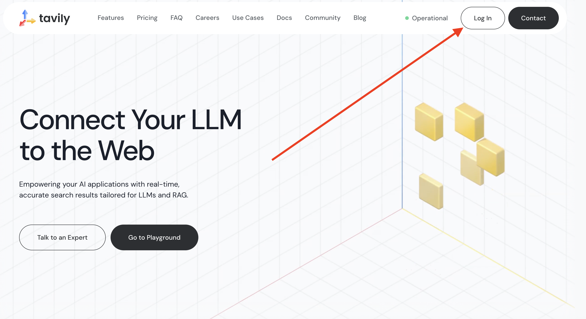

Now click on `Sign up`.

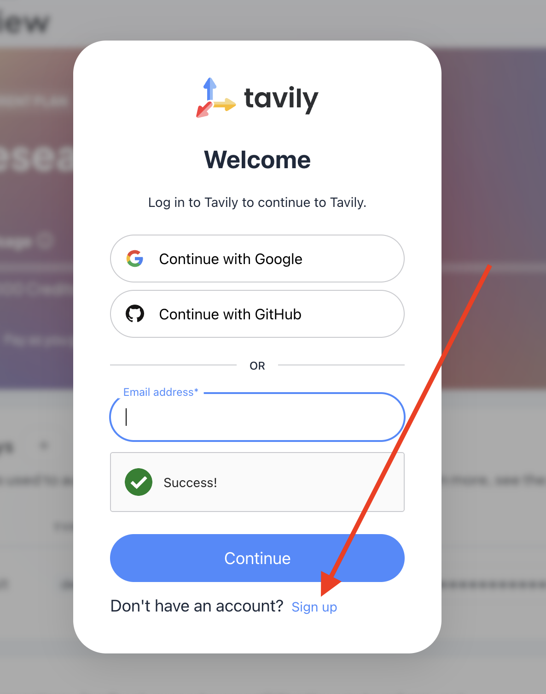

You can sign up with your Google ID, or Github ID or your email address. Once you have successfully completed the signup process and can log into the service, your page should look like this: 

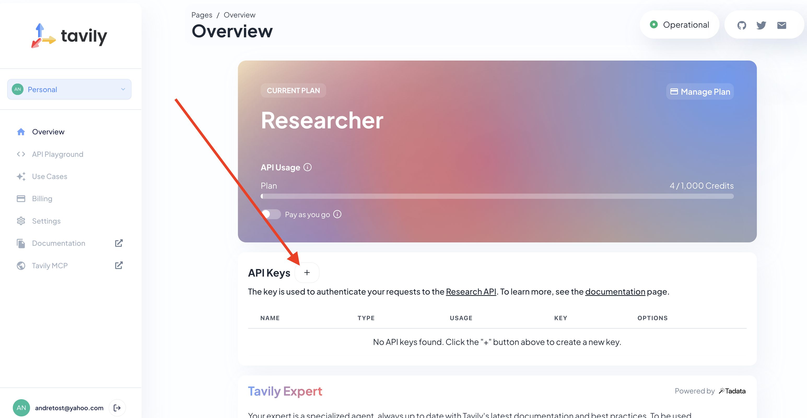

Click on the Plus sign as shown in the image above. Name your key "default". After it has been created, you can copy its value to the clipboard by clicking on the copy icon next to your key:

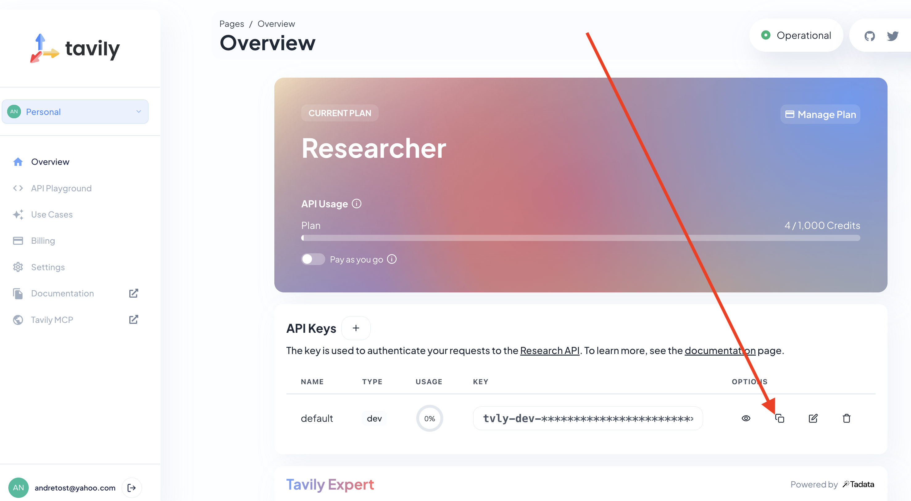

To complete the setup for this use case, we will add the Tavily API key to the .env file as before, either with an editor of your choice or via command line:
```
echo 'TAVILY_API_KEY=[copy the Tavily API key from your clipboard here]' >> .env
```

This is it! You are now ready to proceed to the [detailed lab instructions](../usecases/retail/retail.md).