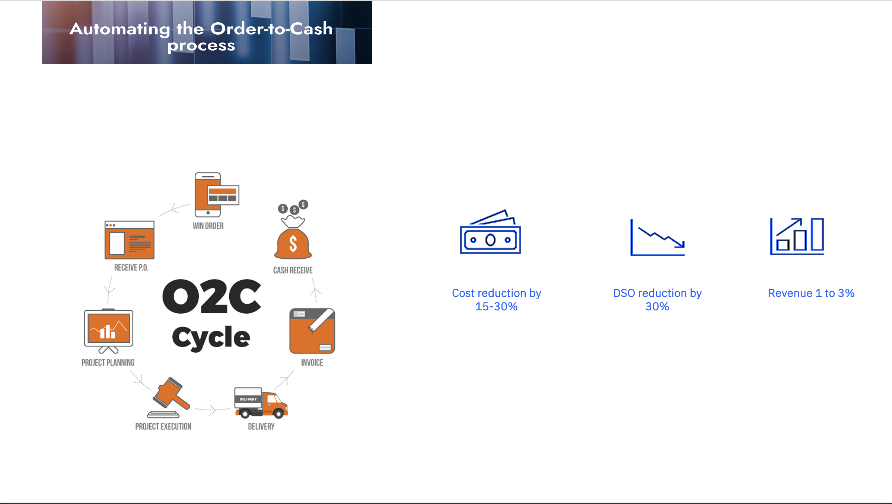

# 💼 Transforming Order-to-Cash Process

One of the critical processes in any enterprise is the Order-to-Cash (O2C) cycle, which spans order placement, invoicing, and payment collection. As businesses scale, managing this workflow manually becomes time-consuming and prone to delays. By simulating interactions with the O2C system and leveraging automation, organizations can streamline order processing, accelerate invoice generation, and ensure timely payment collection. With the rise of Agentic systems and intelligent reasoning models, automating the entire O2C flow not only boosts operational efficiency but also enhances customer satisfaction through faster, more reliable service delivery.

## 🎥 Demo

## 🔍 Problem Statement

The current manual Order-to-Cash (O2C) process is burdened with inefficiencies, excessive manual effort, and frequent errors. These challenges often result in invoice disputes, delayed payments, and past-due accounts—directly impacting cash flow, customer satisfaction, and overall business performance. Streamlining and automating this process is essential to drive operational excellence and protect the bottom line.

## 🎯 Use Case

This project focuses on transforming the Order-to-Cash (O2C) process one of the most critical components of business operations, by eliminating inefficiencies and reducing errors inherent in manual workflows. By streamlining order management, invoicing, and payment collection through intelligent automation, the initiative aims to enhance customer satisfaction, accelerate cash flow, and deliver measurable impact to the bottom line.

## 📊 Business Value to Client

Transforming the Order-to-Cash process through automation and AI-driven systems can drive significant business value across multiple dimensions. Organizations have seen tangible outcomes such as a 15–30% reduction in operational costs, a 30% decrease in Days Sales Outstanding (DSO), and a 1–3% increase in revenue. Beyond these measurable gains, adopting intelligent and agentic systems ensures more accurate transactions, reduces manual intervention, and enhances overall customer experience, ultimately strengthening both financial performance and brand reputation.

## ✅ Outcomes

The transformation of the Order-to-Cash process delivered substantial business impact across operational, financial, and customer experience dimensions:
- Achieved a 90% reduction in manual effort, significantly freeing up teams to focus on higher-value tasks.
- Reduced cycle times by 70%, enabling faster order processing and quicker time-to-cash.
- Improved customer satisfaction scores by over 10%, driven by greater accuracy, transparency, and responsiveness.
- Unlocked multimillion-dollar working capital through accelerated cash conversion cycles, directly improving liquidity and financial agility.

## 🏛️ Architecture

## 📄 Hands-on step-by-step lab

Please find the step-by-step instructions on how you can implement this use case, we have following two workflows.

- [Order Management](./practitioner_docs/order_management.md)
- [Customer Support](./practitioner_docs/customer_support.md)

