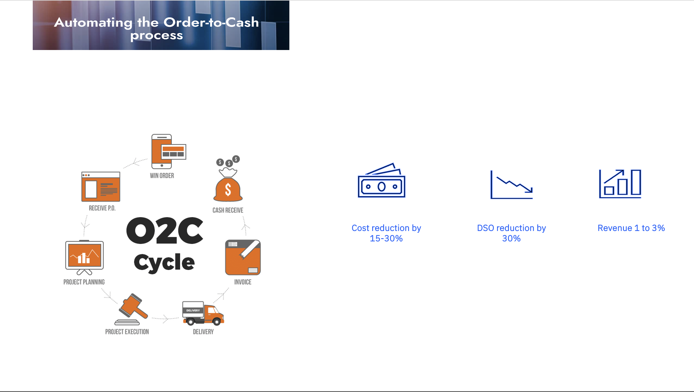
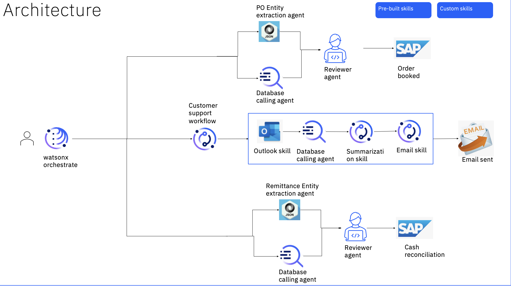

# 💼 Transforming Order-to-Cash Process

Enhancing efficiency and customer satisfaction through automation.

## 🔍 Problem Statement

The current manual order-to-cash process is plagued by inefficiencies, high manual effort, and errors, leading to disputes, past dues, and negatively impacting customer satisfaction and the bottom line.

## 🎯 Use Case

The project involves transforming the order-to-cash process, a critical aspect of a company's operations, to improve customer satisfaction and the bottom line by addressing the inefficiencies and errors inherent in the current manual process.

## 💡 Solution Proposed

- Automated O2C process using watsonx.orchestrate
- Leveraged crewai for enhanced intelligence
- Utilized Code Engine and Watson Code Assistant

## 📊 Business Value to Client

- Reduced costs by 15-30%
- Decreased Days Sales Outstanding (DSO) by 30%
- Increased revenue by 1 to 3%

## ✅ Outcomes

- Achieved 90% reduction in manual effort
- Reduced cycle times by 70%
- Improved customer satisfaction scores by 10%+
- Unlocked multimillion-dollar working capital through faster cash conversion cycles

## 🏛️ Architecture

## 🛠️ Products Used

watsonx.orchestrate, crewai, Code Engine, Watson Code Assistant, Elasticsearch

## 📄 Hands-on step-by-step lab

Please find the step-by-step instructions on how you can implement this use case, we have following three workflows.

- [Order Management](./order_management.md)
[Cash Application](./cash_application.md)
- [Customer Support](./customer_support.md)

© 2025 IBM Corporation