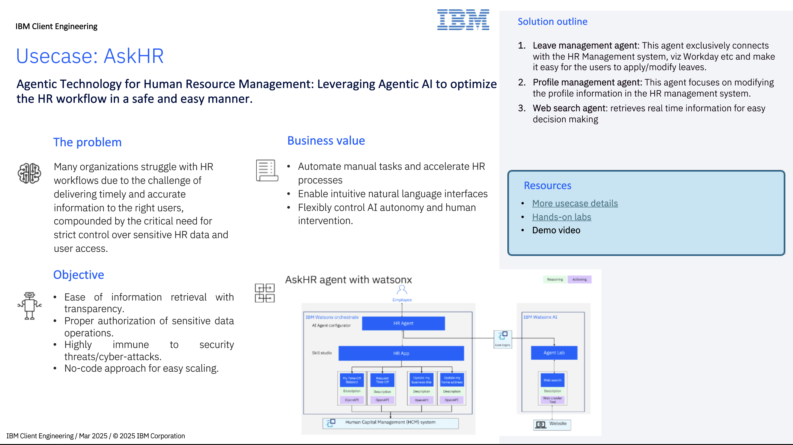

# AskHR

## Introduction

TechCorp Inc., a global IT leader with a workforce of 100,000 employees, faced a significant challenge in managing its growing HR operations. As the company expanded, it struggled with efficiently handling employee profile data, time-off and workforce management. Traditional HR systems were no longer sufficient to keep up with the scale and complexity. 
With this use-case, we are planning to tackle such a challenge by adopting an enterprise-grade platform, watsonx, equipped with Agentic capabilities.
In this lab, we will see how the out-of-the-box prebuilt skills  in watsonx.orchestrate can connect to HR management tools viz Workday, Successfactors etc or create custom skills to connect to any such systems easily. With watsonx.ai's agent driven insights let's see how TechCorp was able to fast-track information retrieval, reduce administrative overhead, and ensure a more efficient and effective management of its vast workforce.

## Artifacts

Architecture diagram : [here](assets/AskHR_architecture.md)

Download One pager: [here](https://ibm.box.com/s/tevk3cwye9z65gouz0ep0riwu0oe3sex)

Step-by-step hands-on guide : [here](assets/hands-on-lab-askhr.md)
