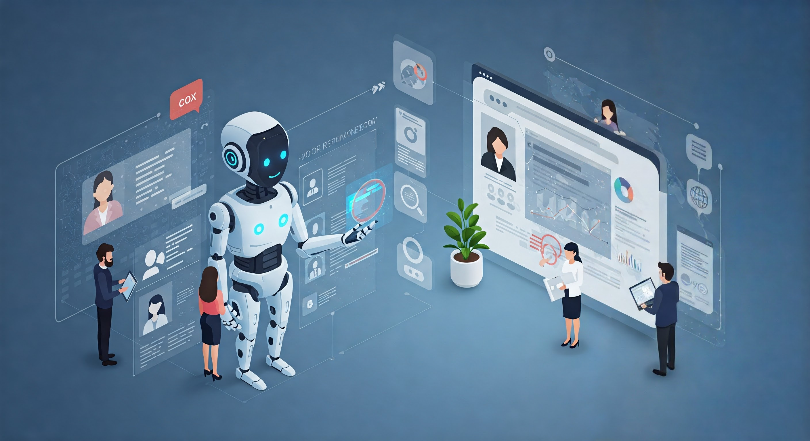

# AskHR

## Introduction

TechCorp Inc., a global IT leader with a workforce of 100,000 employees, faced a significant challenge in managing its growing HR operations. As the company expanded, it struggled with efficiently handling employee data, recruitment, performance evaluations, and workforce management across multiple regions. Traditional HR systems were no longer sufficient to keep up with the scale and complexity. 
With this use-case, we are planning to tackle such a challenge by adopting an enterprise-grade platform, WatsonX, equipped with Agentic capabilities.
This powerful solution streamlined HR processes by automating routine tasks, providing real-time analytics, and offering personalized employee experiences. With WatsonX's AI-driven insights let's see how TechCorp was able to optimize its HR operations, reduce administrative overhead, and ensure a more efficient and effective management of its vast workforce, ultimately fostering a more agile and engaged company culture.

## Artifacts

The artifacts for the use-case:

Business story : [here](assets/AskHR_business_story.md)

Business challenge : [here](assets/AskHR_business_challenge.md)

Architecture diagram : [here](assets/AskHR_architecture.md)

Methodology : [here](assets/AskHR_methodology.md)

One pager: [here](https://ibm.box.com/s/ef5i26l13te9vxi57mi26k95jrxhxhqz)

Step-by-step hands-on guide : [here](assets/hands-on-lab-askhr.md)
