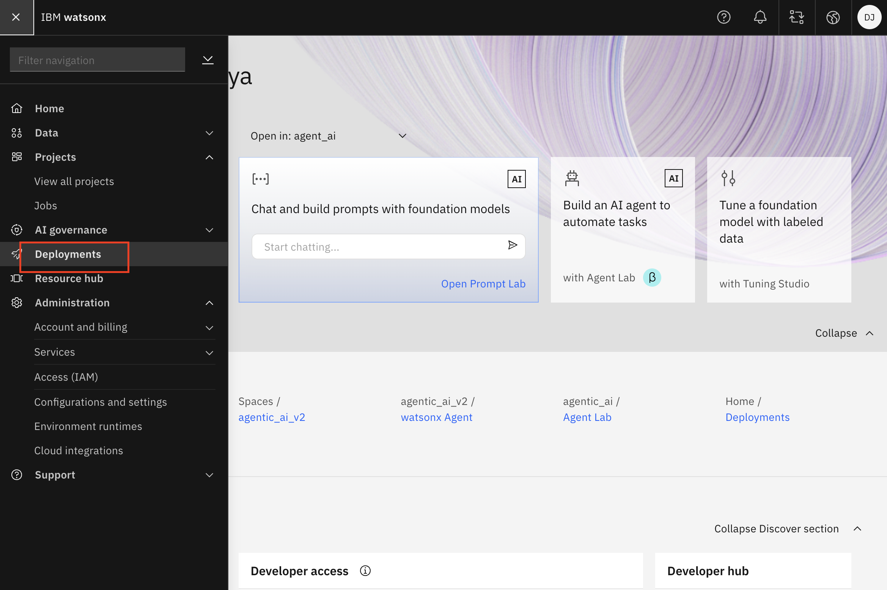
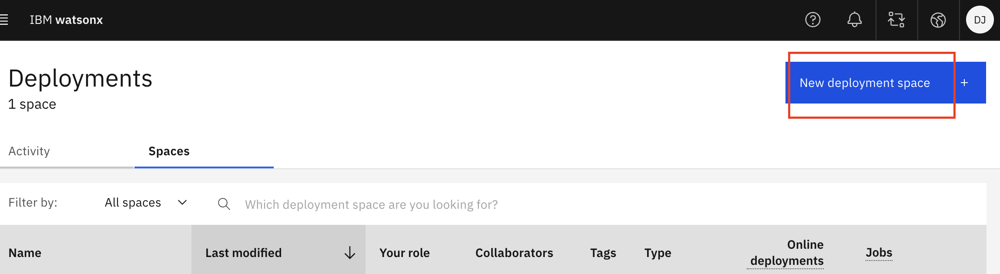
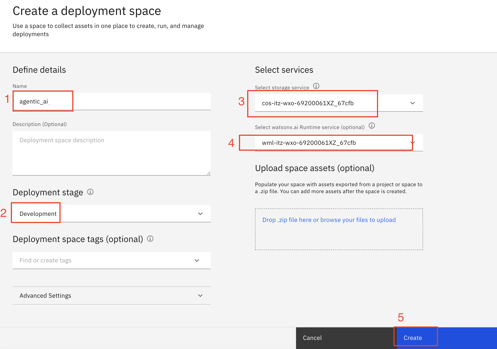
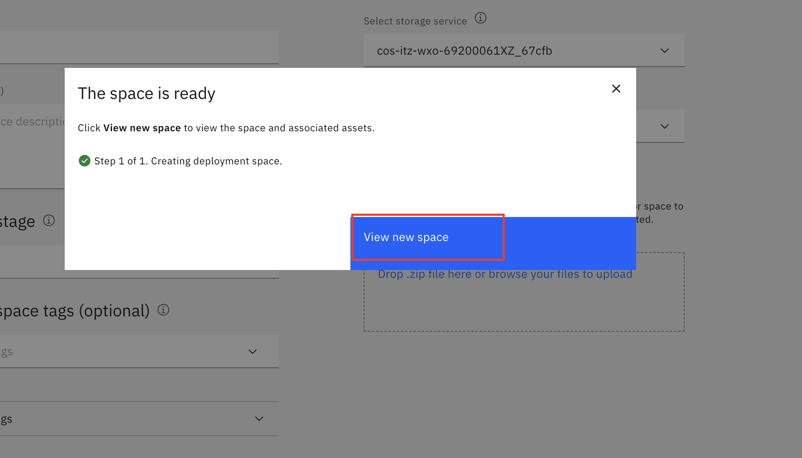

# Deployment Space Creation Guide

1. From IBM watsonx homepage, click on Menu, then click on "Deployments".

2. Click on "New deployment space +"

3. Define details like Name, Deployment stage (from dropdown), storage service (from dropdown) and watsonx.ai Runtime (from dropdown).
   Then, click the Create button.

4. Wait for the space to be ready. Once it's ready, you can see it by clicking on "View new space".

