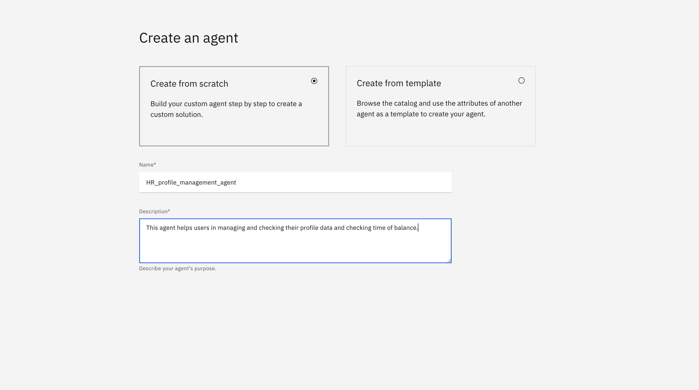

1. When you launch "watsonx orchestrate", you'll be directed to this page. Click on hamburger menu of top left.

2. Click on down arrow against "Build".
   Then click on "Agent Builder".

3. Click on "Create agent +".

4. Select "Create from scratch", Give your agent name "RAG_agent", fill the description "This agent handles queries around employee benefits" as shown in image. Then click on "Create".

5. Scroll the next screen to Knowledge section. Click on "Upload files +".

6. Drag or upload the "Employee Benefits.pdf" here and click on "Upload".
  

7. Scroll more to "Behavior" section, write the instructions as shown in below image, test your agent in chat window in right, finally click on "Deploy"
  

8. Go back to "Manage agents".

9. Click on "Create agent +".

10. Select "Create from scratch", give this agent a name "HR_profile_management_agent" and put the Description as shown in image.

