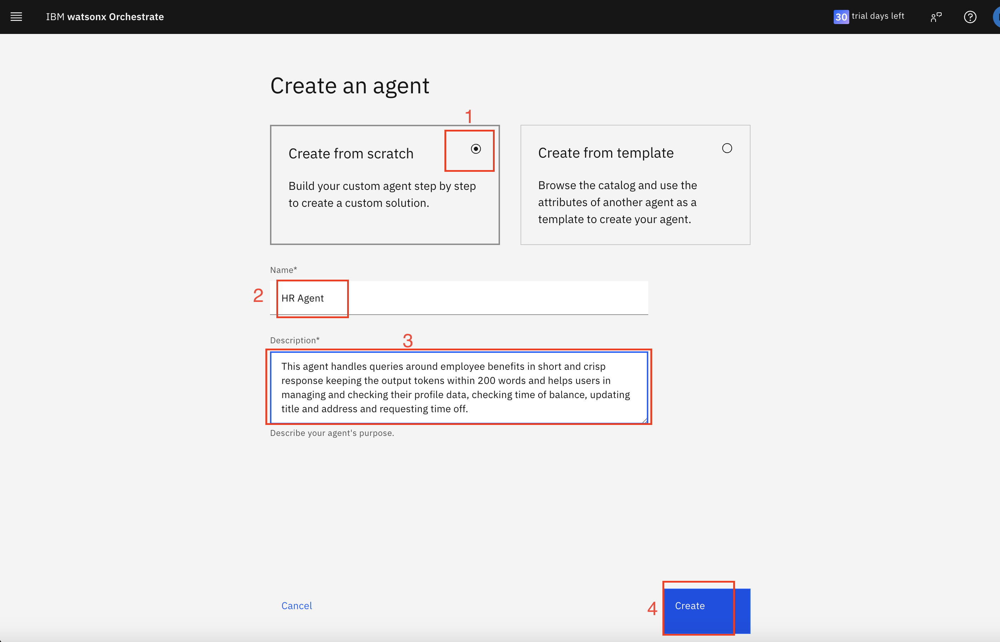
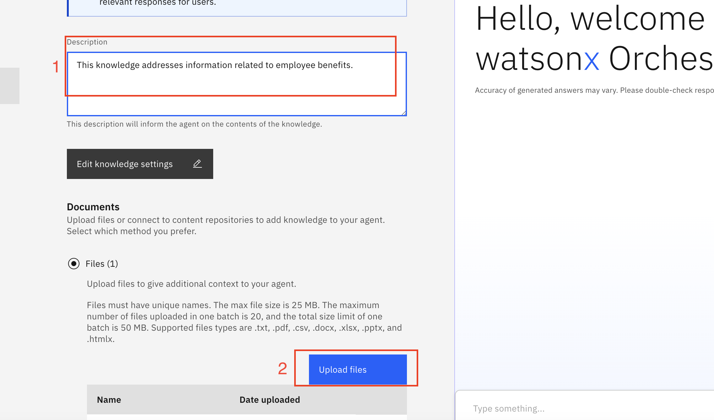
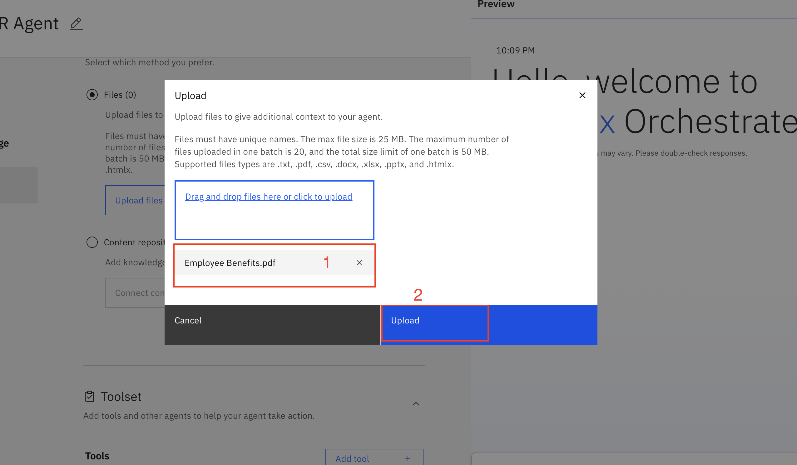
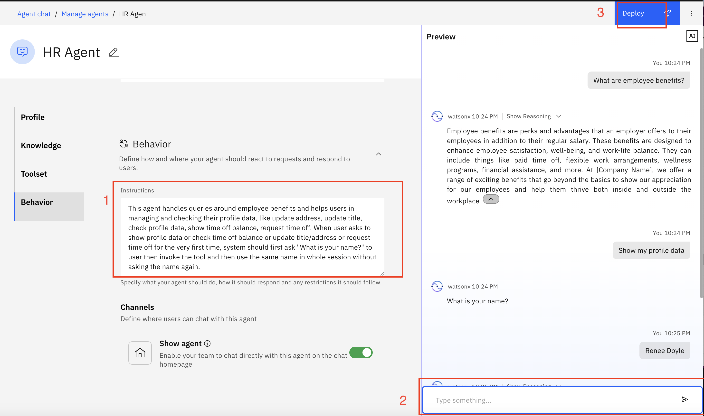
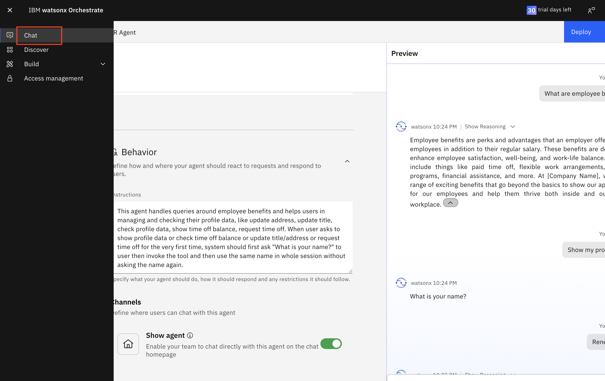

# 🧑‍💼 AskHR: Automate HR tasks with Agentic AI

## Table of Contents

- [Use case description](#use-case-description)
- [Architecture](#architecture)
- [Pre-requisites](#pre-requisites)
- [Step by step instructions to build agents](#step-by-step-instructions-to-build-agents)
  - [Deploying HR agent](#deploying-hr-agent)

    
## Use Case Description

This use case targets developing and deploying an AskHR agent leveraging IBM watsonx Orchestrate, as depicted in the provided architecture diagram. This agent will empower employees to interact with HR systems and access information efficiently through conversational AI. 

In this lab we will build an HR agent in watsonx Orchestrate, leveraging tools and external knowledge to connect to a simulated Human Capital Management System. This agent retrieves relevant information from documents to answer user queries and  allows users to view and manage their profiles.

## Architecture

## Pre-requisites

- Check with your instructor to make sure **all systems** are up and running before you continue.
- Validate that you have access to the right techzone environment for this lab.
- Validate that you have access to a credentials file that you instructor will share with you before starting the labs.
- If you're an instructor running this lab, check the **Instructor's guides** to set up all environments and systems.

## Step by step instructions to build agents: 
1. When you launch "watsonx orchestrate", you'll be directed to this page. Click on hamburger menu of top left.

2. Click on down arrow against "Build".
   Then click on "Agent Builder".

3. Click on "Create agent +".

#### Implementing and deploying HR Agent:
4. Select "Create from scratch", Give your agent name "HR agent", fill the description "This agent handles queries around employee benefits in short and crisp response keeping the output within 200 words and helps users in managing and checking their profile data, checking time of balance, updating title and address and requesting time off." as shown in image. Then click on "Create".

5. Scroll the next screen to Knowledge section. Write the description in knowledge description section "This knowledge addresses  a curated list of modern and employee-centric workplace benefits aimed at boosting job satisfaction, well-being, and work-life balance. From unlimited paid time off and flexible work arrangements to wellness stipends, student loan assistance, and pet-friendly offices, it highlights 20+ innovative perks designed to attract and retain top talent while fostering a supportive and engaging work culture.". Click on "Upload files +".

6. Drag or upload the "Employee Benefits.pdf" ([Employee Benefits.pdf](/usecases/ask-hr/assets/Employee-Benefits.pdf)) here and click on "Upload".
  

7. Scroll down to "Toolset" section. Click on "Add tool +".

8. Select "Import".

9. Drag or upload openapi-agentic.json file here and click on Next.
    

10. Select all the operations and click on Done.

11. Scroll down to Behavior section. Put below instructions in Instructiond field:

 "This agent handles queries around employee benefits and helps users in managing and checking their profile data, like update address, update title, check profile data, show time off balance, request time off. When user asks to show profile data or check time off balance or update title/address or request time off for the very first time, system should first ask "what is your name?", then invoke the tool and then use the same name in whole session without asking the name again. "

Test your agent in chat interface in the preview on the right side and click on "Deploy".

12. Click on hamburger menu in the top left corner and then click on "Chat".
   

13. Make sure "HR agent" is selected in chat interface. You can test your agent now.

