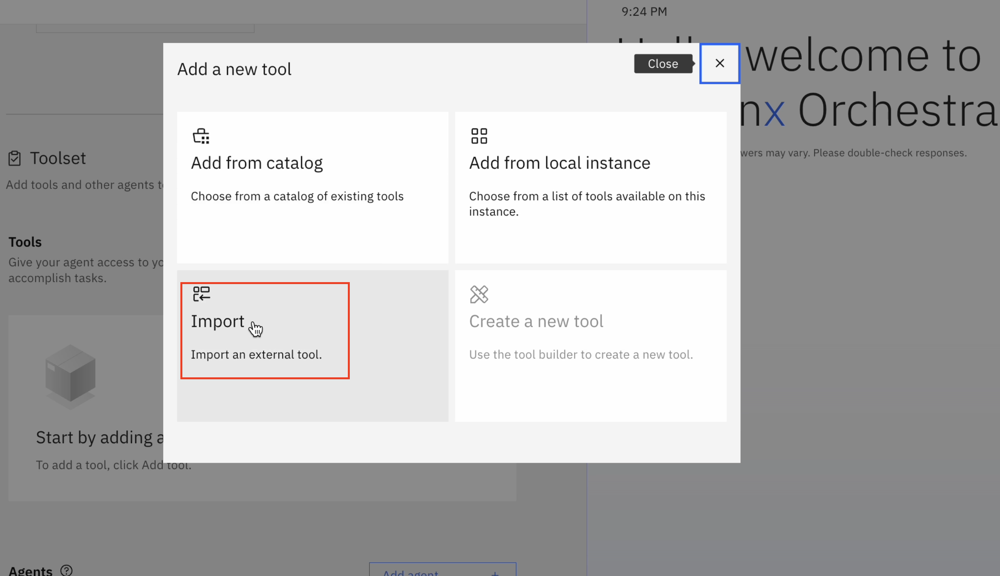
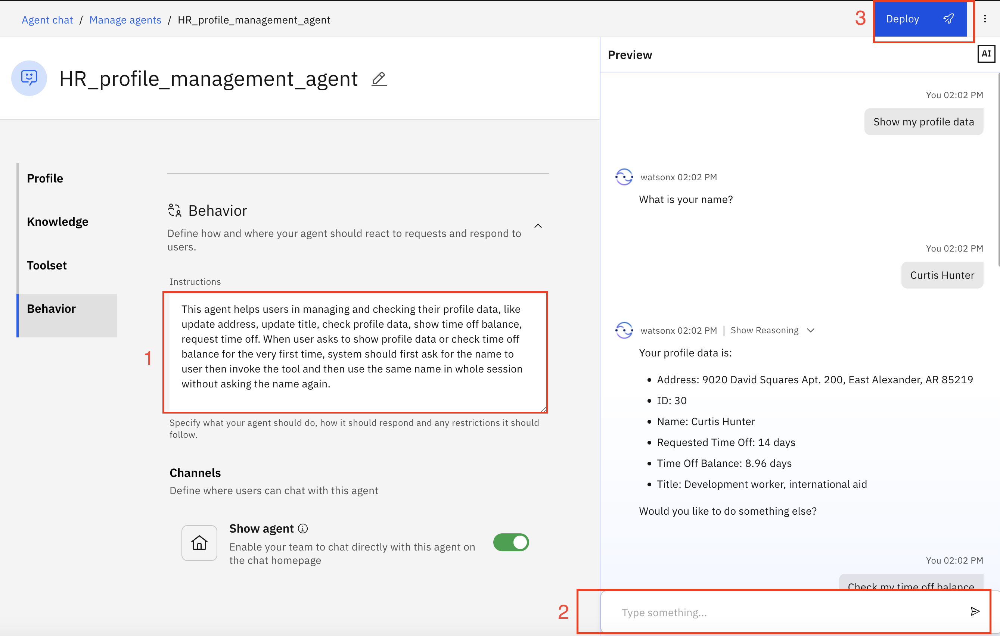
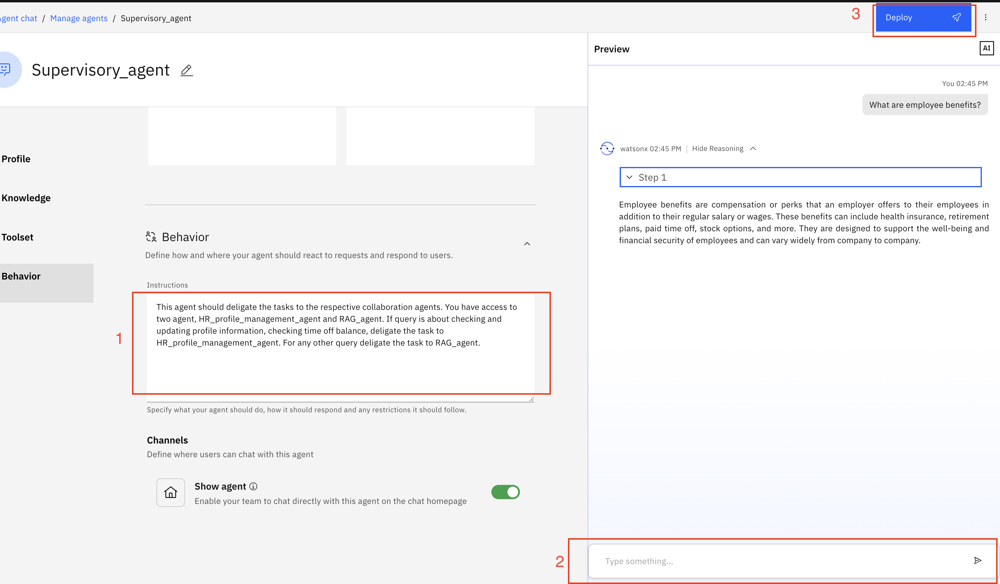

# 🧑‍💼 AskHR: Automate HR tasks with Agentic AI

### Pre-requisites

- Check with your instructor to make sure **all systems** are up and running before you continue.
- Validate that you have access to the right techzone environment for this lab.
- Validate that you have access to a credentials file that you instructor will share with you before starting the labs.
- If you're an instructor running this lab, check the **Instructor's guides** to set up all environments and systems.

In this lab, you'll create three different agents. One is RAG agent, which extracts information from a document to resolve user queries, second agent is HR profile management agent, which lets user check profile, third agent is Supervisory agent, which delagate tasks to these two agents, RAG agent and HR profile management agent based on the query.

### Step by step instructions to build agents: 
1. When you launch "watsonx orchestrate", you'll be directed to this page. Click on hamburger menu of top left.

2. Click on down arrow against "Build".
   Then click on "Agent Builder".

3. Click on "Create agent +".

#### Deploying RAG agent:
4. Select "Create from scratch", Give your agent name "RAG_agent", fill the description "This agent handles queries around employee benefits" as shown in image. Then click on "Create".

5. Scroll the next screen to Knowledge section. Click on "Upload files +".

6. Drag or upload the "Employee Benefits.pdf" ([Employee Benefits.pdf](/usecases/ask-hr/assets/Employee-Benefits.pdf)) here and click on "Upload".
  

7. Scroll more to "Behavior" section, write the instructions as shown in below image, test your agent in chat window in right, finally click on "Deploy"
  

8. Go back to "Manage agents".

#### Deploying HR profile management agent:
9. Click on "Create agent +".

10. Select "Create from scratch", give this agent a name "HR_profile_management_agent" and put the Description as shown in image.

11. Click on "Add tool +".

12. Select "Import".

13. Drag or upload openapi-agentic.json file here and click on Next.
    

14. Select all the operations and click on Done.

15. Scroll down to "Behavior" section, Put below in Instructions field: 

"This agent helps users in managing and checking their profile data, like update
address, update title, check profile data, show time off balance, request time off. When user asks to show profile data or check time off balance, system should first ask for the name to user then invoke the tool."

 Test your agent in chat window in right and click on deploy.

16. Again go back to "Manage agents", Click on "Create agent +".

#### Deploying Supervisory agent:
17. Select "Create from scratch", give this agent a name "Supervisory_agent" and put the Description :
"This agent should deligate the tasks to the respective collaboration agents. You have access to two agent, HR_profile_management_agent and RAG_agent. If query is about checking and updating profile information, checking time off balance, deligate the task to HR_profile_management_agent. For any other query deligate the task to RAG_agent."

Click on "Create".

18. Scroll down to "Toolset" section and click on "Add agent +".

19. Select "Add from local instance".

20. Select "HR_profile_management_agent" and "RAG_agent", click on "Add to agent".

21. Add the following Instructions in Behavior section:
"This agent should deligate the tasks to the respective collaboration agents. You have access to two agent, HR_profile_management_agent and RAG_agent. If query is about checking and updating profile information, checking time off balance, deligate the task to HR_profile_management_agent. For any other query deligate the task to RAG_agent."

Test your agent in chat window in right, finally click on deploy.

22. Go back to "Manage agents". You should see all your agents listed here. Click on hamburger menu.

23. Click on "Chat".

24. Select "Supervisory_agent" in Agents.

 25. Test your agent now.

.

