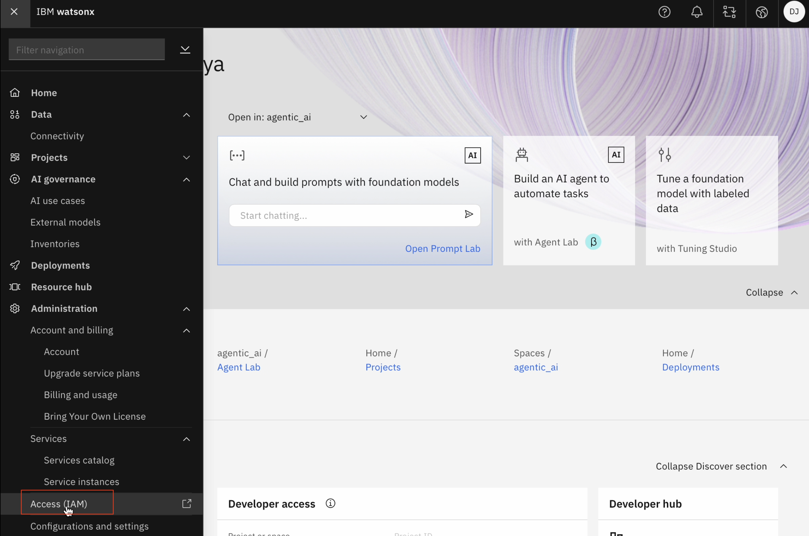
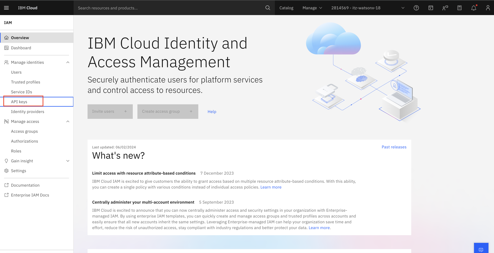
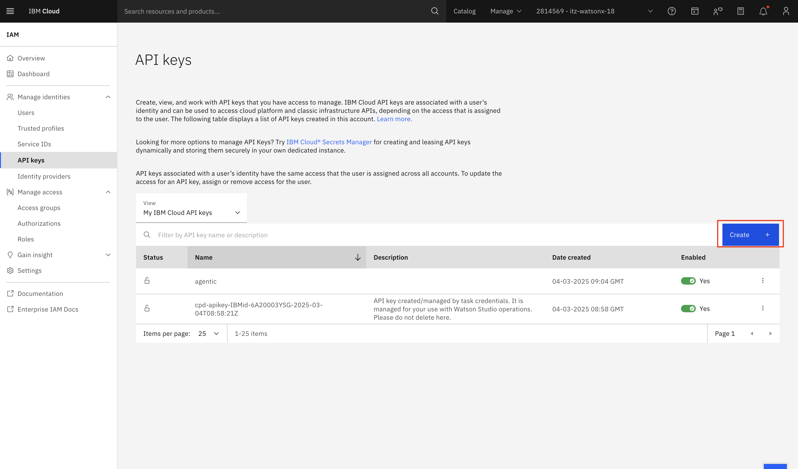
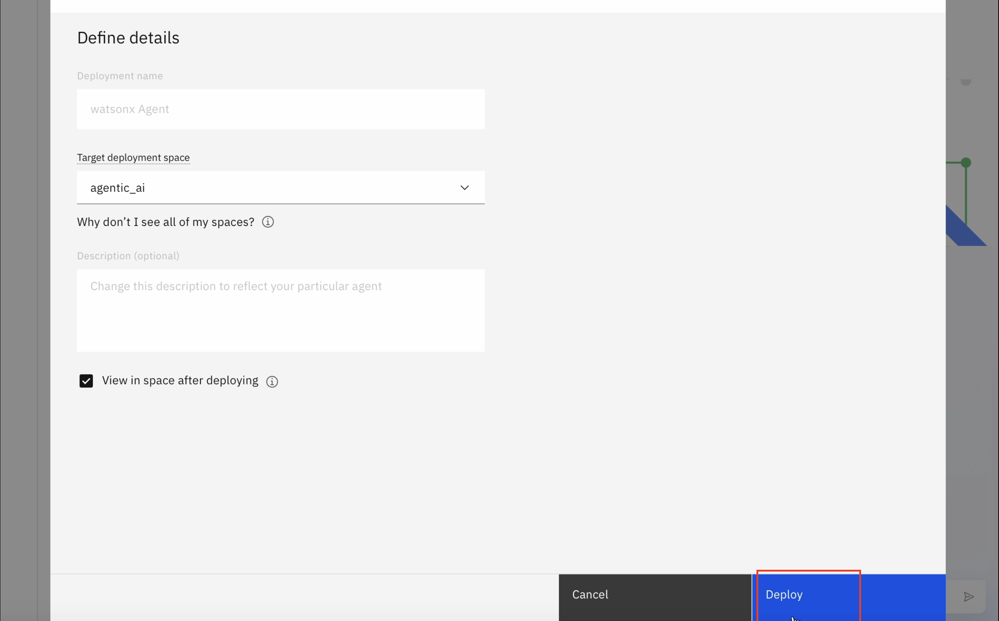
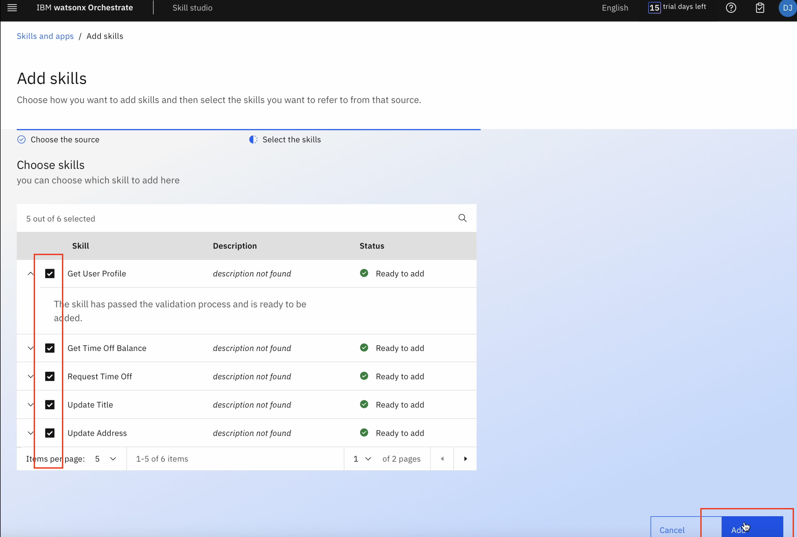
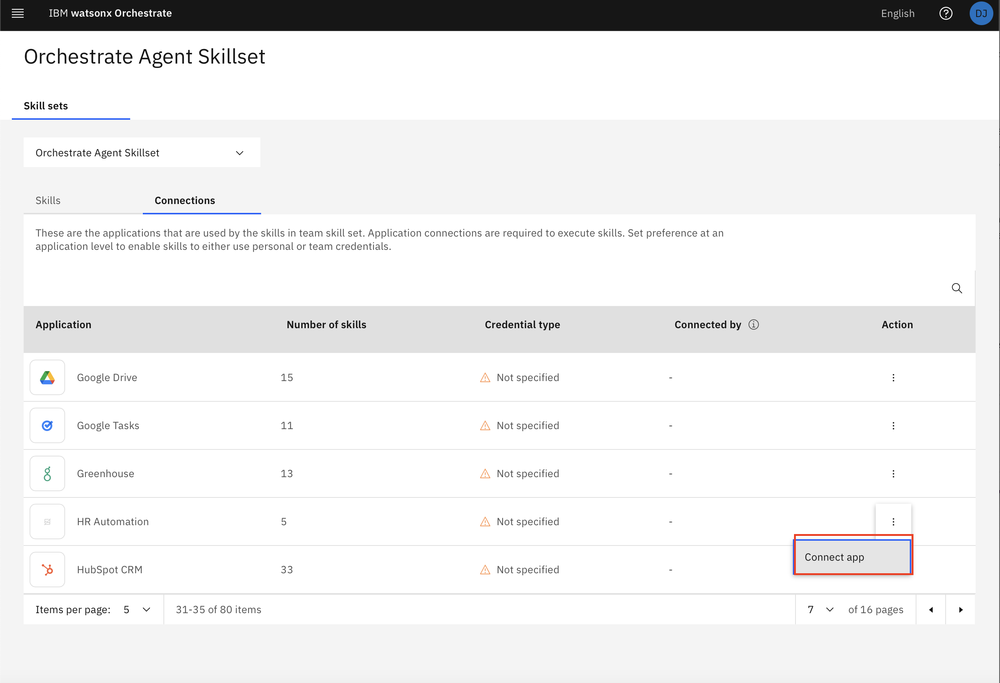
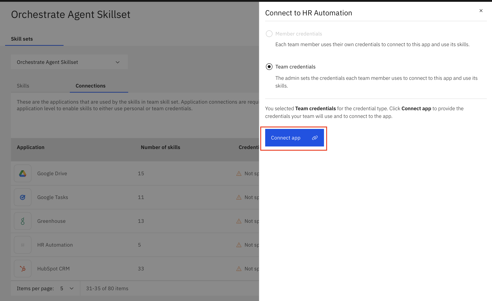
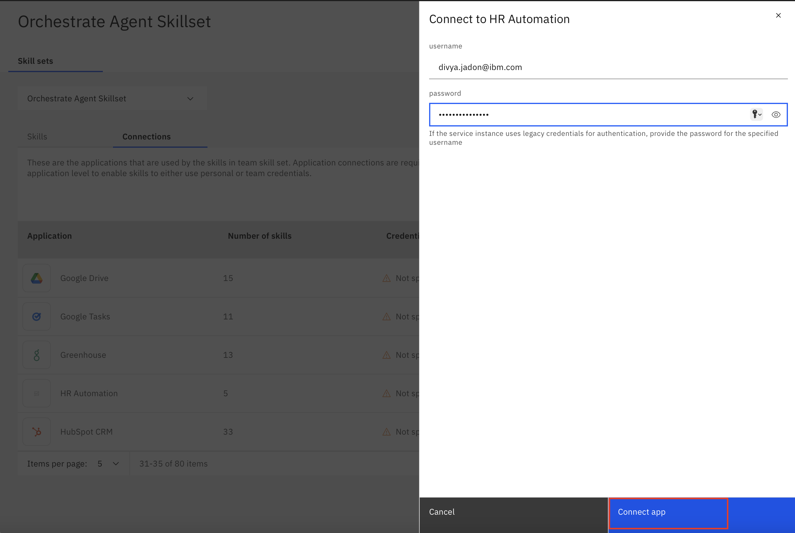
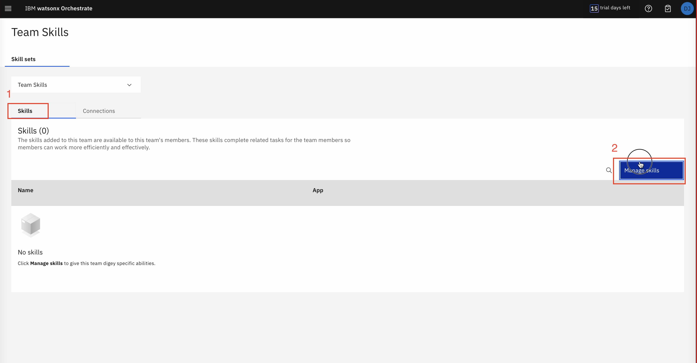

# AskHR - Agent setup hands on lab

1.	Login into your Watsonx account. This is Homepage of Watsonx AI.

2.  Click on “+” icon to create a project.
  

3. Enter the name of your project, select storage from available storages and finally click on create. A new project will be created.

4.	Click on hamburger icon on top left and select “Access (IAM)”.

5.	In next screen, select “API Keys” from menu.

6.	Click on “Create”.

7.	Give your API key a name, then click on “Create”.

8.	Copy the API key that is shown after clicking on “create”. Paste it somewhere, it’ll be used in later steps.

9.	Switch back to the homepage. Open Agent Lab.

10.	In “Instructions” field, paste this prompt “You are a helpful Human Resources Assistant that uses tools to answer questions in detail. Please use website https://www.cipd.org/en/knowledge/factsheets/hr-policies-factsheet/ to give answers to user questions. When greeted, say “Hi, I am HR agent, How can I help you?”

11.	From “Added tools” section remove already added tools.

12.	Then click on “Add a tool”.

13.	Enable “Webcrawler” tool and close this tools window.

14. Close this window.
 

15.	Click on “Deploy”.

16. Enter Deployment name and select “Deployment Space”. If there are no deployment space you need to create one. Then click on “Deploy”.

17.	Wait for the status to change to “Deployed” from “Initializing”.

18.	Click on the name of the deployment you just deployed.

19.	Copy and paste deployment id as shown in below image. You will need it in later step.

20.	From menu, select “Deployments”.

21.	Select “Spaces” and open the space where you deployed the agent.

22.	Under “manage” section, you’ll find “Space GUID”. Copy and paste it somewhere.

23.	Open the url https://multi-agent-external.1slrp41syyn5.us-south.codeengine.appdomain.cloud.
Paste “Deployment ID” and “Space ID” that you copied in previous steps. 
Click on “Generate Token”.

24.	A token will be generated. Copy and paste it somewhere.

25.	Go to “Watsonx Orchestrate” homepage. 

26.	Click on hamburger menu on top left and select “AI agent configuration” from menu.

27.	Click on “Agents“

28.	Clcik on “Add Agent +”.

29.	Give a name to your agent. Enter the description “This HR agent is an AI-powered assistant designed to handle common HR queries efficiently. It can, provide policy information and answer frequently asked questions.”

30.	Under “Authentication type”, select “Bearer Token”, enter the generated token you copied, In “Service Instance URL” section , enter code-engine-url/chat/completions.

Click on “Connect”

31.	Now you can see your agent in this page.

32.	From menu, select “chat”.

33.	You can enter you HR queries here and see the responses.

34.	From the menu select "Skill Studio".

35.	Click on "Create".

36.	Select "Import API" from the dropdown.

37.	Select "From a file".

38.	Drag or Select the open specs file and click on "next".

39.	Select all checkboxes and click on "Add".

40.	Once the skills are imported, click in three dots against imported "Update address" skill.

41.	Select "Enhance this skill".

42.	Click on "Publish".

43.	Repeat last 3 steps for other imported skills as well.

44.	Once the skills are published, from menu go to "Skill sets".

45.	From the dropdown, select "Orchestrate Agent Skills".

46.	Click on "Connections". Your imported skills should be grouped in one app automatically. By clicking on arrow, search for that app. Click on three dots against that app and then click on "Connect app".

47.	Select "Team credentials" and click on "Connect app".

48.	Enter your credentials and click on "Connect app".

49.	Once thats done, click on skills and then click on "Manage skills".

50.	Click on app in which your skills are grouped.

51.	Check if "Get Time Off Balance", "Get User Profile", "Request Time Off", "Update address" and "Update Title" skills are added. If not already added, click on "Add skill + " for all skills you want to add. 
Then click on "Connect App" on top right, if not already connected.

52.	From menu, click on "AI agent configuration".

53.	Select "Apps and skills" and click on the app your skills are grouped into.

54.	Click on "Add to chat +" for Get Time off Balance.

55.	Enter the description of this skill, "To get time off balance data" Then click on "Add skill".

56.	Similarly add all the imported skills with following descriptions as follows. Get User Profile : to get complete profile data of user. Request Time Off : to request time off, apply for leaves Update Address : To update user address Update Title : To update user Title

57.	Now click on your profile icon in top right and select "settings"

58.	Click on "chat", then "Switch to legacy chat", then click on "Change to legacy chat" as shown in below image.

59.	From menu, select "Skill sets"

60.	Select "Team Skills" in dropdown, then click on "connections".

61.	Search for the app your skills are grouped into and connet it by clicking on 3 dots.

62.	Click on "skills" and then "Manage skills".

63.	Search for the app, where skills are imported, click on it.

  Then click on "add skills +" for all the skills you imported and then connect app using "Connect App" button in top right.

64.	Then click on profile icon, then settings , then click on chat and switch to AI chat again.

65.	From menu click on "chat".

66.	Use your imported skills in chat.

End of Document
