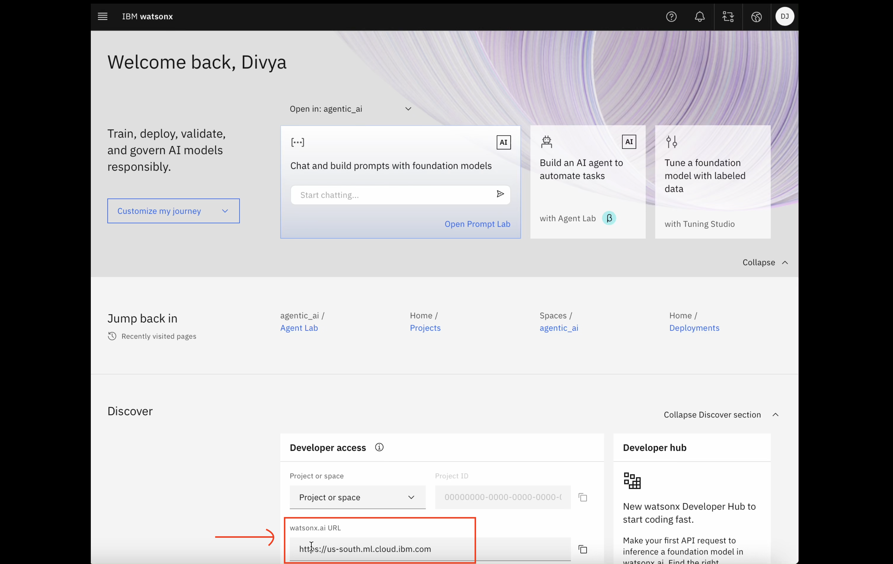
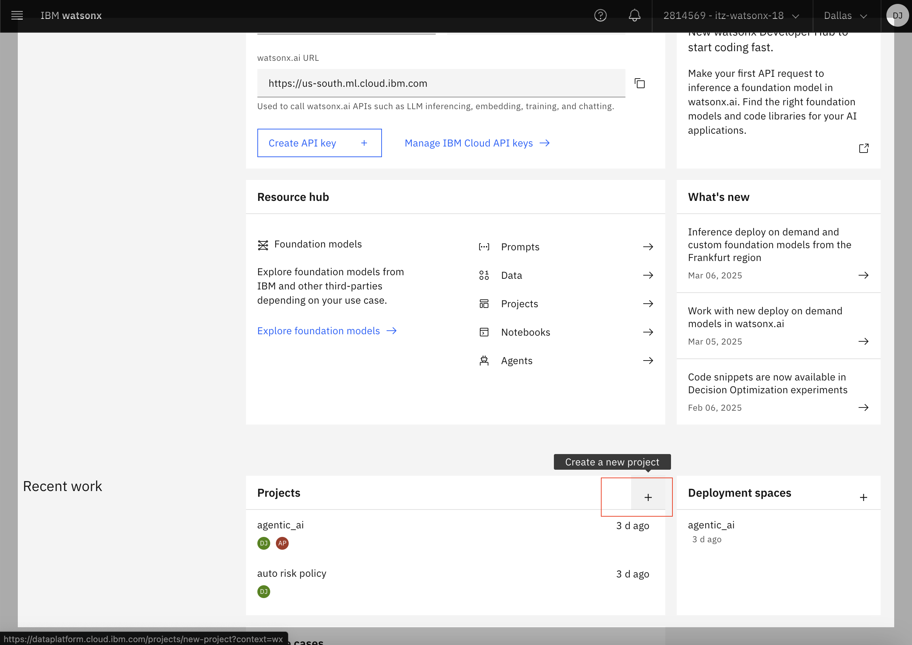
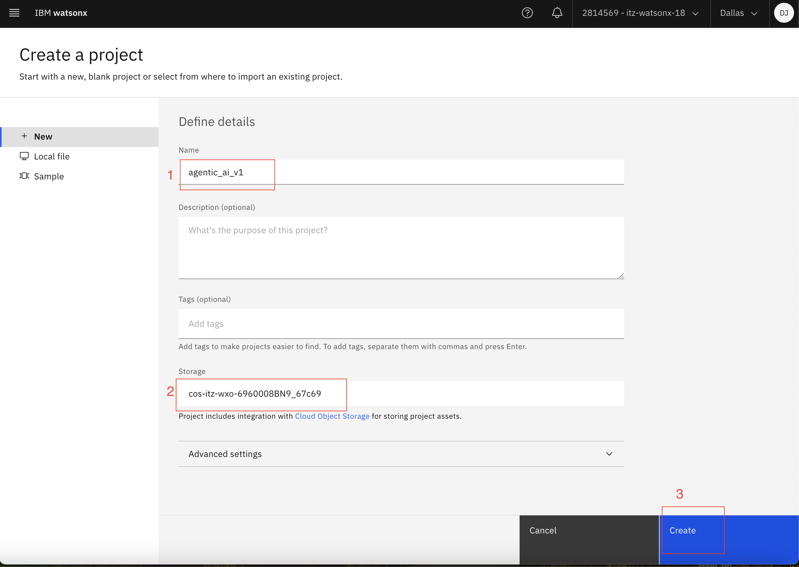
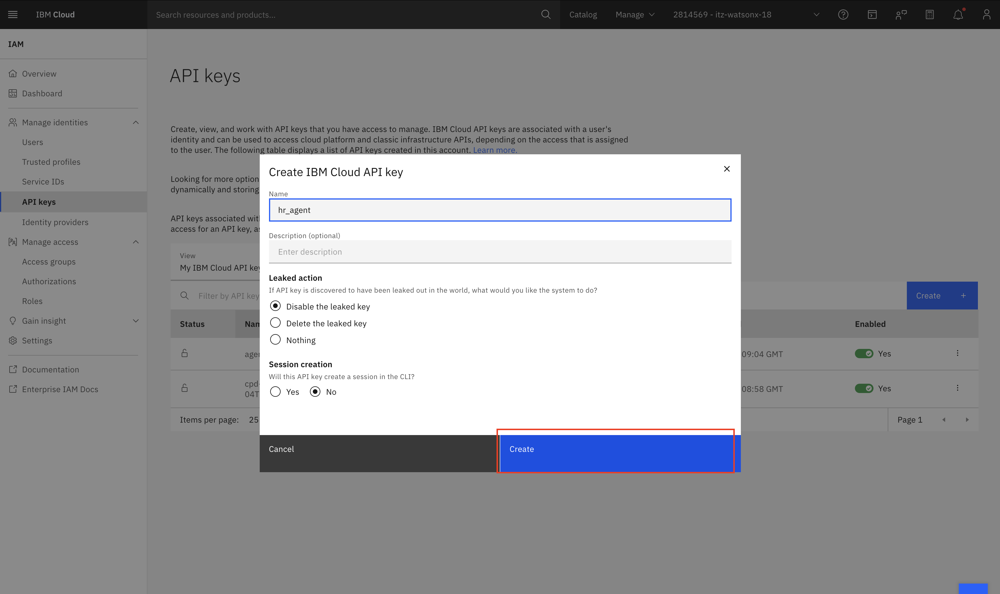
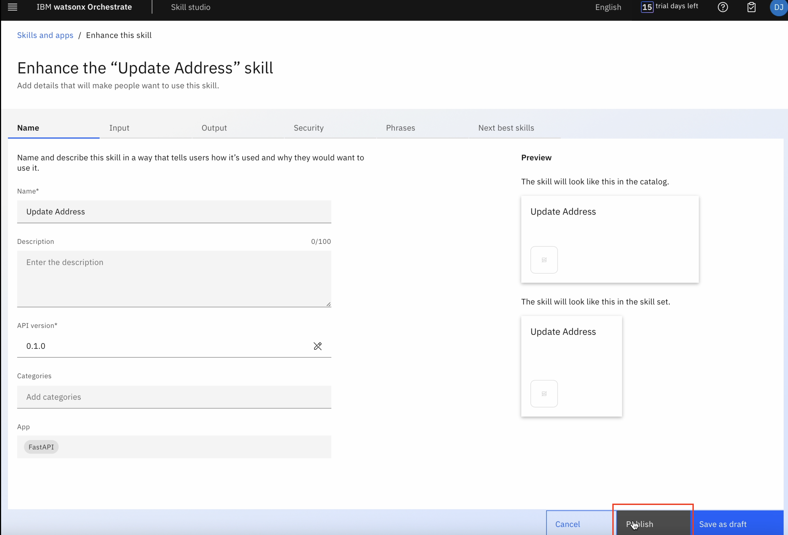
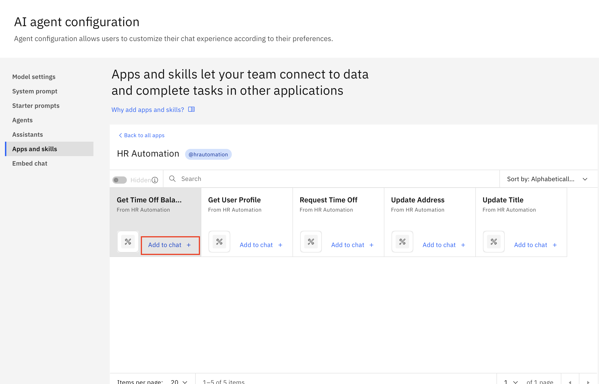
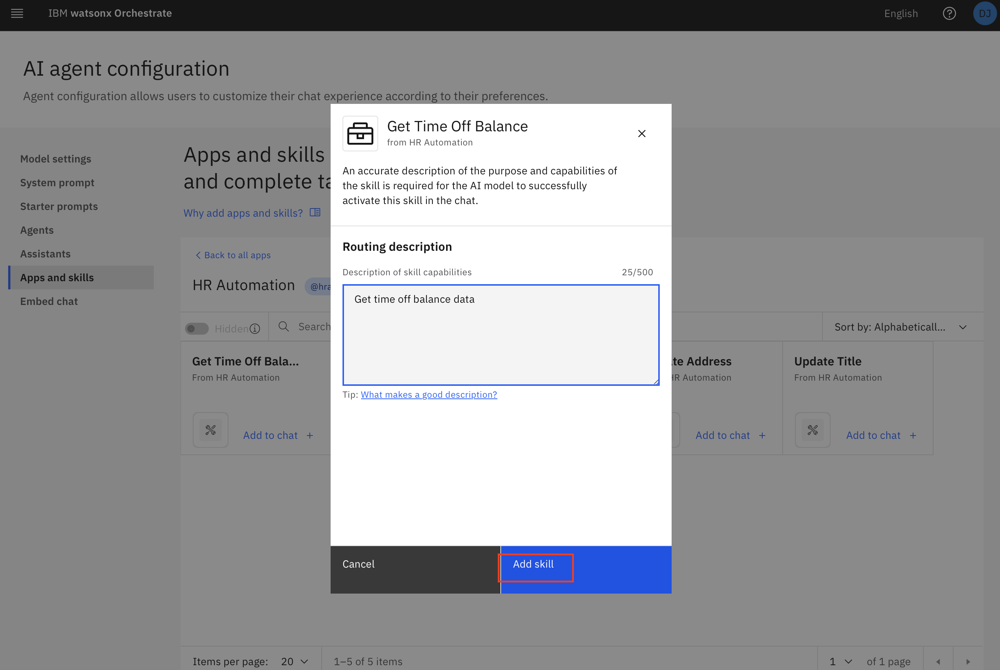
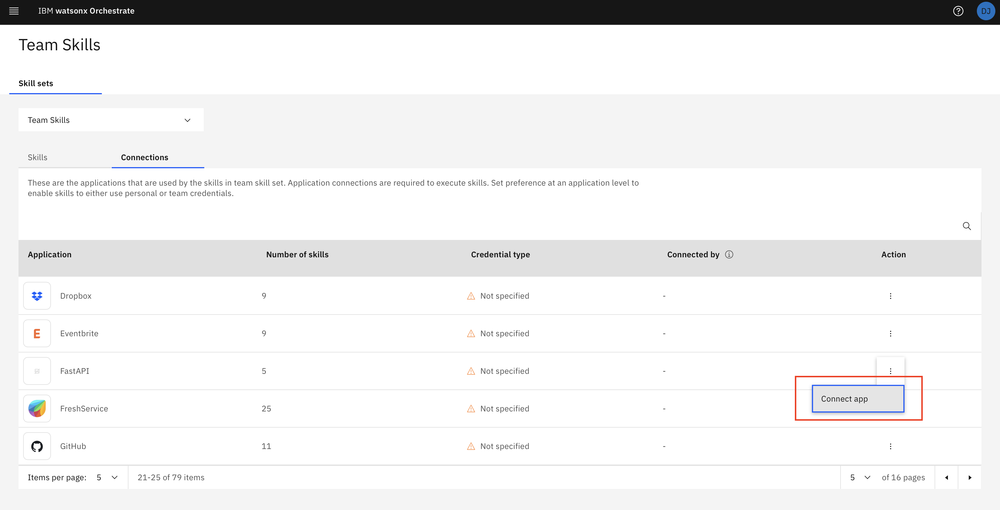

# AskHR - Agent setup hands on lab

## Table of Contents

- [Use case: AskHR](#use-case-askHR)
  - [Table of Contents](#table-of-contents)
  - [Introduction](#introduction)
  - [Use case description](#use-case-description)
  - [Agent Lab - Creating your first agent](#agent-lab---creating-your-first-agent)
    - [Using a tool](#using-a-tool)
    - [Deploy your agent](#deploy-your-agent)
  - [watsonx Orchestrate](#watsonx-orchestrate)
    - [AI agent configuration](#ai-agent-configuration)
    - [Skill Studio](#skill-studio)

## Introduction

## Use case description

This use-case targets developing and deploying an AskHR agent leveraging IBM watsonx Orchestrate and watsonx.ai, as depicted in the provided architecture diagram. This agent will empower employees to interact with HR systems and access information efficiently through conversational AI. we have 4 skills in watsonx.orchestrate which leverages custom skills to connect to a dummy HR Application storing the employee data. Another agent in watsonx.ai can answer user queries using a grounded data source. Integrating these 5 agents, we will see how most of the routine HR operations can be brought under a single powerful Agent.

### Agent Lab - Creating your first agent

1.	Login into your watsonx account. This is Homepage of watsonx AI.

1.1 For agent creation, you'll be needing a project. Click on "+" icon against "Projects" as shown in below image.

1.2 Give your a project a name, select storage from available storages, then click on "Create".

2.	Click on hamburger icon on top left and select “Access (IAM)”.

3.	In next screen, select “API Keys” from menu.

4.	Click on “Create”.

5.	Give your API key a name, then click on “Create”.

6.	Copy the API key that is shown after clicking on “create”. Paste it somewhere, it’ll be used in later steps.

7.	Switch back to the homepage. Open Agent Lab.

8.	In “Instructions” field, paste this prompt “You are a helpful Human Resources Assistant that uses tools to answer questions in detail. Please use website https://www.cipd.org/en/knowledge/factsheets/hr-policies-factsheet/ to give answers to user questions. When greeted, say “Hi, I am HR agent, How can I help you?”

### Using a tool
9.	From “Added tools” section remove already added tools.

10.	Then click on “Add a tool”.

11.	Enable “Webcrawler” tool and close this tools window.

12. Close this window.
 

### Deploy your agent

13.	Click on “Deploy”.

14. Enter Deployment name and select “Deployment Space”. Then click on “Deploy”.(If there are no deployment space you need to create one using  [this](#/deployment_space_creation.md) guide.)

15.	Wait for the status to change to “Deployed” from “Initializing”.

16.	Click on the deployment you just deployed.

17.	Copy and paste deployment id as shown in below image. You will need it in later step.

18.	From menu, select “Deployments”.

19.	Select “Spaces” and open the space where you deployed the agent.

20.	Under “manage” section, you’ll find “Space GUID”. Copy and paste it somewhere.

21.	Please refer to the [Code Engine instructor](https://github.ibm.com/skol/agentic-ai-client-bootcamp-instructors/blob/main/environment-setup/external-agent-builder/Readme.md) guide for deployment instructions. Once you obtain the deployment link, kindly open it.

You will reach the page shown in the image below.
Paste “Deployment ID”, “Space ID”, "API Key" and "watsonx URL" that you copied in previous steps. 
Click on “Generate Token”.

22.	A token will be generated. Copy and paste it somewhere.

## watsonx Orchestrate

23.	Go to “watsonx Orchestrate” homepage. 

### AI agent configuration

24.	Click on hamburger menu on top left and select “AI agent configuration” from menu.

25.	Click on “Agents“

26.	Click on “Add Agent +”.

27.	Give a name to your agent. Enter the description: 'This HR agent is an AI-powered assistant designed to handle common HR queries efficiently. It can provide policy information and answer frequently asked questions.”

28.	Under “Authentication type”, select “Bearer Token”, enter the generated token you copied, In “Service Instance URL” section , enter "https://multi-agent-external.1slrp41syyn5.us-south.codeengine.appdomain.cloud/chat/completions".

Click on “Connect”

29.	Now you can see your agent in this page.

30.	From menu, select “chat”.

31.	You can enter you HR queries here and see the responses.

### Skill Studio

32.	From the menu select "Skill Studio".

33.	Click on "Create".

34.	Select "Import API" from the dropdown.

35.	Select "From a file".

36.	Drag or Select the open specs file and click on "next".

37.	Select all checkboxes and click on "Add".

38.	Once the skills are imported, Click on the three dots against the 'Update address' skill.

39.	Select 'Enhance this skill'.

40.	Click on 'Publish'..

41.	Repeat last 3 steps for other imported skills as well.

42.	Once the skills are published, from menu go to "Skill sets".

43.	From the dropdown, select "Orchestrate Agent Skills".

44.	Click on "Connections". Your imported skills should be grouped in one app automatically. By clicking on arrow, search for that app. Click on three dots against that app and then click on "Connect app".

45.	Select "Team credentials" and click on "Connect app".

46.	Enter your credentials and click on "Connect app".

47.	Once thats done, click on skills and then click on "Manage skills".

48.	Click on app in which your skills are grouped.

49.	Check if "Get Time Off Balance", "Get User Profile", "Request Time Off", "Update address" and "Update Title" skills are added. If not already added, click on "Add skill + " for all skills you want to add. 
Then click on "Connect App" on top right, if not already connected.

50.	From menu, click on "AI agent configuration".

51.	Select "Apps and skills" and click on the app your skills are grouped into.

52.	Click on "Add to chat +" for Get Time off Balance.

53.	Enter the description of this skill, "To get time off balance data" Then click on "Add skill".

54.	Similarly add all the imported skills with following descriptions as follows. Get User Profile : to get complete profile data of user. Request Time Off : to request time off, apply for leaves Update Address : To update user address Update Title : To update user Title

55.	Now click on your profile icon in top right and select "settings"

56.	Click on "chat", then "Switch to legacy chat", then click on "Change to legacy chat" as shown in below image.

57.	From menu, select "Skill sets"

58.	Select "Team Skills" in dropdown.

59. Then click on "connections".Search for the app your skills are grouped into. Click on 3 dots and then click on "Connect app".

59.a Select "Team Credentials", then click on "Connect app".

59.b Enter your credentials, then click on "Connect app".

60.	Click on "skills" and then "Manage skills".

61.	Search for the app, where skills are imported, click on it.

  Then click on "add skills +" for all the skills you imported and then connect app using "Connect App" button in top right.

62.	Then click on profile icon, then settings , then click on chat version and switch to AI chat again.

63.	From menu click on "chat".

64.	Use your imported skills in chat.

End of Document
