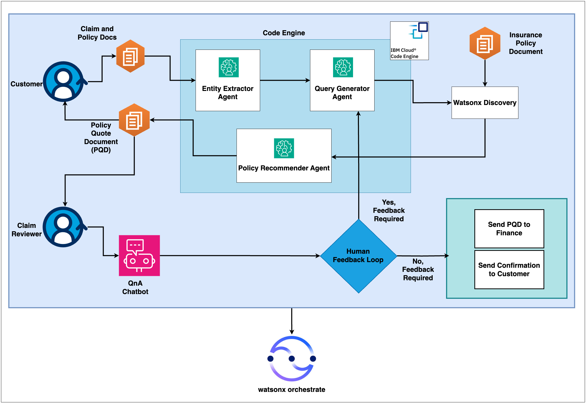

# Seamless Auto Insurance Claim Process with Tailored Recommendations

## 🎥 Demo

https://github.ibm.com/skol/agentic-ai-client-bootcamp/assets/448234/72ebd062-cd1d-488b-8cce-41bc062b1948

## Introduction: 
Greetings introduce you to WatsonxAutoClaims, a revolutionary digital platform that transforms the auto insurance claim process through the power of Agentic AI.
Traditionally, filing an insurance claim is a tedious, manual, and often frustrating process. Customers struggle with complex paperwork, poor communication, and long wait times, while claim reviewers are burdened with data overload, fraud detection challenges, and regulatory compliance.
But what if we could change that? What if we could make claims processing seamless, intelligent, and highly efficient? That’s exactly what WatsonxAutoClaims delivers!

## 🤔 The Problem
Let’s take a quick look at the challenges faced by both customers and claim reviewers in the current process:

### Customers experience:
  - A complicated, time-consuming claim submission process.
  - Lack of communication and transparency.
  - Delayed settlements due to manual processing.
  - Unclear understanding of policy coverage.

### Claim Reviewers face:
  - An overwhelming volume of claims.
  - Complex and time-consuming fraud detection.
  - Manual paperwork leading to inefficiencies and errors.
  - Disputes and regulatory challenges.

Clearly, the current system is outdated and inefficient. Now, let’s see how WatsonxAutoClaims addresses these pain points.

## 🏛️ Architecture

## Solution Overview – WatsonxAutoClaims in Action: 
Imagine a scenario where a customer is involved in an accident and needs to file a claim.
### 1.Seamless Claim Submission
 * The customer uploads a claim via the digital portal, using a simple, guided workflow.
 * AI automatically extracts and verifies key details from the uploaded documents and images.
### 2.Intelligent Claim Processing
 * The system cross-references policy documents and past claims to determine eligibility.
 * AI-powered recommendations suggest the most probable settlement amount based on historical data.
### 3.Real-time Updates & Communication
 * Customers receive instant notifications at every stage of the process.
 * AI-driven chatbots clarify policy coverage and answer questions in real time.
### 4.AI-Driven Fraud Detection & Claim Assessment
 * AI flags potentially fraudulent claims by analyzing patterns and anomalies.
 * Smart assessment tools estimate damage repair costs and recommend fair settlements.
### 5.Automated Approvals & Faster Payouts
 * The system ensures compliance with insurance regulations.
 * Approved claims are automatically forwarded for payout, reducing settlement time significantly.

## 📈 Business value

### For Customers:
  **Faster submissions & tracking** – No more paperwork hassles.
  
  **Real-time communication** – Stay informed throughout the process.
  
  **Accelerated settlements** – AI automates approvals for quicker payouts.
  
  **Enhanced coverage insights** – AI explains policies in simple terms.
  
  **Full transparency** - – Customers see exactly where their claim stands.

### For Claim Reviewers:
  **AI-driven prioritization** – Sorts claims by urgency and complexity.
  
  **Advanced fraud detection** – AI flags suspicious claims for investigation.
  
  **Automated data extraction** – Reduces manual errors and workload.
  
  **Smart claim assessments** – AI predicts fair settlements accurately.
  
  **Seamless dispute resolution** -– Data-backed insights help resolve conflicts faster.
