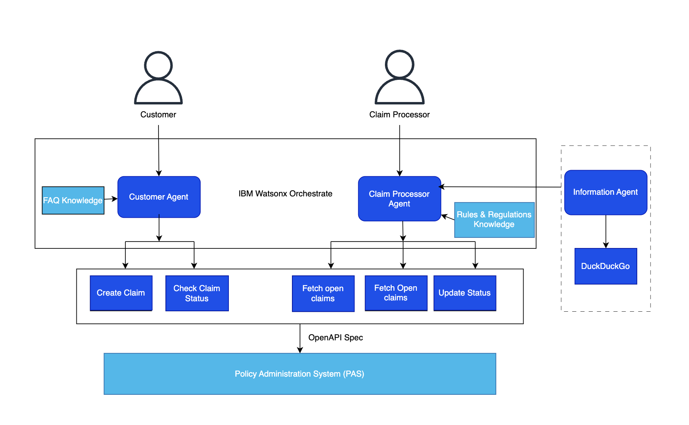

# AutoClaims Insurance: Intelligent Claims Automation with Agentic AI & Watsonx Orchestrate

## Introduction

Welcome to **Autoclaims Insurance**—a groundbreaking digital solution that redefines how auto insurance claims are handled using the power of **Watsonx Orchestrate** and **Agentic AI**.

In the traditional claims world, customers are met with confusing paperwork, delayed responses, and poor visibility into their claim’s status. At the same time, insurers face the burden of high claim volumes, manual data validation, and growing fraud risks—all under pressure to stay compliant.

**Autoclaims Insurance** changes this paradigm by introducing an **intelligent, agent-driven ecosystem** that streamlines, accelerates, and simplifies the entire claim lifecycle—for both customers and insurers.

---

## Problem Statement

Despite technological advances, auto insurance claims continue to suffer from outdated systems and fragmented processes. Let’s examine the core pain points:

### For Customers

* Tedious, manual claim filing processes.
* Poor communication and status tracking.
* Delays due to manual verification and processing.
* Confusing policy terms and unclear coverage limits.

### For Claim Reviewers

* Overflowing claim queues with limited prioritization.
* Difficulty detecting fraud amidst massive volumes.
* Time-consuming paperwork and data entry.
* Compliance risks and prolonged dispute resolution.

In short, both sides struggle with inefficiency, lack of clarity, and missed expectations.

---

## Solution Overview – Autoclaims Insurance in Action

**Autoclaims Insurance** offers a smarter, AI-first alternative. Here’s how our agentic system transforms the experience:

## 💡 Solution Overview – Autoclaims Insurance in Action

**Autoclaims Insurance** offers a smarter, AI-first alternative. Here’s how our agentic system transforms the experience:

### 1. Seamless Claim Submission

* **No paperwork required**: Customers start the claim process through a simple, guided digital interface.
* **AI-driven data extraction**: Key information from documents, images, and inputs is automatically extracted and validated in real-time, ensuring smooth submission.

### 2. Intelligent Claim Processing

* **Automated validation**: Claims are cross-checked against policy details and claim history to ensure eligibility and reduce errors.
* **AI-powered recommendations**: The system generates intelligent settlement recommendations based on historical data, policy conditions, and claim context.

### 3. Real-Time Communication & Transparency

* **Instant status updates**: Customers are kept in the loop with real-time claim status notifications at every step.
* **AI-driven assistance**: Conversational AI agents clarify policy terms, answer questions, and guide customers through complex insurance concepts.

### 4. RAG System Integration

* **Customer & Claim Processor Support**: Our **Retrieval-Augmented Generation (RAG)** system is seamlessly integrated into the platform to answer all policy, claim processing, and insurance-related queries.
* **Instant, context-driven responses**: Whether it's for customers seeking claim status or claim processors verifying details, the RAG system ensures fast, accurate, and compliant responses.

---

## Architecture

---

## Demo

<https://github.ibm.com/skol/agentic-ai-client-bootcamp/assets/461826/55793477-f55d-42f0-8943-7de3d7a80d73>

---

## **Business Value & Benefits**

### For Customers POV

#### **Frictionless Claim Submissions**

* **Simplified experience**: With just a few guided steps, customers can initiate a claim without dealing with paperwork or filling out long forms. The entire claim initiation process is handled digitally, with **AI agents** facilitating document generation, data extraction, and input validation.
* **Document automation**: The system auto-generates necessary claim documents, such as policy summaries, damage reports, and estimates, saving the customer significant time and effort.

#### **Real-Time Claim Tracking & Updates**

* **Instant status notifications**: At any point during the claim lifecycle, customers can easily check the status of their claim, getting real-time updates. Whether a claim is in the submission phase, awaiting review, or being processed for payout, customers can track its progress.
* **Clear, conversational summaries**: Through AI-powered conversational agents, customers receive simple and transparent explanations of where their claim stands, eliminating confusion and reducing unnecessary support calls.

#### **Accelerated Claim Settlements**

* **AI-powered automation**: Claims are validated against policy documents and pre-set business rules automatically, allowing for instant verification and faster processing.

#### **Personalized Policy Explanations**

* **Easy-to-understand breakdowns**: AI agents transform complex insurance language into simple, personalized explanations that help customers understand their coverage and policy limits.
* **Instant policy clarification**: Customers can instantly ask questions about policy terms and get direct, accurate answers. This helps them make more informed decisions and feel more confident about the insurance they have purchased.
* **Proactive policy recommendations**: AI analyzes customer queries to offer relevant policy add-ons or coverage modifications, ensuring that the customer’s needs are continuously met.

#### **Full Process Transparency**

* **End-to-end visibility**: From the moment a claim is submitted to the final payout, every step of the process is clearly documented and easily accessible to the customer.
* **Clear communication at all stages**: Customers are continuously informed about each step in their claim journey, from the initial submission to the final resolution, ensuring they are never left in the dark.

---

### For Claim Processors & Insurers POV

#### **AI-Driven Claim Prioritization**

* **Automated sorting**: AI evaluates claims for urgency, complexity, and risk factors, then categorizes them based on predefined business rules. Claims with high value, high urgency, or those suspected of being fraudulent are flagged for immediate review.
* **Efficient resource allocation**: By automatically identifying priority claims, the system helps insurers allocate resources to the highest-impact cases, ensuring faster processing of critical claims while reducing workload on human agents.

#### **Automated Data Collection & Extraction**

* **Streamlined documentation**: The AI agents extract and organize key data from submitted documents and images, including vehicle details, incident descriptions, and claim amounts. This eliminates the need for manual data entry, reducing errors and accelerating claim validation.
* **Eliminating inconsistencies**: By auto-checking for discrepancies in data, the system ensures that submitted claims align with the policy, avoiding mistakes that would otherwise lead to rework or delays.
* **Cross-referencing with existing data**: AI cross-references claim information with previous claims and customer profiles to detect any inconsistencies or anomalies that may require further investigation.

#### **Smart Claim Assessment & Recommendations**

* **Structured decision support**: For each claim, the system analyzes key factors such as policy terms, claim history, and incident specifics to generate well-supported recommendations. The AI suggests whether a claim should be **approved**, **rejected**, or **escalated** to a higher authority.
* **Data-driven rationale**: Along with each recommendation, the AI provides a clear and concise rationale, outlining the factors considered (e.g., policy limits, prior claims, damages). This enables reviewers to make confident, data-backed decisions.
* **Fair settlement predictions**: For straightforward claims, the system suggests an estimated settlement amount based on historical data, ensuring consistency and fairness in payout decisions.

#### **Faster Dispute Resolution**

* **Comprehensive claim summaries**: AI automatically generates detailed, well-organized summaries for each claim, including cross-references to policy documents and prior claims. This enables claim processors to quickly understand the situation and resolve disputes efficiently.
* **Conflict resolution assistance**: When a conflict arises between the insurer and the customer, the AI provides valuable insights and data-backed reasoning that supports the resolution process, whether it’s for settlement negotiations or regulatory compliance.

---

## Hands-on step-by-step lab

Please find the step-by-step instructions [Hands-on Lab](/usecases/autoclaim-insurance/assets/hands_on_lab_autoclaim_insurance.md) on how you can implement this use case.
