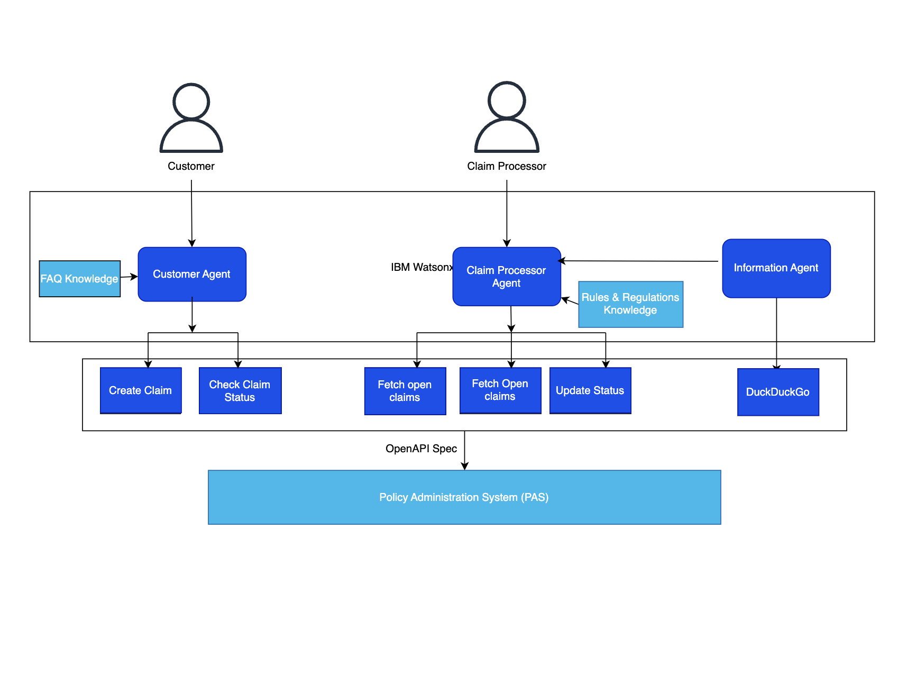

# Automate Insurance Claim Processing with Agentic AI

## Table of Contents

- [Automate Insurance Claim Processing with Agentic AI](#automate-insurance-claim-processing-with-agentic-ai)
  - [Table of Contents](#table-of-contents)
  - [Use case description](#use-case-description)
  - [Architecture](#architecture)
  - [Exisitng Customer Database](#exisitng-customer-database)
  - [Implementation](#implementation)
    - [Pre-requisites](#pre-requisites)
    - [Implementation](#implementation-1)
  - [Testing the Flow](#testing-the-flow)
    - [Information Agent Flow](#information-agent-flow)
    - [Claim Processor Flow](#claim-processor-flow)
    - [Customer Flow](#customer-flow)

## Use case description

With the help of Agentic AI powered by watsonx Orchestrate, you will build an intelligent, agent-driven system that streamlines the entire claims process. This solution not only assists customers in effortlessly filing their claims but also empowers insurers to process them more efficiently, reducing manual effort and turnaround time.
Customers can simply answer a few guided questions and initiate a claim using minimal information. From there, the agentic system intelligently handles the end-to-end filing process—including document generation, data extraction, and claim verification—ensuring speed, accuracy, and ease of use. Additionally, customers can quickly check the status of their claims at any time, improving transparency and enhancing their overall experience.
On the insurer's side, submitted claims can be seamlessly fetched, and the agentic system automatically cross-verifies claim details against the customer’s policy documents. It extracts key information and validates it against predefined business rules and regulatory guidelines. Based on this analysis, the system generates intelligent, structured suggestions on whether a claim should be approved or rejected—significantly reducing manual effort and the risk of errors. The final decision, however, remains with the insurer, supported by a clear and concise summary of all relevant details.

## Architecture

## Exisitng Customer Database

**Use this following database as a reference to test out the creating claim requests. Registering new users is outside the scope of this lab exercise. The focus is strictly on demonstrating features available to already registered users. Claims can only be initiated and processed for customers who already exist in the database. A pre-populated customer database is provided as part of the hands-on lab environment for this purpose.**

To get the list of already present user names in database, download it from [Insurance Database](/usecases/autoclaim-insurance/assets/data/Insurance_Database_v1.csv)

|   customer_id | customer_name          |   phone_number | email_id                     | vehicle_type   | vehicle_details                     | policy_number   |
|--------------:|:-----------------------|---------------:|:-----------------------------|:---------------|:------------------------------------|:----------------|
|      15658583 | Juan Andrade           |      916396839 | tasha38@example.net          | SUV            | Turquoise Recognize SUV             | POL71225AUTO    |
|      60201922 | Valerie Thornton MD    |      915417256 | brittany64@example.com       | Motorcycle     | SlateGray Central Motorcycle        | POL16024AUTO    |
|      60695904 | Jordan Davenport       |      857922884 | kfry@example.net             | Truck          | SkyBlue Study Truck                 | POL81610AUTO    |
|      93315106 | Emma Smith             |      615476666 | adam69@example.com           | Truck          | Gold True Truck                     | POL56327AUTO    |
|      57755089 | Jennifer Chan          |      827449842 | andrew27@example.com         | Motorcycle     | DarkTurquoise Great Motorcycle      | POL41466AUTO    |
|      39427986 | Mrs. Melinda Hernandez |      688281354 | vwilliams@example.net        | Sedan          | LightBlue It Sedan                  | POL99487AUTO    |
|      86878349 | Mr. John Smith DVM     |      788140488 | davidquinn@example.org       | Sedan          | PapayaWhip Stock Sedan              | POL66951AUTO    |
|      15561010 | Cindy Williamson       |      710035685 | christinasimpson@example.org | Truck          | BlueViolet Yeah Truck               | POL35562AUTO    |
|      77976123 | Michael Harris         |      978440540 | wisewalter@example.net       | Sedan          | LightSkyBlue Together Sedan         | POL41317AUTO    |
|      15603903 | Charles Garza          |      810525698 | robinsonrhonda@example.net   | Motorcycle     | SteelBlue Ten Motorcycle            | POL28969AUTO    |
|      65533632 | Kathleen Prince        |      811688783 | vanessagonzalez@example.com  | Truck          | Orange Cell Truck                   | POL54507AUTO    |
|      77070408 | Kristin Martinez       |      752304501 | melvin62@example.org         | Motorcycle     | FloralWhite Today Motorcycle        | POL87469AUTO    |
|      23665264 | Darrell Davis          |      798601723 | peggybarron@example.org      | Truck          | PaleVioletRed Deep Truck            | POL16871AUTO    |
|      73389535 | Brandy Anderson        |      648148812 | bsanchez@example.org         | Sedan          | Violet Skill Sedan                  | POL87688AUTO    |
|      15406724 | Miss Diane Davis       |      740012539 | shellyhunter@example.com     | Motorcycle     | Yellow Little Motorcycle            | POL86896AUTO    |
|      47659055 | Barry Munoz            |      949671535 | jasonhorton@example.org      | Truck          | LightGreen Cultural Truck           | POL30408AUTO    |
|      42151585 | Brandon Campbell       |      893027994 | shannonkelly@example.org     | Truck          | Violet Though Truck                 | POL08417AUTO    |
|      95495718 | Kimberly Brown         |      706032589 | qsherman@example.org         | Hatchback      | Orchid Cultural Hatchback           | POL61944AUTO    |
|      72645667 | John Smith             |      818364350 | crystal66@example.net        | Sedan          | MediumPurple Small Sedan            | POL23617AUTO    |
|      96063620 | Rebecca Benton         |      842816422 | sergio99@example.org         | Sedan          | Green Experience Sedan              | POL89353AUTO    |
|      30371112 | Kristi Duncan          |      755244569 | welchpamela@example.org      | Motorcycle     | MediumSpringGreen Public Motorcycle | POL59939AUTO    |
|      15850858 | Adam Murray            |      907462362 | charlesnavarro@example.org   | Sedan          | Linen Push Sedan                    | POL28984AUTO    |
|      44788956 | Patricia Villarreal MD |      990512269 | barbaraburton@example.net    | Motorcycle     | MediumVioletRed Foreign Motorcycle  | POL34321AUTO    |
|      45376758 | Melinda Davis          |      978778681 | sandra66@example.org         | Hatchback      | Pink South Hatchback                | POL81468AUTO    |
|      56074256 | Nicole Jenkins         |      864277090 | uperry@example.com           | Hatchback      | DarkBlue Be Hatchback               | POL60427AUTO    |
|      36016922 | Andrew Manning         |      692985134 | dale10@example.net           | Motorcycle     | BlanchedAlmond Military Motorcycle  | POL73516AUTO    |
|      20895027 | Cynthia Graves         |      655183466 | lindsaycarter@example.org    | Sedan          | DimGray Both Sedan                  | POL30049AUTO    |
|      14968514 | Mary Lambert           |      821203573 | lisa61@example.com           | Hatchback      | DarkOrchid Season Hatchback         | POL94111AUTO    |
|      33947767 | Diane Baker            |      625539570 | karenrasmussen@example.org   | Truck          | DodgerBlue Especially Truck         | POL29747AUTO    |
|      65413199 | Claire Johnson         |      870803705 | frazierjonathan@example.com  | Motorcycle     | DarkOrchid Customer Motorcycle      | POL60326AUTO    |
|      99845337 | Carolyn Washington     |      904291631 | tarasosa@example.net         | SUV            | SeaShell Nothing SUV                | POL84256AUTO    |
|      44384431 | Justin Wilson Jr.      |      941686988 | cgould@example.com           | Hatchback      | CornflowerBlue Side Hatchback       | POL57492AUTO    |
|      68298670 | Taylor Palmer          |      674479833 | kgibson@example.com          | Truck          | Cyan Amount Truck                   | POL64603AUTO    |
|      60141430 | Megan Perez            |      661507644 | tinadominguez@example.com    | Sedan          | Maroon Him Sedan                    | POL17904AUTO    |
|      41991899 | Stephanie Griffin      |      722852140 | castrodevin@example.org      | Truck          | MistyRose Option Truck              | POL56160AUTO    |
|      70364469 | Jessica Flores         |      817518165 | perezdavid@example.com       | Hatchback      | LightPink Continue Hatchback        | POL51753AUTO    |
|      94252233 | Stanley Brown          |      747265702 | jillrichards@example.net     | SUV            | Chocolate Which SUV                 | POL71012AUTO    |
|      68559430 | Christina Brown        |      905449392 | hatfielddavid@example.org    | Truck          | Khaki Mrs Truck                     | POL43803AUTO    |
|      77899587 | Robert Martin          |      947373171 | bbell@example.net            | Truck          | Maroon Human Truck                  | POL17862AUTO    |
|      29451178 | Karen James            |      671259111 | andrewsnow@example.com       | Hatchback      | MistyRose Expert Hatchback          | POL14151AUTO    |
|      10644726 | David Barrett          |      947722047 | burnstrevor@example.net      | Truck          | DeepSkyBlue Room Truck              | POL35832AUTO    |
|      57474947 | Charles Green          |      978151245 | brownmarilyn@example.net     | Hatchback      | Pink Thus Hatchback                 | POL60976AUTO    |
|      98904074 | Valerie Pearson        |      959067001 | kwalsh@example.net           | Truck          | Tomato Strategy Truck               | POL57902AUTO    |
|      45053281 | Frank Day              |      802023093 | anthony31@example.net        | Truck          | DarkBlue Experience Truck           | POL19423AUTO    |
|      98235621 | Mark Perez             |      909218558 | lisasmith@example.com        | Motorcycle     | MistyRose Congress Motorcycle       | POL87825AUTO    |
|      22634739 | Sherry Rowe            |      750127116 | twise@example.org            | Motorcycle     | HotPink Read Motorcycle             | POL48512AUTO    |
|      35080990 | Kathryn Thomas         |      660259021 | tvelez@example.net           | Truck          | Turquoise Light Truck               | POL57655AUTO    |
|      33456447 | Douglas Little         |      747388149 | burnserin@example.net        | Motorcycle     | LightYellow Beat Motorcycle         | POL35841AUTO    |
|      19564030 | Rachel Schwartz        |      611017817 | howardjay@example.net        | Hatchback      | Yellow Tv Hatchback                 | POL71642AUTO    |
|      74152986 | Aimee Taylor           |      626228796 | jreed@example.org            | Truck          | PaleVioletRed Then Truck            | POL65309AUTO    |

## Implementation

### Pre-requisites

- Check with your instructor to make sure **all systems** are up and running before you continue.
- Validate that you have access to the right techzone environment for this lab.
- Validate that you have access to a credentials file that you instructor will share with you before starting the labs.
- If you're an instructor running this lab, check the **Instructor's guides** to set up all environments and systems.

### Implementation

- Login into IBM Cloud. Navigate to Resource List. Click on watsonx Orchestrate. 

- Welcome to watsonx Orchestrate. Click on Build.

**Create Information Agent**
**Information Agent:**

- Click on Agent Builder
  

- Click on Create Agent

- Follow the steps according to the screenshot below.
- Copy the following description:

> **The Information agent will fetch the news and different articles and use this information to summarize results and share.**

- Now click on the add tool to upload OpenAPI Specs. Click on Add Tool.

- Click on Import.

- Upload the required OpenAPI Spec. The OpenAPI Spec will be provided by the instructor.
- The OpenAPI spec will be of the name: **duckduckgo.json**

- Select the API. Then, select Done.
- The tool description is already added in the OpenAPI Spec. It will be auto-filled.

- Add Behviour which defines how the Agent should behave and what it should expect.
  
- Add the following for the Agent Behaviour:
  
> `The Information Agent will use the tool to search for information and return a summarized results.`

- Test the Agent flow

- Step 1 : Type `Insurance laws for fire in California`

- Step 2 : You will get a summarized version of all the search results, you can click on the Step 1 and see the tool results

- You can find the agent testing steps here -  [Information Agent Flow](#information-agent-flow)

- After testing the flow, then click on Deploy, to deploy the agent.

**Create Claim Processor Agent**
**Claim_Processor_Agent:**

- Click on Agent Builder.

- Click on Create Agent

- Follow the steps according the screenshot below.
- Copy the following description:

> **The Claim Processor agent assists the claim processor to fetch the open claim request, approve, validate and verify the open request. This agent will suggest to the claim processor if they should accept or reject the claim.**

- Upload "Policy.pdf"  [Claim Processor Knowledge Base](</usecases/autoclaim-insurance/assets/data/Policy.pdf>) to the knowledge base by clicking on Upload files.
- Add Description of the Knowledge Base describing what the Knowledge Base is about:

> This knowledge base is about insurance and claim process. This knowledge base will help the claim processor in processing the claims according to the rules and regulations defined by the insurance company. 

- Now click on the add tool to upload OpenAPI Specs. Click on Add Tool.

- Click on Import.

- Upload the required OpenAPI Specs. The OpenAPI Spec will be provided by the instructor.
- The OpenAPI spec will be of the name: **claim_processor_agent_tools.json**

- Select the API. Then, select Done.
- The tool description is already added in the OpenAPI Spec. It will be auto-filled.

- Click on Add Agent. Add from Local Instance.

- Add information-agent

- Add Behviour defining how the Agent should behave and what it should expect.
  
- Add the following in the Agent Behaviour section :
  
> You will begin by welcoming the claim processor and displaying the open claims in a table. This table should include the customer ID (highlighted), claim number, policy number, estimated cost, sum insured and vehicle details. Do not show duplicates.Ask the claim processor to select a customer ID.Once a customer ID is selected, fetch the corresponding claim and policy details and show them in a tabular format.
> Then, generate a summary based on the following points:
  >
  > 1. Compare the estimated cost with the sum insured and calculate the approved claim amount by subtracting the deductible. Highlight the approved amount.
  > 2. Check if the policy is currently active and whether the claim falls within the coverage period.
  > 3. Classify the accident into one of the following types: rear-end collision, head-on collision, side-impact, sideswipe, single-vehicle, multi-vehicle pileup, hit-and-run, parking lot, animal collision, weather-related, mechanical failure-related, vandalism, or theft.
  > 4. Determine if the classified accident type is covered by the policy. If policy details are not clear, refer to the knowledge base to verify.
  > 5. It is mandatory for you to use the information_agent to query for the accident type you discovered in step 4. Query: The rules and regulations for accident type in US. Use the result to verify if the claim details are compliant.
  > 6. Provide a clear recommendation to accept or reject the claim based on these checks.
  > 7. Highlight the total claim amount (estimated cost minus deductible).
  > 8. Create a clear and concise summary for the claim processor, emphasizing key details like approved amount, claim number, and policy number.
> HIGHLIGHT ALL THE DETAILS IN NEAR FORMAT.
>
> Finally, ask the claim processor "Whether they accept the claim?"
> Do not give next steps.
>
>Once a decision is made, update the claim status and send a message confirming that emails have been sent to the customer and finance team.

- Test the Agent flow.

- Step 1 : Show open claims

- Step 2 : Input Customer ID: 15561010

- Step 3 : Yes

- Step 4 : Shows update confirmation

-  You will also find the steps to test here : [Claim Processor Flow](#claim-processor-flow)

- After testing the flow, then click on Deploy.

**Create Customer Agent**
**Customer Agent:**

- Click on Agent Builder.

- Click on Create Agent

- Follow the steps according the screenshots below.
- Copy the following description:

> `The Customer Claims agent will allow customers to query for the status of their claim request and create a new claim request. You will also answer questions based on claim process and insurance policy using the knowledge base`

- Upload "Automobile Insurance Knowledge Base.pdf" [Customer Knowledge Base](</usecases/autoclaim-insurance/assets/data/Automobile Insurance Knowledge Base.pdf>) to the knowledge base by clicking on Upload files.
- Add Description of Knowledge Base as to what the Knowledge Base is about.

> This knowledge base is about insurance and claim process. This knowledge base will help the customer in getting information about the claims process and the rules and regulations of processing insurance claims.

- Now click on add tool to upload OpenAPI Specs. Click on Add Tool.

- Click on Import. The OpenAPI Spec must be provided by the instructor.
- The OpenAPI spec will be of the name: **customer_claims_agent_tools.json**

- Upload the required OpenAPI Specs. Select the API. Then, select Done.
- The tool description is already added in the OpenAPI Spec. It will be auto-filled.

- Add Behviour as to how the Agent should behave and what it should expect.
- Add the following for the Agent Behaviour:

`> The agent has to ask the user questions about how the accident happened, like
1. The location and date of the incident.
2. Ask for vehicle details.
3. Ask for a detailed description of the incident

Parse the answers for this, in case any details is missing, you can ask the following questions
1. If there were any damages and what was the estimated cost of the damages?   
2. If the accident was reported to the police, and on which date and time?
3. Ask for a detailed description of the incident, 
4. Ask if any medical expenses were incurred , how much ?

The final estimated cost should be an addition of the damages and medical expenses
Once these information have been added, create a detailed and descriptive summary of this information and then use this information as incident_details in the tool. Before these questions ask, for user their name as a form of authetication. 
In the end, inform the customer they will recieve a confirmation of their claim request on mail 
You will display a formatted and consice summary.
Each detail should be in a new line.
Highlight important information, if possible present in tabular format.

When asked for status you will also help user get the status of the claim request, by first asking for customer name and then the claim number. Once information is fetched, display in tabular format.

Once the status is shown please end the conversation.

If a question is asked about insurance and the claim's process, use the Automobile Insurance Knowledge Base.pdf to answer questions, if you don't know the answer, reply with "I don't know". Please don't use this knowledge base when you are asking questions for a tool
DO NOT REFER TO THIS KNOWLEDGE BASE WHEN WORKING WITH TOOLS.`

- Test the Agent flow 

- Step 1 : Check RAG/ Knowledge base
  " What are the different types of automobile insurance?"

- Step 2 : How to check the flow for creating a new claim
  1. Submit a new claim

  

  2. Jordan Davenport

  

  3. St Mary's Street, San Francisco, California

  

  4. 23-05-2025

  

  5. I was driving to work when a red pickup truck ran a red light and collided with the rear right side of his vehicle at the intersection. The impact caused the Camry to spin slightly, resulting in damage to the rear bumper, right-side tail light, and a dent in the rear quarter panel.I was wearing a seatbelt and did not sustain serious injuries, but reported minor back pain and visited a doctor the same day. Medical expenses were 3400 and the damages repair cost was 4500.

  

- Step 3 : How to check the flow for "Checking claim status"
  1. Check claim status
  

  2. John Smith
  

  3. CLM187229
  

- You will also find the steps to test here : [Customer Flow](#customer-flow)

- After testing the flow, then click on Deploy.

>
> ***You can also test the flow before deploying the agents to AI chat.***
> ***Now, the Agents are deployed.***
> ***You can navigate to AI chat and select the required agent and test the flow.***

## Testing the Flow

### Information Agent Flow

- Step 1 : Insurance laws for fire in California

- Step 2 : You will get a summarized version of all the search results, you can click on the Step 1 and see the tool results

### Claim Processor Flow

- Step 1 : Show open claims

- Step 2 : Input Customer ID: 15561010

- Step 3 : Yes

- Step 4 : Shows update confirmation

### Customer Flow

- Step 1 : Check RAG/ Knowledge base
  " What are the different types of automobile insurance?"

- Step 2 : How to check the flow for creating a new claim
  1. Submit a new claim

  

  2. Jordan Davenport

  

  3. St Mary's Street, San Francisco, California

  

  4. 23-05-2025

  

  5. I was driving to work when a red pickup truck ran a red light and collided with the rear right side of his vehicle at the intersection. The impact caused the Camry to spin slightly, resulting in damage to the rear bumper, right-side tail light, and a dent in the rear quarter panel.I was wearing a seatbelt and did not sustain serious injuries, but reported minor back pain and visited a doctor the same day. Medical expenses were 3400 and the damages repair cost was 4500.

  

- Step 3 : How to check the flow for "Checking claim status"
  1. Check claim status
  

  2. John Smith
  

  3. CLM187229
  
