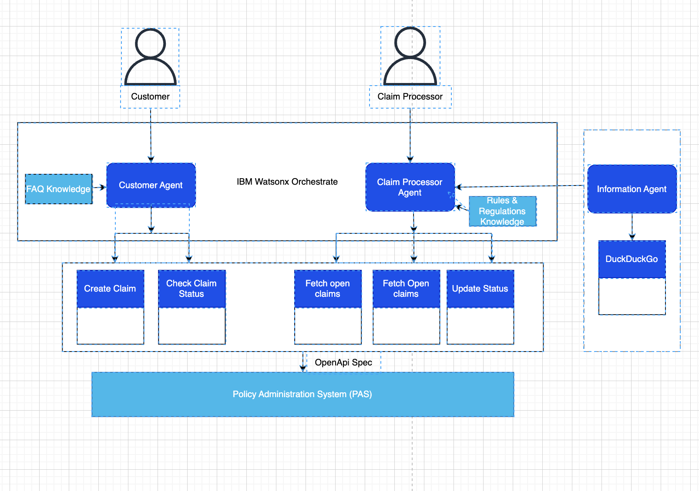

#  Automate Insurance Claim Processing with Agentic AI

## Table of Contents

- [Autoclaims Insurance: Automate Insurance with Watsonx Orchestrate and Agentic AI](#autoclaims-insurance-automate-insurance-with-watsonx-orchestrate-and-agentic-ai)
  - [Table of Contents](#table-of-contents)
  - [Use case description](#use-case-description)
  - [Architecture](#architecture)
  - [WxO Implementation](#wxo-implementation)
    - [Pre-requisites](#pre-requisites)
    - [Watsonx Orchestrate Deployment](#watsonx-orchestrate-deployment)

## Use case description

With the help of Agentic AI powered by watsonx Orchestrate, you will build an intelligent, agent-driven system that streamlines the entire claims process. This solution not only assists customers in effortlessly filing their claims but also empowers insurers to process them more efficiently, reducing manual effort and turnaround time.
Customers can simply answer a few guided questions and initiate a claim using minimal information. From there, the agentic system intelligently handles the end-to-end filing process—including document generation, data extraction, and claim verification—ensuring speed, accuracy, and ease of use. Additionally, customers can quickly check the status of their claims at any time, improving transparency and enhancing their overall experience.
On the insurer's side, submitted claims can be seamlessly fetched, and the agentic system automatically cross-verifies claim details against the customer’s policy documents. It extracts key information and validates it against predefined business rules and regulatory guidelines. Based on this analysis, the system generates intelligent, structured suggestions on whether a claim should be approved or rejected—significantly reducing manual effort and the risk of errors. The final decision, however, remains with the insurer, supported by a clear and concise summary of all relevant details.

## Architecture

## Implementation

### Pre-requisites

- Check with your instructor to make sure **all systems** are up and running before you continue.
- Validate that you have access to the right techzone environment for this lab.
- Validate that you have access to a credentials file that you instructor will share with you before starting the labs.
- If you're an instructor running this lab, check the **Instructor's guides** to set up all environments and systems.

### Implementation

**Information Agent:**

- Click on Agent Builder.
- Click on Create Agent
- Follow the steps according the below screenshot.

- Now click on add tool to upload OpenAPI Specs. Click on Add Tool.

- Click on Import from External Tool

- Upload the required OpenAPI Specs
[duckduckgo](/usecases/autoclaim-insurance/assets/open_api_specs/duckduckgo.json)

- Select the API. Then, select Done.

- Add Behviour as to how the Agent should behave and what it should expect.
- Make sure to also Add Description of the Agent.
- Refine the Tool Description what to expect from the tools.
- Find out what to add here: [Description and Behaviour](/usecases/autoclaim-insurance/assets/description_and_behaviour/information_agent.txt)

- Test the Agent flow and then Click on Deploy.

**Claim_Processor_Agent:**

- Login into IBM Cloud. Navigate to Resource List. Click on Watsonx Orchestrate.

- Welcome to Watsonx Orchestrate. Click on Build.

- Click on Agent Builder.

- Click on Create Agent

- Follow the steps according the below screenshot.

- Upload "Policy.pdf"  [Claim Processor Knowledge Base](/data/Policy.pdf) to the knowledge base by clicking on Upload files.
- Add Description of Knowledge Base as to what the Knowledge Base is about.

- Now click on add tool to upload OpenAPI Specs. Click on Add Tool.

- Click on Import from External Tool

- Upload the required OpenAPI Specs
[open_top_5_claims](/usecases/autoclaim-insurance/assets/open_api_specs/open_top_5_claims.json)
[claim_processor_fetch_claim](/usecases/autoclaim-insurance/assets/open_api_specs/claim_processor_fetch_claim.json)
[claim_status_update](/usecases/autoclaim-insurance/assets/open_api_specs/claim_status_update.json)

- Select the API. Then, select Done.

- Click on Add Agent. Add from Local Instance.

- Add information-agent

- Add Behviour as to how the Agent should behave and what it should expect.
- Make sure to also Add Description of the Agent.
- Refine the Tool Description what to expect from the tools.
- Find out what to add here: [Description and Behaviour](/usecases/autoclaim-insurance/assets/description_and_behaviour/claim_processor_insurance_agent.txt)

- Test the Agent flow and then Click on Deploy.

**Customer Agent:**

- Click on Agent Builder.

- Click on Create Agent

- Follow the steps according the below screenshot.

- Upload "Automobile Insurance Knowledge Base.pdf" [Customer Knowledge Base](</usecases/autoclaim-insurance/assets/data/Automobile Insurance Knowledge Base.pdf>) to the knowledge base by clicking on Upload files.
- Add Description of Knowledge Base as to what the Knowledge Base is about.

- Now click on add tool to upload OpenAPI Specs. Click on Add Tool.

- Click on Import from External Tool

- Upload the required OpenAPI Specs. Select the API. Then, select Done.
[claim_status](/usecases/autoclaim-insurance/assets/open_api_specs/claim_status.json)
[tool_create_claim](/usecases/autoclaim-insurance/assets/open_api_specs/tool_create_claim.json)

API 1: 

API 2: 

- Add Behviour as to how the Agent should behave and what it should expect.
- Make sure to also Add Description of the Agent.
- Refine the Tool Description what to expect from the tools.
- Find out what to add here: [Description and Behaviour](/usecases/autoclaim-insurance/assets/description_and_behaviour/customer_claims_agent.txt)

- Test the Agent flow and then Click on Deploy.

***Now, the Agents are deployed.***
***You can navigate to AI chat and select the required agent and test the flow.***
