# Automate Insurance Claim Processing with Agentic AI

## Table of Contents

- [Automate Insurance Claim Processing with Agentic AI](#automate-insurance-claim-processing-with-agentic-ai)
  - [Table of Contents](#table-of-contents)
  - [Use case description](#use-case-description)
  - [Architecture](#architecture)
  - [Implementation](#implementation)
    - [Pre-requisites](#pre-requisites)
    - [Agent Builder Implementation](#agent-builder-implementation)
      - [**Create Information Agent**](#create-information-agent)
      - [**Create Customer Agent**](#create-customer-agent)
      - [**Create Claim Processor Agent**](#create-claim-processor-agent)
  - [Testing the Flow](#testing-the-flow)
    - [Information Agent Flow](#information-agent-flow)
    - [Customer Flow](#customer-flow)
    - [Claim Processor Flow](#claim-processor-flow)

## Use case description

Powered by Agentic AI and watsonx Orchestrate, this solution enables the creation of an intelligent, agent-driven system that transforms and streamlines the entire claims process. It simplifies claim submission for customers while equipping insurers with automation to reduce manual effort and accelerate processing times.

Customers can initiate a claim by answering a few guided questions, even with minimal initial information. From there, the agentic system orchestrates the full claims workflow—automatically handling document generation, data extraction, and verification. This ensures a fast, accurate, and user-friendly experience, with real-time claim status updates that enhance transparency and customer satisfaction.

For insurers, incoming claims are automatically retrieved and intelligently cross-verified against policy documents. The system extracts critical data and evaluates it against business rules and regulatory standards, generating structured recommendations for claim approval or denial. While final decisions remain with the insurer, each recommendation is backed by a clear, concise summary of all supporting details—minimizing errors and enabling faster, more informed decision-making.
## Architecture


## Implementation

### Pre-requisites

- Check with your instructor to ensure **all systems** are up and running before you continue.
- Validate that you have access to the right TechZone environment for this lab.
- Validate that you have access to a credentials file that your instructor will share with you before starting the labs.
- If you're an instructor running this lab, check the [Instructor's guides](https://github.ibm.com/skol/agentic-ai-client-bootcamp-instructors/blob/main/environment-setup/readme.md) to set up all environments and systems.
- Make sure that your instructor has provided the following:
  - **OpenAPI Specs**
  - **A customer username registered in the insurance database.**

### Agent Builder Implementation

- Log in to IBM Cloud (cloud.ibm.com). Navigate to top left hamburger menu, then to Resource List. Open the AI/Machine Learning section. You should see a **watsonx Orchestrate** service, click to open.

  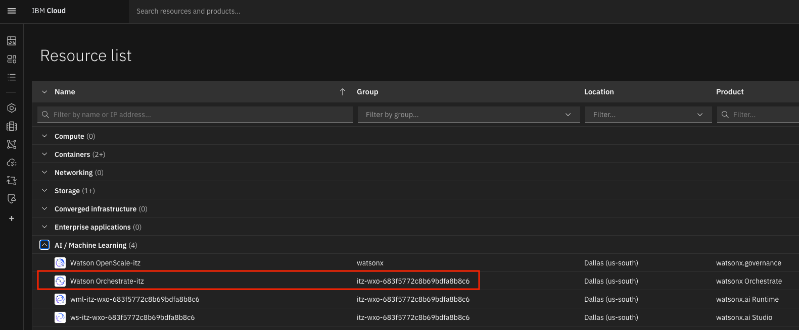

- Click the "Launch watsonx Orchestrate" button.

  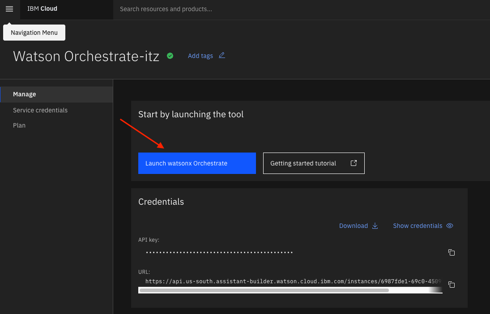

- Welcome to watsonx Orchestrate. Open the hamburger menu, click on **Build**->**Agent Builder**.

  

#### **Create Information Agent**

- Click on **Create Agent**

  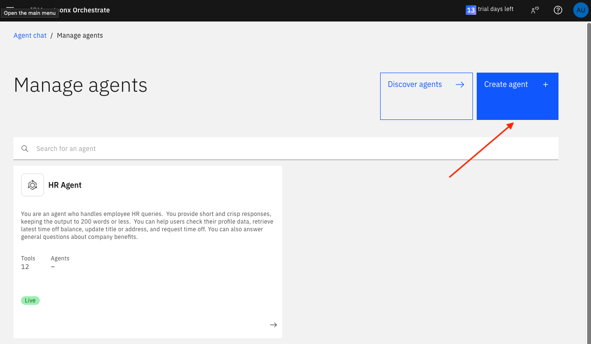

- Follow the steps according to the screenshot below.
  - Select **Create from scratch**
  - Name the agent `information_agent`
  - Use the following description:
    ```
    The Information agent will fetch the news and different articles and use this information to summarize results and share.
    ```
  - Click **Create** 
  

- On the `information_agent` page, take the defaults for **Profile** and **Knowledge** sections. Under the **Toolset** section, click on the **Add tool** button to upload the OpenAPI Spec.

  

- Click on **Import**.

  

- Upload the **duckduckgo.json** OpenAPI Spec which will be provided by the instructor.

  
- Once the file is uploaded, select **Next**.

  

- Select the all of the **Operations** and click **Done**

  

- Go to the **Behavior** section. Add the following for **Instructions**. This will define how the Agent should behave and what it should expect:
  ```
  The Information Agent will use the tool to search for information and return a summarized result.
  ```
  
- Click on **Deploy** to deploy the agent
  

- Test the Agent

  Type this query:
  ```
  Insurance laws for fire in California
  ```
  

- You will get a summarized version of all the search results. You can click on the **Step 1** and see the tool results

  

#### **Create Customer Claims Agent**

- Click on hamburger menu, then **Build**->**Agent Builder**

  

- On the next screen, click on **Create Agent**
  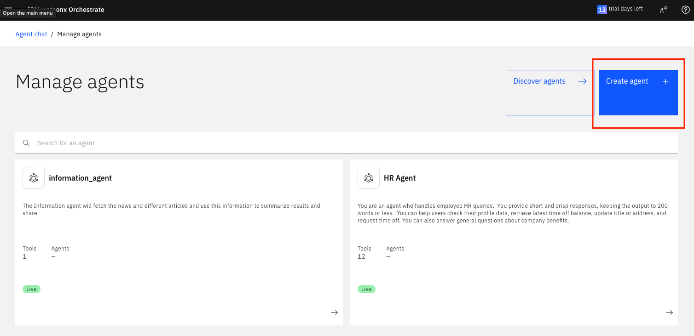

- Follow the steps according the screenshot below
  - Select **Create from scratch**
  - Name the agent `customer_claims_agent`
  - Use the following description:
    ```
    The Customer Claims agent will allow customers to query the status of their claim request and create a new claim request. You will also answer questions based on the claim process and insurance policy using the knowledge base.
    ```
    
  - Click **Create**
- In the **Knowledge** section, add the following to the **Description**:
  ```
  This knowledge base is about insurance and the claim process. This knowledge base will help the customer in getting information about the claims process and the rules and regulations of processing insurance claims.
  ```

- Download [Automobile Insurance Knowledge Base.pdf](<./data/Automobile Insurance Knowledge Base.pdf>) to your local system, then upload by clicking on **Upload files** under **Documents**
  
  
  

- In the **Toolset** section, click on **Add tool** 

  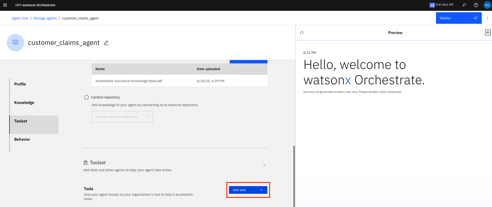

- Click on **Import**. Import the **customer_claims_agent_tools.json** OpenAPI Spec file provided by your instructor

  
  

- Select **Next**

  
- Select all of the **Operations** and click **Done**
  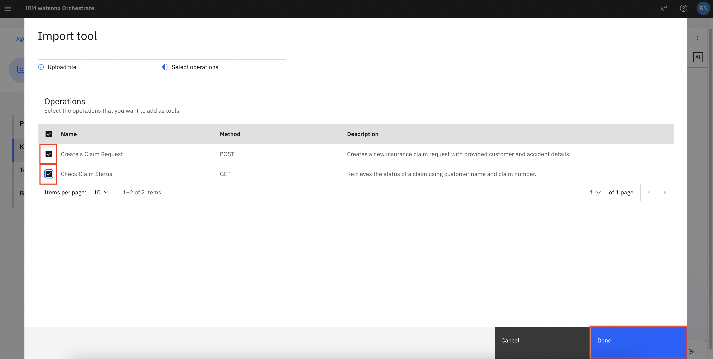

- In the **Behavior** section, add the following prompt to the **Instructions**:

  ```
  Primary Task: Submit a New Claim

  When a user wants to submit a claim, follow these steps:
  1. Collect Required Information (no assumptions)

  Ask the user to provide the following details:
  - Full name (for authentication)
  - The location of the incident
  - The date of the incident
  - Vehicle details and type
  - A detailed description of the incident

  If any of these are missing, pause and request them before continuing.

  2. Request Additional Information (only if not already provided)

  If needed, ask:
  - Were there any damages? What is the estimated cost?
  - Was the incident reported to the police? If yes, what date and time?
  - Were there any medical expenses? If yes, how much?

  Compute the total estimated cost by summing damages and medical expenses.

  3. Create and Use the Claim Request

  Once all necessary information is collected:
  - Create a concise, structured summary of the incident and related details.
  - Use this information as claim_request_details in the Create Claim Request tool.

  After Tool Response – Display to User

  If the tool returns a successful claim:
  - Display the results in a formatted table, with each detail on a new line
  - Highlight the claim number
  - Inform the user: “You will receive a confirmation of your claim request by mail.”

  If the tool returns "customer not found":
  - Respond with: “You are not authorized to submit a claim.”
  - Do not display any additional tool output.

  Claim Status Requests

  If the user asks for claim status:
  1.	Ask for their name and claim number
  2.	Use the appropriate tool to retrieve the claim status
  3.	Display the result in a clean, tabular format
  4.	End the conversation after displaying the claim status

  General Insurance Questions

  If the user asks questions about:
  - Insurance processes
  - Claim eligibility
  - Documentation

  Refer to the “Automobile Insurance Knowledge Base.pdf” only.
  If the answer is not in the knowledge base, reply: “I don’t know.”
  Do not reference the knowledge base while interacting with tools.
  ```
  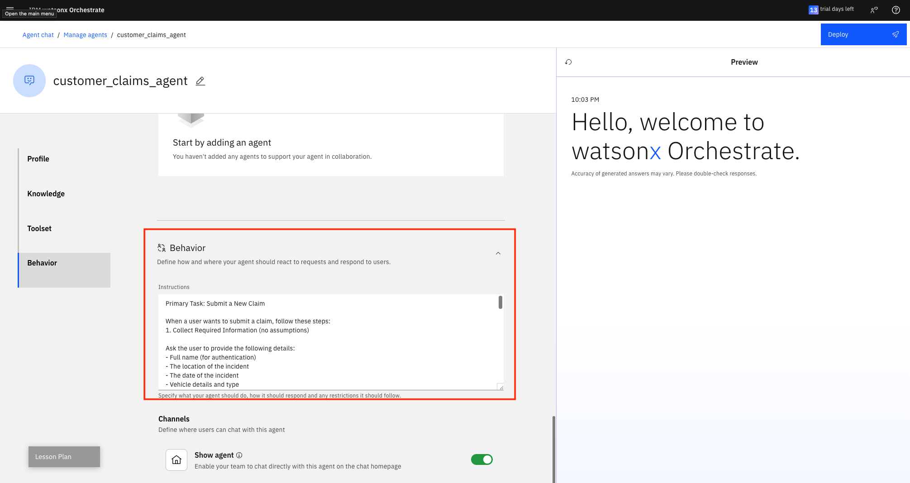

- Click on **Deploy** to deploy the agent

  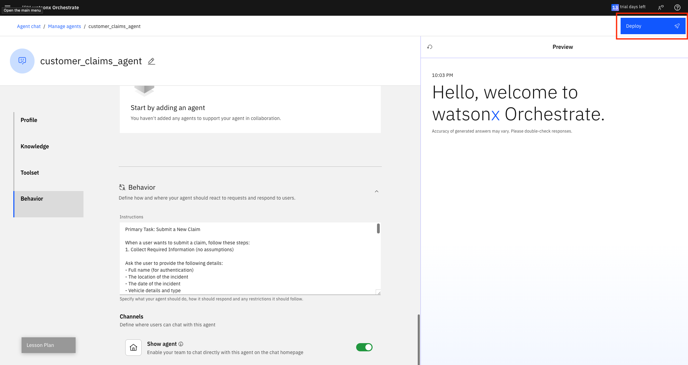

- Test the Agent
  
  1) Enter a basic query:
     ```
     What are the different types of automobile insurance?
     ```
  
     
  
     

  2) Check the flow for creating a new claim

     Enter the following:
     ```
     Submit a new claim
     ```
     

     Enter the name provided to you by the lab instructor from the preloaded database.  Each participant needs to use a different name.

     

     For location, enter `St Mary's Street, San Francisco, California`

     

     For date, enter `23-05-2025`

     

     For vehicle information, enter `Toyota Corolla, 2003`

     

     For details, enter: 
     ```
     I was driving to work when a red pickup truck ran a red light and collided with the rear right side of his vehicle at the intersection. The impact caused the Tata Study Truck to spin slightly, resulting in damage to the rear bumper, right-side tail light, and a dent in the rear quarter panel. I was wearing a seatbelt and did not sustain serious injuries, but reported minor back pain and visited a doctor the same day. Medical expenses were 3400 and the damages repair cost was 4500.
     ```

     

  3) Check the flow for claim status:

     Enter the query

     ```
     Check claim status
     ```

     

     For name, enter `John Smith`

     

     For claim number, enter `CLM187229`

     


#### **Create Claim Processor Agent**

- Click on hamburger menu, then **Builder**->**Agent Builder**.

  

- Click on **Create Agent**

  

- Follow the steps according the screenshot below.
  - Select **Create from scratch**
  - Name the agent `claim_processor_insurance_agent`
  - Use the following description:

    ```
    The Claim Processor agent assists the claim processor to fetch the open claim request, approve, validate and verify the open request. This agent will suggest to the claim processor if they should accept or reject the claim.
    ```

  

- In the **Knowledge** section, add the following to the **Description**:
  ```
  This knowledge base is about insurance and claim process. This knowledge base will help the claim processor in processing the claims according to the rules and regulations defined by the insurance company. 
  ```
- Download [Policy.pdf](<./data/Policy.pdf>) to your local system, then upload by clicking on **Upload files** under **Documents**. 

  
  

- In the **Toolset** section, click on **Add tool**

  

- Click on **Import**

  

- Upload the **claim_processor_agent_tools.json** OpenAPI Spec provided by the instructor

  

  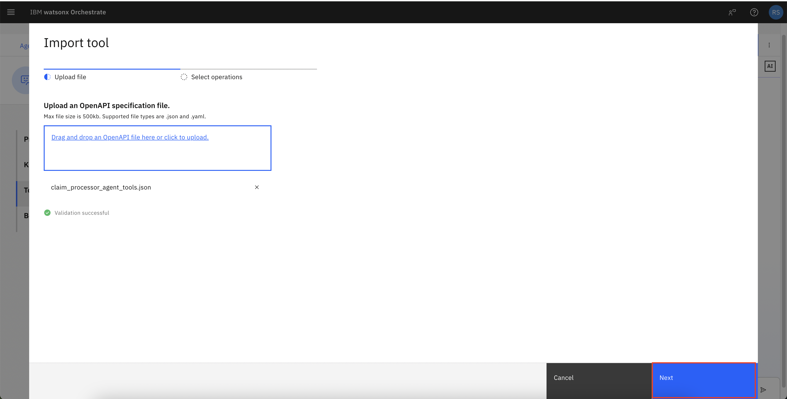

- Select all of the **Operations**. Then, select **Done**.

  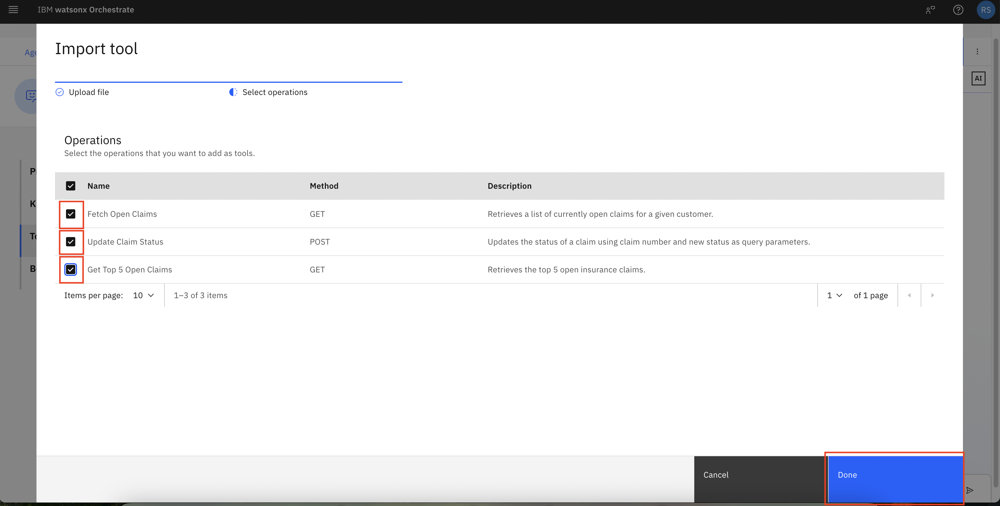

  

- Click on **Add Agent**

  
- Click **Add from local instance**

  

- Select **information_agent** and then the **Add to Agent button**

  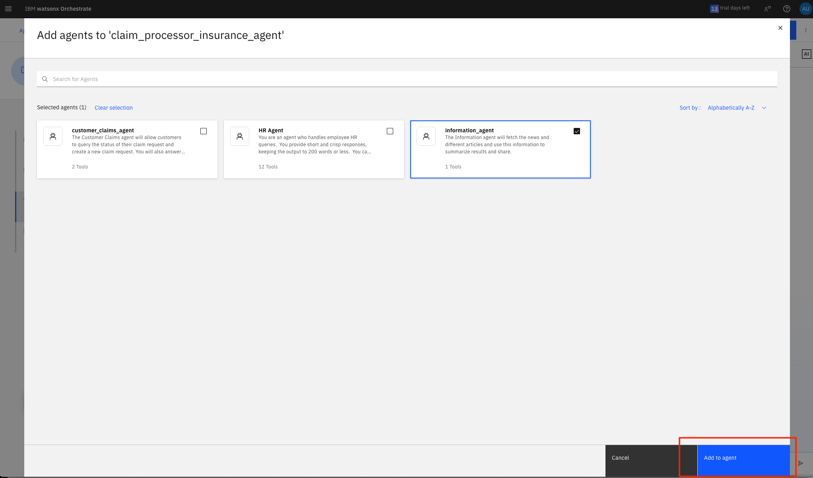

- In the **Behavior** section, add the following for **Instructions**:
  ```
  You will begin by welcoming the claim processor and displaying the open claims in a table. 
  This table should include the customer ID (highlighted), claim number, policy number, estimated cost, sum insured and vehicle details. Do not show duplicates.

  Ask the claim processor to select a customer ID.

  Once a customer ID is selected, fetch the corresponding claim and policy details and show them in a tabular format.
  If there are more than open claims for a customer ID, ask claim processor to select a claim 
  Use the claim number and customer id to fetch details and then generate summary on the following points

  1. Compare the estimated cost with the sum insured and calculate the approved claim amount by subtracting the deductible. Highlight the approved amount.

  2. Check if the policy is currently active and whether the claim falls within the coverage period.

  3. Classify the accident into one of the following types: rear-end collision, head-on collision, side-impact, sideswipe, single-vehicle, multi-vehicle pileup, hit-and-run, parking lot, animal collision, weather-related, mechanical failure-related, vandalism, or theft.

  4. Determine if the classified accident type is covered by the policy. If policy details are not clear, refer to the knowledge base to verify.

  5. It is mandatory for you to use the information_agent to query for the accident type you discovered in step 4. Query: The rules and regulations for accident type in US. Use the result to verify if the claim details are compliant.

  6. Provide a clear recommendation to accept or reject the claim based on these checks.

  7. Highlight the total claim amount (estimated cost minus deductible).

  8. Create a clear and concise summary for the claim processor, emphasizing key details like approved amount, claim number, and policy number.
  HIGHLIGHT ALL THE DETAILS IN NEAR FORMAT.

  Finally, ask the claim processor "Whether they accept the claim?"
  Do not give next steps. 

  Once a decision is made, update the claim status and send a message confirming that emails have been sent to the customer and finance team.
  ```

  

- Click on **Deploy** to deploy the agent

  

- Test the Agent

  1) Enter the basic query

     ```
     Show open claims
     ```

    

  2) Enter a Customer ID

     ```
     60695904
     ```
     

  3) Input Claim Number

     ```
     CLM347697
     ```
     

  4) When prompted to accept the claim respond:

     ```
     Yes
     ```

     

  5) You should see an update confirmation

     

>
> ***You can also test the flow before deploying the agents to AI chat.***
> ***Now, the Agents are deployed.***
> ***You can navigate to AI chat and select the required agent and test the flow.***

## Testing entire the Flow

### Information Agent Flow

- Step 1 : Insurance laws for fire in California

  ```
  Insurance laws for fire in California
  ```


- Step 2 : You will get a summarized version of all the search results, you can click on the Step 1 and see the tool results


### Customer Flow

- Step 1 : Check RAG/ Knowledge base
  "What are the different types of automobile insurance?"

  ```
  What are the different types of automobile insurance?
  ```


- Step 2 : How to check the flow for creating a new claim
  1. Submit a new claim

  ```
  Submit a new claim
  ```

  

  2. Jordan Davenport

  ```
  Jordan Davenport
  ```

  

  3. St Mary's Street, San Francisco, California

  ```
  St Mary's Street, San Francisco, California
  ```

  

  4. 23-05-2025

  ```
  23-05-2025
  ```

  

  5. Toyota Corolla, 2003

  ```
  Toyota Corolla, 2003
  ```

  

  6. I was driving to work when a red pickup truck ran a red light and collided with the rear right side of his vehicle at the intersection. The impact caused the Tata Study Truck to spin slightly, resulting in damage to the rear bumper, right-side tail light, and a dent in the rear quarter panel. I was wearing a seatbelt and did not sustain serious injuries, but reported minor back pain and visited a doctor the same day. Medical expenses were 3400 and the damages repair cost was 4500.

  ```
  I was driving to work when a red pickup truck ran a red light and collided with the rear right side of his vehicle at the intersection. The impact caused the Tata Study Truck to spin slightly, resulting in damage to the rear bumper, right-side tail light, and a dent in the rear quarter panel. I was wearing a seatbelt and did not sustain serious injuries, but reported minor back pain and visited a doctor the same day. Medical expenses were 3400 and the damages repair cost was 4500.
  ```


- Step 3 : How to check the flow for "Checking claim status"
  1. Check claim status

  ```
  Check claim status
  ```

  

  1. John Smith

  ```
  John Smith
  ```

  

  1. CLM187229

  ```
  CLM187229
  ```

  

### Claim Processor Flow

- Step 1 : Show open claims

  ```
  Show open claims
  ```

  

  - Step 2 : Input Customer ID: 60695904

  ```
  60695904
  ```


  - Step 3 : Input Claim Number

 ```
  CLM347697
```
  

  - Step 4 : Yes

  ```
  Yes
  ```

  

  - Step 4 : Shows update confirmation

  

