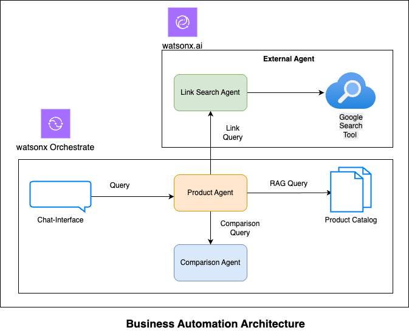

 # 🥇 Business Automation - Competitive Insights 2.0

<!---->

## 🤔 The Problem

ABC Motors Corp's sales department faced challenges in preparing sales proposals for their new line of high performance vehicles. Every time they release a new model, the competitive analysis team spends a great amount of time and resources to deliver their insights. Issues include: 

- Manual research delays decisions and reduces productivity.

- Weak positioning hampers sales differentiation.

- Slow response to market changes without real-time intelligence.

## 🎯 Objective

ABC Motors Corp plans to implement an AI-powered Competitive Intelligence System to automate market research and competitor analysis. This system will help sales teams quickly identify and position their products against competitors, overcoming the inefficiencies of manual research and outdated insights. The goal is to create an AI-enabled system that supports competitive analysis and market research by:

* Extract products from the company’s product catalog.
* Identify and extract key features of each product.
* Search for competitor products based on key attributes.
* Generate a structured competitive comparison table with price, features, and differentiators.
* Perform SWOT Analysis (Strengths, Weaknesses, Opportunities, and Threats) to provide deeper strategic insights.

By automating these tasks, the company aims to accelerate sales processes, improve data accuracy, and enable sales teams to make informed decisions faster.

## 📈 Business Value

* Reduction in manual competitor research time.
* Automated, real-time updates on market competition.
* Improved sales pitch effectiveness

## 🏛 Architecture

To streamline the competitive analysis process, we have designed a Multi-Agent AI Automation System that autonomously extracts and analyzes product data from [ABC Motors Corp's Product Catalog](assets/ABC_Motor_Product_Catalog.pdf). This system leverages a collaborative multi-agent approach, ensuring efficiency, accuracy, and real-time insights for sales and strategy teams. The architecture consists of specialized AI agents working together to perform key functions:
  * To extract products from the product catalog
  * Extract features of the product from the product catalog,
  * Searches for competitor products
  * Generates a structured competitive comparison table
  * Strengths, Weaknesses, Opportunities, and Threats (SWOT) Analysis

This system harnesses the combined power of two Orchestrate agents and one watsonx.ai agent, working seamlessly together to automate competitive research, strengthen sales pitches, and minimize manual effort.

This use case utilizes the capabilities of two Orchestrate agents to extract product-specific information (such as names and features) from the product catalog and to perform product comparisons. These agents are supported by a specialized agent developed in the watsonx.ai Agent Lab, and all are integrated within watsonx Orchestrate. Through the watsonx Orchestrate chat assistant, the agents collaborate and delegate tasks smoothly, delivering comprehensive insights and enabling informed decision-making.

  * **Product Agent** : This agent serves as the entry point for all queries and is designed to search for a specified product, retrieving its details and features in a structured format from the product catalog. It ensures clarity and organization by systematically presenting key product information, making it easy to understand and utilize. Additionally, it delegates tasks to the Link Search Agent and Comparison Agent for further processing.

  * **Link Search Agent** : This agent is expert in finding URLs or links for similar products that share matching features, ensuring users can explore alternatives efficiently.

  * **Comparison Agent** : This agent is designed to compare competitor products using these links, extract key insights, and return a SWOT analysis of all products. The findings should be presented in a well-structured table format, making it easy to understand and compare the information briefly.

> **!IMPORTANT**
> This lab uses a simulator for a Human Capital Management system. However, this could be easily changed to any real system running in production such as Workday or others.

## 📝 Step-by-step Hands-on Lab
You can find step-by-step instructions here :

[Step-by-step hands-on guide](https://github.ibm.com/skol/agentic-ai-client-bootcamp/blob/staging/usecases/business-automation/hands-on-lab-buisness-automation.md)

## Demo Video
We're working on a demo video to showcase the features — coming soon!

It shows how you can implement the use case using watsonx.ai and watsonx Orchestrate. 
