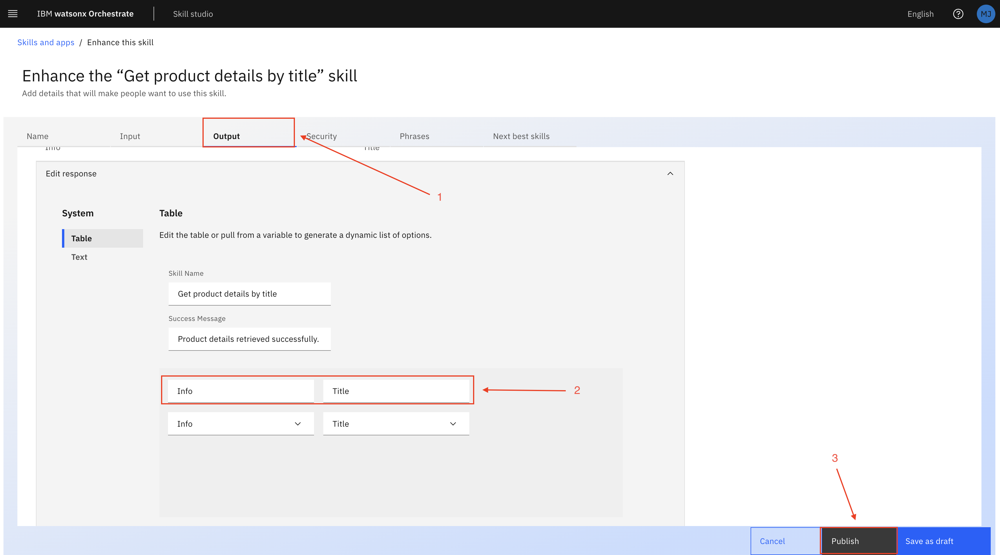

# Use case: Business Automation   

## Table of Contents
- [Introduction](#introduction)
- [Use Case Description](#use-case-description)
- [Adding Custom Skills](#adding-custom-skills)
- [Agent Creation](#agent-creation)
  - [Link Search Agent](#link-search-agent)
  - [Comparison Agent](#comparison-agent)
- [Getting the Space ID for Deployment on Code Engine](#getting-the-space-id-for-deployment-on-code-engine)
- [Deploying Agents on Code Engine](#deploying-agents-on-code-engine)
- [Integration with Watsonx Orchestrate](#integration-with-watsonx-orchestrate)
- [Agent Descriptions](#agent-descriptions)
- [Demo Video](#demo-video) 

## Introduction  

  

## Use Case Description

The sales department of ABC Motor Corp, an automotive large player, when preparing sales proposals, they were spending a lot of time understanding the features of competing products and comparing them with their own products. ABC Motor Corp, needs an automated competitive analysis system to help their sales teams quickly identify and position their products against competitors. Traditionally, gathering competitor insights required extensive manual research, making it inefficient and prone to outdated information. Therefore, the goal of this use case is to create an AI enabled system that support the customer's competitive analysis and market research.

## Adding Custom Skill 

After your instructor has completed the **Product APP** setup, request the server URL from them. Open the [OPEN_API_SPEC File](open_api_spec.json) and replace the default server URL with the one provided.

Now, let's add this JSON file as a skill in **watsonx Orchestrate** by importing it.

Here's the corrected version with proper grammar and clarity:  

---

1. Open the **watsonx Orchestrate** home page and click on the menu icon (hamburger) as shown below.  
     

2. From the menu, select **Skill Studio**.  
     

3. To import the API, click **Create** (marked as 1), then select **Import API** (marked as 2).  
     

4. Click the **From File** tab (marked as 1) and upload the [OPEN_API_SPEC File](open_api_spec.json) (marked as 2).  
     

5. After uploading, confirm that the file name appears (marked as 1), then click **Next** to proceed (marked as 2).  
     

6. Accept the API by selecting the checkboxes (marked as 1), then click **Next** (marked as 2).  
     

7. Once completed, all your skills will appear in **Skill Studio** under **Skills** but will be labeled **Ready to Publish**. You need to publish them before using them.  
     

8. To publish a skill, click on the three vertical dots (marked as 1), then select **Enhance the Skill** (marked as 2).  
     

9. In the **Get Product Detail by Title** skill, some configurations are needed. Click on the **Output** tab (marked as 1), then scroll down to the **Table** section. At the bottom of the table, enter the name of your variable, which will be displayed on the chat screen (marked as 2). Then, click the **Publish** button to publish your skill (marked as 3).  
     

10. Once your **Get Product Detail by Title** skill is published, click on the three vertical dots (marked as 1) again and select **Enhance the Skill** to publish it.  
     

11. For the **Get Product Title** skill, simply click **Publish**—no changes are required.  
     

12. Once all skills are published, their status will change to **Published**.  
     

13. Now, we need to add our skills from the **Skill Catalog**. Click on the hamburger menu and select **Skill Catalog**.  
     

14. In the search bar, type **Product** (marked as 1) and select **Product Information API** (marked as 2).  
     

15. To add the skill, you first need to connect the API. Click on **Connect**.  
     

16. Enter the API key to connect the app (use your TechZone instance API key) (marked as 1), then click **Connect App** (marked as 2).  
     

17. After connecting the API, it will show as **Connected**.  
     

18. Now, we need to connect the app from the **Skill Set** as well. Click on the hamburger menu and select **Skill Set**.  
     

19. On the **Skill Set** page, search for **Orchestrate Agent Skillset**.  
     

20. In the **Connections** tab (marked as 1), search for **Product Information API** by navigating through the pages. Click on the three vertical dots and select **Connect App**.  
     

21. Click **Connect App** as shown below.  
     

22. Enter the API key (TechZone API key) (marked as 1) and click **Connect App** (marked as 2).  
     

23. Once connected, the API will display the user's email ID in the **Connected By** column.  
     

24. Since we have connected the app from the **Skill Set**, we now need to add the skill to the chat. Open the hamburger menu and select **AI Agent Configurations**.  
     

25. Click on **Apps and Skills** (marked as 1), then select **Product Information API** (marked as 2).  
     

26. Add both API-related skills to the chat as shown below.  
     

27. First, add the **Get Product Details by Title** skill by clicking **Add to Chat**.  
     

28. Do not change the description; keep it as shown in the image below, then click **Add Skill**.  
     

29. Next, add the **Get Product Titles** skill to the chat.  
     

30. Once both skills are connected, it will look like this:  
     

31. From the hamburger menu, navigate to **Chat**.  
     

32. You can now interact with the skills as shown below.  
     

Note before starting the Agent creation make sure you have generated your project Id and API key refer [api_key_project_id_setup.md](http:)

## Agent Creation  
We will create three agents as part of this setup:  
1. **Link Search Agent**  
2. **Comparison Agent**  

Let's start with the **Link Search Agent**.     

### Link Search Agent  
#### Setup  
- Enter a **name** for the agent as shown in the image.  
- Add a **description** (optional).  

  

#### Configuration  
- Enter the **Instructions** as shown in the image. These instructions guide your agent on what tasks it should perform.  
- Choose **LangGraph** as the framework.  
- Select **ReAct** as the architecture.  

  

#### Tools  
- Select **Google Search** as the tool to gather data.  

  

Once the agent is created, test it on the right-hand side of the chat section, as shown in the image below.  

Click on the **Save As** button to save your agent (marked as number 1 in the image). Then, click on the **Deploy** button to deploy the agent (marked as number 2 in the image). Deployment may take 1-2 minutes.  

  

Follow these steps to successfully create the Link Search Agent.  

---

### Comparison Agent  
#### Setup  
- Enter a **name** for the agent as shown in the image.  
- Add a **description** (optional).  

  

#### Configuration  
- Enter the **Instructions** as shown in the image. These instructions guide your agent on what tasks it should perform.  
- Choose **LangGraph** as the framework.  
- Select **ReAct** as the architecture.  

  

#### Tools  
- Select **Google Search** as the tool to gather data.  

  

Once the agent is created, test it on the right-hand side of the chat section, as shown in the image below.  

Click on the **Save As** button to save your agent (marked as number 1 in the image). Then, click on the **Deploy** button to deploy the agent (marked as number 2 in the image). Deployment may take 1-2 minutes.  

  

Follow these steps to successfully create the Comparison Agent.

## Getting the Space ID for Deployment on Code Engine

To deploy your agent on Code Engine, follow the steps available in instruct lab how to deploy your agents to get your Space ID:

### Space ID

1. Go to the home page of Agent Lab. 
   

2. Click the hamburger menu and choose Deployment.
  

3. On the Deployment page, find Deployment Space and click on it.
  

4. Click on the Manage tab and copy your Space ID.
 

### Deployment

On the Deployment Space page, select the agent. It will take you to the deployment page, where you can get the Deployment ID.

Repeat the same step for all the agents, as shown in the image below

## Deploying Agents on Code Engine

Please refer to the [Code Engine instructor](https://github.ibm.com/skol/agentic-ai-client-bootcamp-instructors/blob/main/environment-setup/external-agent-builder/Readme.md) guide for deployment instructions. Once you obtain the deployment link, kindly open it.

You will reach the page shown in the image below. Follow these two steps to generate the Bearer Token:

1. Enter the Deployment ID and Space ID, then click on the Generate Token button.

2. Copy the Bearer Token.

The Space ID remains constant for all agents, but each Deployment ID has a unique Bearer Token.

Repeat these steps for all the remaining agents to get their respective Bearer Tokens.

## Integration with Watsonx Orchestrate

1. Go to the home page of Watsonx Orchestrate.

2. Click the hamburger menu and choose AI Agent Configuration.

3. On the Configuration page, select Agents.

4. On the Agents page, click the New Agent button.

5. Enter all the details as shown in the image and select "Bearer Token" instead of "API Key."

6. Click the Connect button to integrate the agents with Watsonx Orchestrate.

Repeat these steps for all the remaining agents to integrate them in Watsonx Orchestrate.

## Agent Descriptions

1. Link Search Agent: This agent is an expert in finding URLs or links for similar products that share matching features, ensuring users can explore alternatives efficiently.

2. Comparison Agent: This agent is designed to compare the given data with additional information gathered from Google search results. Its task is to carefully analyze the input data, extract key insights, and identify both differences and similarities. The findings should be presented in a well-structured table format, making it easy to understand and compare the information at a glance.

After completing the integration, your flow will appear as shown below.

## Demo Video

