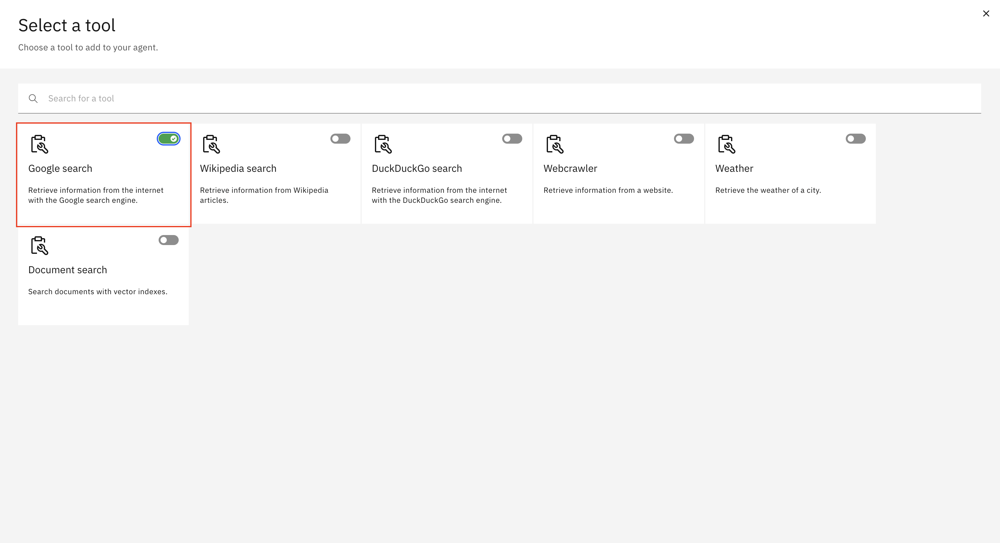

# 👨🏻‍💻 Use case: Business Automation   

## Table of Contents
- [Architecture](#architecture)
- [Use Case Description](#use-case-description)
- [Adding Custom Skills](#adding-custom-skills)
- [Agent Lab](#agent-lab)
  - [Link Search Agent](#link-search-agent)
  - [Comparison Agent](#comparison-agent)
- [Getting the Space ID for Deployment on Code Engine](#getting-the-space-id-for-deployment-on-code-engine)
- [Deploying Agents on Code Engine](#deploying-agents-on-code-engine)
- [Integration with Watsonx Orchestrate](#integration-with-watsonx-orchestrate)
- [Experience Skills & Agents in Action](#experience-skills--agents-in-action)
- [Demo Video](#demo-video) 

## 🏛Architecture  

  

## Use Case Description

The sales department of ABC Motor Corp, an automotive large player, when preparing sales proposals, they were spending a lot of time understanding the features of competing products and comparing them with their own products. ABC Motor Corp, needs an automated competitive analysis system to help their sales teams quickly identify and position their products against competitors. Traditionally, gathering competitor insights required extensive manual research, making it inefficient and prone to outdated information. Therefore, the goal of this use case is to create an AI enabled system that support the customer's competitive analysis and market research.

## Pre-requisites

- Check with your instructor to make sure **all systems** are up and running before you continue.
- If you're an instructor running this lab, check the **Instructor's guides** to set up all environments and systems.

## Adding Custom Skills 

After your instructor has completed the **Product APP** setup, request the server URL from them. Open the [OPEN_API_SPEC File](https://github.ibm.com/skol/agentic-ai-client-bootcamp/blob/main/usecases/business-automation/assets/open_api_spec.json) and replace the default server URL with the one provided.


Now, let's add this JSON file as a skill in **watsonx Orchestrate** by importing it.

Here's the corrected version with proper grammar and clarity:  

---

1. Open the **watsonx Orchestrate** home page and click on the menu icon (hamburger) as shown below.  
     

2. From the menu, select **Skill Studio**.  
     

3. To import the API, click **Create** (marked as 1), then select **Import API** (marked as 2).  
     

4. Click the **From File** tab (marked as 1) and upload the [OPEN_API_SPEC File](open_api_spec.json) (marked as 2).  
     

5. After uploading, confirm that the file name appears (marked as 1), then click **Next** to proceed (marked as 2).  
     

6. Accept the API by selecting the checkboxes (marked as 1), then click **Next** (marked as 2).  
     

7. Once completed, all your skills will appear in **Skill Studio** under **Skills** but will be labeled **Ready to Publish**. You need to publish them before using them.  
     

8. To publish a skill, click on the three vertical dots (marked as 1), then select **Enhance the Skill** (marked as 2).  
     

9. In the **Get product details by title** skill, click the **Publish** button to publish your skill.  
     

10. Once your **Get product details by title** skill is published, click on the three vertical dots (marked as 1) again and select **Enhance the Skill** to publish it.  
     

11. For the **Get product titles** skill, simply click **Publish**—no changes are required.  
     

12. Once all skills are published, their status will change to **Published**.  
     

13. Now, we need to add our skills from the **Skill Catalog**. Click on the hamburger menu and select **Skill Catalog**.  
     

14. In the search bar, type **Product** (marked as 1) and select **Product Information API** (marked as 2).  
     

15. To add the skill, you first need to connect the API. Click on **Connect**.  
     

16. Enter any dummy value to connect the app (marked as 1), then click **Connect App** (marked as 2).  
     

17. After connecting the API, it will show as **Connected**.  
     

18. Now, we need to connect the app from the **Skill Set** as well. Click on the hamburger menu and select **Skill Set**.  
     

19. On the **Skill Set** page, search for **Orchestrate Agent Skillset**.  
     

20. In the **Connections** tab (marked as 1), search for **Product Information API** by navigating through the pages. Click on the three vertical dots and select **Connect App**.  
     

21. Click **Connect App** as shown below.  
     

22. Enter any dummy value (marked as 1) and click **Connect App** (marked as 2).  
     

23. Once connected, the API will display the user's email ID in the **Connected By** column.  
     

24. Since we have connected the app from the **Skill Set**, we now need to add the skill to the chat. Open the hamburger menu and select **AI Agent Configurations**.  
     

25. Click on **Apps and Skills** (marked as 1), then select **Product Information API** (marked as 2).  
     

26. Add both API-related skills to the chat as shown below.  
     

27. First, add the **Get product details by title** skill by clicking **Add to Chat**.  
     

28. Do not change the description; keep it as shown in the image below, then click **Add Skill**.  
     

29. Next, add the **Get product titles** skill to the chat.  
     

30. Once both skills are connected, it will look like this:  
     

31. From the hamburger menu, navigate to **Chat**.  
     

32. You can now interact with the skills as shown below.  
     

Before starting the Agent creation, ensure you have generated your project ID and API key. Refer to [api_key_project_id_setup.md](https://github.ibm.com/skol/agentic-ai-client-bootcamp/blob/main/environment-setup/api_key_project_id_setup.md) for guidance.

## Agent Lab 

We will create two agents as part of this setup:  
1. **Link Search Agent**  
2. **Comparison Agent**  

From the Home page of Agnet Lab, click on the 
Build an AI agent to automate tasks

 

Let's start with the **Link Search Agent**. 

### Link Search Agent  
#### Setup  
1. Enter a **name** for the agent as shown in the image.
2. Add a **description** (optional).
  

#### Configuration    
1. Choose **LangGraph** as the framework.  
2. Select **ReAct** as the architecture. 
3. Enter the **Instructions** as shown in the image. These instructions guide your agent on what tasks it should perform. You can use below prompt for it.
```
You are a skilled assistant specialized in locating URLs for similar products with matching features. Provide a maximum of three URLs with name of the product.
```
  


> **Note:** The Google Search Tool is added by default to the Agent. However, if you accidentally click the delete icon, follow the Tool steps below. Otherwise, you can skip this.

#### Tools  

1. Click on the Add Tool.


2. Select **Google Search** as the tool to gather data.  
  

#### Saving and Deploying
1. Once the agent is created, test it on the right-hand side of the chat section, as shown in the image below.
2. Click on the **Save As** button to save your Agent
3. click on the **Deploy** button to deploy the agent.
 
4. After clicking on the save as button select Agent (marked as 1) and Click Save ((marked as 2))

5. After clicking the deployoment button make sure your Targeted deployemnt has been seleceted if not please select it.(marked as 1), click Deploy to deploy the agent (marked as 2)


Follow these steps to successfully create the Link Search Agent.  

---

### Comparison Agent 
For this agent, follow the same steps outlined in the [Link Search Agent](#link-search-agent). However, for the Instructions specific to the Comparison Agent, use the prompt below while keeping all other steps unchanged.
```
You are an expert of automobile industry combining given details present in your context window. You have to use the given links to generate the comparison. Your task is to analyse and compare products on the following parameters strictly: Range, Pricing, Acceleration, Top Speed, Interior and Safety Features If a parameter is not applicable, mark it as N/A. Additionally, perform a SWOT analysis of top products (Strengths, Weaknesses, Opportunities, and Threats) Present the comparison in 3 tables one for the comparison , second for the rating numerical rating (X/5) and a star rating (★ out of ★★★★★) for each parameter  and  third for the SWOT analysis. Give heading to each table . After every table give two divider.
```
---
## Getting the Space ID for Deployment on Code Engine

To deploy your agent on Code Engine, follow the steps available in instruct lab how to deploy your agents to get your Space ID:

### Space ID

1. Go to the home page of Agent Lab. 
   

2. Click the hamburger menu and choose Deployment.
  

3. On the Deployment page, find Deployment Space tab (marked as 1) and then click on your deployment space(marked as 2).
  

4. Click on the Manage tab and copy your Space ID.
 

### Deployment

1. On the Deployment Space page, select the Asset. This will take you to the deployment page, where you can obtain the Deployment ID. Wait until your Agent is fully deployed.  
  

2. After deployment, the status will change to **Deployed**.  
  

3. Retrieve the Deployment ID from the URL.  
  

Repeat these steps for Comparison Agent.

## Deploying Agents on Code Engine

For deployment, you need a Code Engine URL, which you can request from your instructor. Once you receive the deployment link, please open it.

You will reach the page shown in the image below. Follow these two steps to generate the Bearer Token:

1. Enter the Deployment ID, Space ID, API-KEY and Wastsonx URL then click on the Generate Token button.


2. Copy the Bearer Token.


The Space ID remains constant for all agents, but each Deployment ID has a unique Bearer Token.

Repeat these steps for Comparison Agent to get its respective Bearer Tokens.

## Integration with Watsonx Orchestrate

1. Go to the home page of Watsonx Orchestrate.


2. Click the hamburger menu and choose AI Agent Configuration.


3. On the Configuration page, select Agents.


4. On the Agents page, click the Add Agent button.


5. Enter all the details as shown in the image and select "Bearer Token" instead of "API Key."

   Add this in description 
   ```
   This agent is an expert in finding URLs or links for similar products that share matching features, ensuring users can explore alternatives efficiently.
   ```
   

6. Click the Connect button to integrate the agents with Watsonx Orchestrate.
   

Repeat these steps for Comparison Agent to integrate it in watsonx Orchestrate.

For comparison Agent use the below description

```
This agent is designed to compare the given data with additional information gathered from Google search results. Its task is to carefully analyze the input data, extract key insights, and identify both differences and similarities. The findings should be presented in a well-structured table format, making it easy to understand and compare the information at a glance.
```
## Experience Skills & Agents in Action
After completing all the steps mentioned above, you can interact with this use case:  

1. **Response from the Product Catalog Skill**  
     

2. **Response from the Link Search Agent**  
     

3. **Response from the Comparison Agent**  
     
   

## Demo Video


