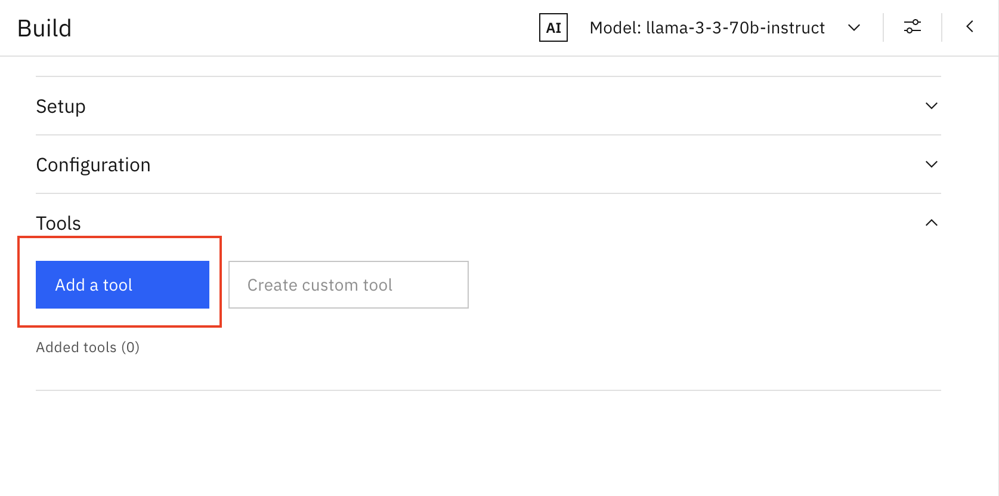
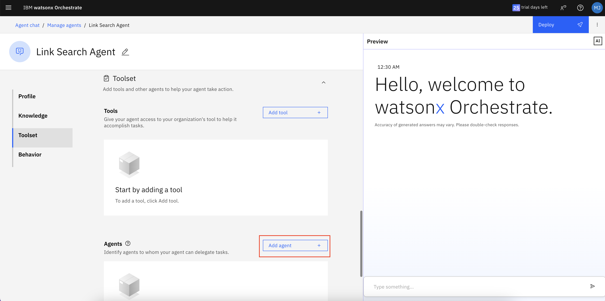
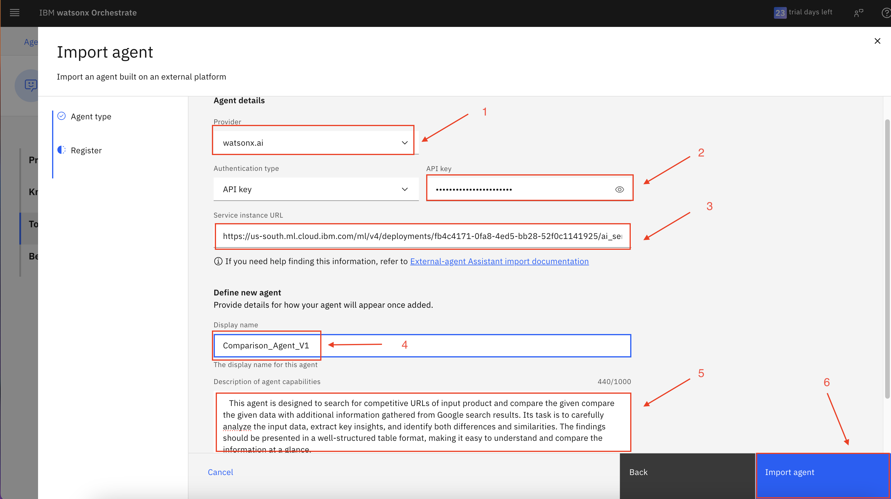
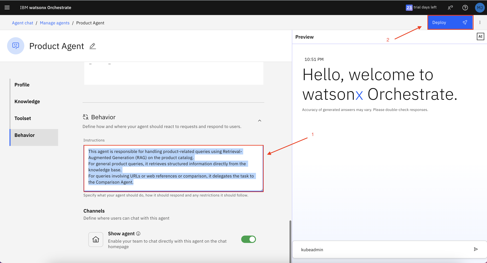

# 👨🏻‍💻 Use case: Business Automation   

## Table of Contents
- [Architecture](#-architecture)
- [Use Case Description](#use-case-description)
- [Pre-requisites](#pre-requisites)
- [Agent Lab - watsonx.ai](#agent-lab---watsonxai)
  - [Link Search Agent](#link-search-agent)
    - [Setup](#setup)
    - [Configuration](#configuration)
    - [Tools](#tools)
    - [Saving and Deploying](#saving-and-deploying)
- [Deploying watsonx.ai's External-Agent on Orchestrate](#deploying-watsonxais-external-agent-on-orchestrate)
- [Orchestrate Agent](#orchestrate-agent)
  - [Comparison Agent](#comparison-agent)
  - [Product Agent](#product-agent)
- [Experience Agents in Action](#experience-agents-in-action)


## 🏛 Architecture  


## Use Case Description

The sales department of ABC Motor Corp, an automotive large player, when preparing sales proposals, they were spending a lot of time understanding the features of competing products and comparing them with their own products. ABC Motor Corp, needs an automated competitive analysis system to help their sales teams quickly identify and position their products against competitors. Traditionally, gathering competitor insights required extensive manual research, making it inefficient and prone to outdated information. Therefore, the goal of this use case is to create an AI enabled system that support the customer's competitive analysis and market research.

## Pre-requisites

- Check with your instructor to make sure **all systems** are up and running before you continue.
- If you're an instructor running this lab, check the **Instructor's guides** to set up all environments and systems.

## Agent Lab - watsonx.ai

>**Note:** Before starting the Agent creation, ensure you have generated your API key of watsonx.ai instance. 

We will create one agent **Link Search Agent** in watsonx.ai's Agent Lab as part of this setup:  

From the Home page of Agent Lab, click on the Build an AI agent to automate tasks

 

Let's start the **Link Search Agent**. 

### Link Search Agent  
#### Setup  
1. Enter a **name** for the agent as shown in the image.
2. Add a **description** (optional).
```
Agent specialised for searching URLs on the internet.
```
  

#### Configuration    
1. Choose **LangGraph** as the framework.  
2. Select **ReAct** as the architecture. 
3. Enter the **Instructions** as shown in the image. These instructions guide your agent on what tasks it should perform. You can use below prompt for it.
```
You are a skilled assistant specialized in locating URLs for similar products with matching features. Provide a maximum of three URLs with name of the product.
```
  


> **Note:** The Google Search Tool is added by default to the Agent. However, if you accidentally click the delete icon, follow the Tool steps below. Otherwise, you can skip this.

#### Tools  

1. Click on the Add Tool.


2. Select **Google Search** as the tool to gather data.  
  

#### Saving and Deploying
1. Once the agent is created, test it on the right-hand side of the chat section, as shown in the image below.
2. Click on the **Save As** button to save your Agent
3. click on the **Deploy** button to deploy the agent.
 
4. After clicking on the save as button select Agent (marked as 1) and Click Save ((marked as 2))

5. After clicking the deployoment button make sure your Targeted deployemnt has been seleceted if not please select it.(marked as 1), click Deploy to deploy the agent (marked as 2)


Follow these steps to successfully create the Link Search Agent.  

## Deploying watsonx.ai's External-Agent on Orchestrate

To deploy your agent on Orchestrate, follow the steps below: 

1. Go to the homepage of watsonx.ai Agent Lab.


2. Click on the hamberger menu and select **Deployments**.  


3. Click on the **Spaces** tab and select the space where you deployed the agent.  


4. Click on the **Assets** tab and select the agent.  


5. Then you will go the the main deployment page select your agent from the list.


6. Then copy the public endpoint


7. Now, go to the Orchestrate home page, click on the hamburger menu (☰), select Build, and then choose Agent Builder.


8. Click on the Create Agent button.


9. Select Create from scratch (as shown in image 1 below), enter your agent’s name (as shown in image 2), provide a description (as shown in image 3), and then click the Create button (as shown in image 4).

**Description:**
   ```
   The agent is specialized in searching for relevant URLs on the web based on the input query. It scans online sources to find useful links that can support product research, comparisons, or other business needs.
   ```
      

10. After the agent is created, you will be redirected to the agent configuration page.


11. Scroll down to the Toolset section, then under Agents, click on the Add Agent button.


12. Select the import option.


13. On the next page, ensure that External Agent is selected (as shown in image 1 below). If it’s not already selected, please choose it, then click the Next button (as shown in image 2).
 

14. On the next page, enter the following information:
      1. API key: Enter the watsonx.ai API key.
      2. Service instance URL: Enter the public endpoint URL of the agent that we copied in step 6.
      3. Display name: Enter the name of the agent.
      4. Description: Enter the below description.
      5. Click on the Import Agent button.

**Description:**
   ```
   This agent is skilled in locating URLs for similar products with matching features. A maximum of three URLs should be provided, each accompanied by the product name.
   ```
   

15. You can confirm that your agent has been successfully imported if it appears under the Agents section within the Toolset.


16. Once the agent is created , test it on the right-hand side of the chat section, as shown in the image below and click the deploy button to publish it.
 

## Orchestrate Agent

In Orchestrate, we will create two agents, as outlined below:

1. Comparison Agent
2. Product Agent


### Comparison Agent

1. Go to the Orchestrate home page, click on the hamburger menu (☰), select Build, and then choose Agent Builder.


2. Click on the Create Agent button.


3. Select Create from scratch (as shown in image 1 below), enter your agent’s name (as shown in image 2), provide a description (as shown in image 3), and then click the Create button (as shown in image 4).

   For comparison Agent use the below description

   ```
   This agent is designed to compare the given data with additional information gathered from Google search results. Its task is to carefully analyze the input data, extract key insights, and identify both differences and similarities. The findings should be presented in a well-structured table format, making it easy to understand and compare the information at a glance.
   ```
   

4. After the agent is created, navigate to the Agent Configuration page. Scroll down to the Behavior section, add the description shown in image as 1, and then click the Deploy button as shown in image as 2.

   For comparison Agent use the below description in Behavior Section

   ```
   You are an expert of automobile industry combining given details present in your context window. You have to use the given links to generate the comparison. Your task is to analyse and compare products on the following features strictly: Range, Pricing, Acceleration, Top Speed, Interior and Safety Features If a feature is not applicable, mark it as N/A. Additionally, perform a SWOT analysis of top products (Strengths, Weaknesses, Opportunities, and Threats) Present the comparison in 3 tables one for the comparison , second for the rating numerical rating (X/5) and a star rating (★ out of ★★★★★) for each feature  and  third for the SWOT analysis. Give heading to each table . After every table give two divider.

   Instructions:

   1. Title for Table 1: Feature Comparison
   2. Title for Table 2: Rating Comparison
   3. Make sure that the Rating Comparison table has both the numerical(X/5) and star rating(★ out of ★★★★★)
   4. The products should be the column names in all the tables.
   5. The font size of the Table Title should be 40% bigger as compared to the rest of the text.
   6. Add appropriate space between each section in the table.
   ```
   

### Product Agent

1. Go to the Orchestrate home page, click on the hamburger menu (☰), select Build, and then choose Agent Builder.


2. Click on the Create Agent button.


3. Select Create from scratch (as shown in image 1 below), enter your agent’s name (as shown in image 2), provide a description (as shown in image 3), and then click the Create button (as shown in image 4).

   For Product Agent use the below description
        
   ```
   This agent is designed to search for a specified product and retrieve its details and features using Retrieval-Augmented Generation (RAG) on the product catalog. It presents the information in a clear and structured format, ensuring systematic organization of key product data, making it easy to understand and use.
   ```
   

4. After the agent is created, navigate to the Agent Configuration page.

   **Description:**
   ```
   Your knowledge base is the document that contains all the product-related information. All queries related to the product will be addressed using this document as the primary source.
   ```
   

5. Scroll down to the Knowledge section, then in the Document section, click on the Upload file button nad upload the product catalog.


6. Scroll down to the Toolset section, then in the Agents section click on the Add Agent button.


7. From the pop-up menu, select the Add from local instance option.


> **Note:** : We are now adding the Link Search Agent (an external agent) and the Comparison Agent to the Product Agent, enabling it to delegate tasks to them.

8. Then, select the Comparison Agent (as shown in image 1) and the Link Search Agent [External Agent] (as shown in image 2). After selecting both, click the Add to agent button to include them (as shown in image 3).


9. Once the delegated agents are added, they will appear as shown in the image below.


10. Scroll down to the Behavior section, add the description shown in image as 1, and then click the Deploy button as shown in image as 2.

      For Product Agent use the below description in Behavior Section.

      ```
      This agent is responsible for handling product-related queries using Retrieval-Augmented Generation (RAG) on the product catalog.

      For general product queries, it retrieves structured information directly from the knowledge base.

      For queries involving URLs or web references, it delegates the task to the Link Search Agent.

      For product comparison queries, it forwards the request to the Comparison Agent.

      This delegation ensures that each query type is handled by the most suitable agent, improving accuracy and efficiency.
      ```
      

> **Note:** : The Product Agent is now ready to handle product-related queries, delegating tasks to the Link Search Agent and Comparison Agent as needed.

## Experience Agents in Action
Follow the steps above, then try interacting with the use case using these sample queries:

1. Product Agent

   Ask the following questions to get responses from the Product Agent:
   ```
   Q1: What are the products of ABC Motors.
   Q2: Get me the info of Velocity S1.
   ```
     

2. Link Search Agent

   Use this query to retrieve competitor links:
   ```
   Provide me the links of 4 competitors of above product.
   ```
   

3. Comparison Agent

   To compare the retrieved data, ask:
   ```
   Give me the comparison of above data.
   ```
     
   

Now, explore and experience the power of Skills & Agents in action! 🚀 
