# Use case: Intelligent AI Assistant

## Table of Contents

- [Use case: Intelligent AI Assistant](#use-case-intelligent-ai-assistant)
  - [Table of Contents](#table-of-contents)
  - [Introduction](#introduction)
  - [Sample Use case description](#sample-use-case-description)
  - [Agent Lab - Creating your first agent](#agent-lab---creating-your-first-agent)
    - [Define a custom tool](#define-a-custom-tool)
    - [Deploy your agent](#deploy-your-agent)
  - [CodeEngine (to be removed later)](#codeengine-to-be-removed-later)
  - [watsonx Orchestrate](#watsonx-orchestrate)
    - [AI agent configuration](#ai-agent-configuration)
    - [Assistant Builder](#assistant-builder)
  - [Summary](#summary)

## Introduction
This use case describes a scenario where a user leverages an AI assistant via chat / natural language interface, to help with the execution of tasks that require the selection of the right agent to satisfy each request.

Agents can be configured in the system and will be selected if they satisfy the taks at hand, based on their description.

Each agent, in turn, is connected with an LLM that support function calling, so that it can leverage one or more tools, again based on each tool's description.

We will show you how to build a sample of this scenario in two stages:
1. Use the watsonx.ai Agent Lab low-code tool to define an agent that leverages a set of tools. One of the tools is a custom tool for which we will add Python code that implements its function (which is calling a REST API to a public service on the Internet). We then deploy this agent in watsonx.ai, so that it can be invoked from the AI assistant, which we build in Stage 2.
2. Use the watsonx Orchestrate Assistant Builder tool to define an assistant that gets exposed as a chat frontend. We will also define one or more agents that the assistant can use to answer the user's request.

<div style="border: 2px solid black; padding: 10px;">
Even though we will take you through a complete and working example, you should also consider making changes that fit your desired use case better, and only take this description as a reference point that guides you along your own implementation.
</div>

## Sample Use case description

In our example, we are looking at the persona of a warehouse manager who wants to manage arrivals and departures of product at the docks of a particular warehouse. 

We envision two phases in which this can be rolled out: in the first phase, the user actively guides the system along the intended path of action. For example, we can ask the system about the status of a specific dock, to retrieve the current number and ID of trucks loading and unloading, as well as details about the products they contain. As a next step, we ask the system to make recommendations about the handling of a certain product that is in surplus. In response, the system will make a recommendation that is most cost effective. The user can then instruct the system to follow the recommendation - or take any other action, of course. The system will notify the user when the change has been made, other stakeholders have been notified (say, by email), and update the overall status of the warehouse inventory. 

There is an argument to be made that a truly agentic solution would show a higher degree of autonomy. To address a particular problem, or ask, an agentic solution will make a plan, then start executing this plan, checking its effectiveness towards a good outcome nad possibly revise the plan accordingly, all in an automated fashion and without human intervention. Applying that to the scenario described above, we simply take out the "human in the loop", by letting the system analyze the status of the dock, decide what to do with surplus product, notify stakeholders of the decision (say, return surplus to original warehouse), and update systems of record. The flow will fundamentally be the same, and it can use the same set of agents, but will add a controller of sorts on top.

In this exercise, we will take you through a rudimentary implementation of the first stage, because we believe that is realistically what enterprises will do in the near future. But it provides a path to mature to the second phase.

## Agent Lab - Creating your first agent

For the first stage of implementation of our agentic solution, we use the watsonx.ai Agent Lab tool. 
> Note that this feature is currently in beta, so its design may change from the screenshots you see below.

We assume you are logged into your watsonx.ai environment, and created a project that will hold the assets you create. If you haven't done so, go ahead and create a project - and don't forget to associate it with your watsonx.ai Runtime instance.

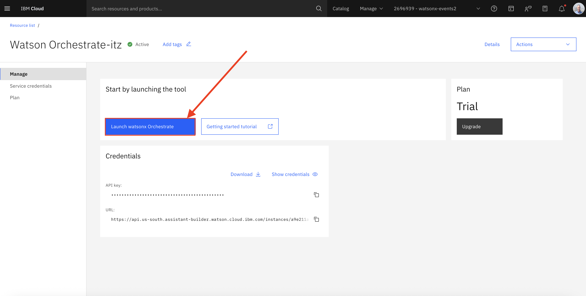

An agent built with Agent Lab is stored in the project as an asset. Thus, to create a new agent, click on the `New Asset` button in the Assets view of the project. Find and select the tile saying `Build an AI agent to automate tasks`.


This opens up the Agent Lab user interface. To make sure you won't forget later, and also to make sure things are saved in case you get logged out of the system unexpectedly, we recommend you immediately go and save the asset, even though you haven't made any changes yet. Click on the `Save as` option at the top right of the screen.

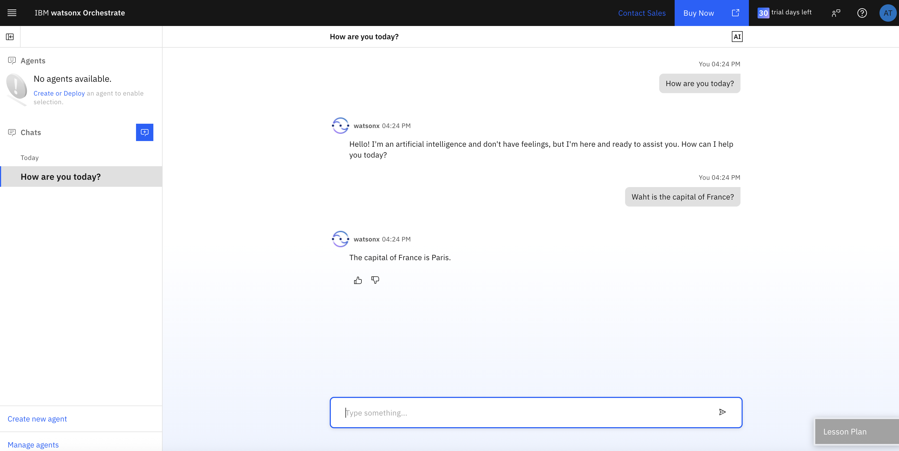

At this point, we will not generate any notebook form it, since we are only just starting. So, save it as an Agent. Note how it will not let you pick a name for your asset, it will be listed as `watsonx Agent` in your project.


After saving it, you will see that the `Autosave on` option is enabled. his ensures none of the changes you are making will get lost.
Now you can study what the tool offers: 
- In the Setup section, you can change the name of your agent and add a meaningful description. We recommend you do change the name. Since we are typically working in shared environments, even if within your own personal project, it is a good practice to give the asset a somewhat unique name, for example, by prefixing it with your name.
- Other elements in the Setup section are not relevant in our case, since we will use this agent from within an AI Assistant running in watsonx Orchestrate.
- In the Configuration section you can choose the architecture and framework for this agent. At the moment, there is only one option for each. Note that the framework we use to implement the agent is LangGraph. We will later see the LangGraph based code that is generated by the tool.
- In the model dropdown list, you can select the model used by the agent. It has to be a model supporting function calling. Please select the `llama-3-3-70b-instruct` model if it is not already selected. 
- In the Tools section, Google Search is preselected by default.
- In the Model parameters section, you see additional settings that influence the behavir of the agent. We will leave these at their default settings.


Let's explore the environment a bit further. To start, remove the Google search tool from the agent, by clicking on the trash bin icon.
In the Agent preview window, type in a question about something the model has most likely not been trained with. For example, enter "What is the current exchange rate between US dollars and Euro?" The response will look similar to what is shown in the screenshot below.


Now let's add the Google search tool back. Click on `Add a tool`, clear the chat, and add the tool back to your agent. Now ask the same question as before in the previw window. This time, the agent will realize the model has not been trained with this information, so it will call the tool to retrieve it. If you expand the "How did I get this answer?" section, you can find details about the steps the agent took.


You have now built your first agent! This agent can answer questions and will rach out to Google to find information the model doesn't have. 

### Define a custom tool

Next we will add a custom tool to our agent, that is, a tool calling an API, for which no tool already exists in the catalog. In our example, we call an API providing current traffic information for a specific location, using a service called here.com.

These elements must be specified when defining a custom tool for your agent:
- a name
- the Tool description. This is important, because it is this description the agent uses to determine if using the tool will help in creating the answer to the request.
- the Input JSON Schema. This defines the input parameters that the agent passes into the tool when calling it. In our sample case, it is the longitude and the latitude of the location we are retrieving traffic information for. Here is what it looks like in our case:
```
{
 "longitude": {
  "title": "Longitude",
  "description": "The longitude of the location",
  "type": "string"
 },
 "latitude": {
  "title": "Latitude",
  "description": "The latitude of the location",
  "type": "string"
 }
}
```
- the Python code. This implements the tool. Note that you cannot define any extra packages to be installed and imported, in other words, it has to be 'vanilla' Python code at this time. This is the Python code we use for the custom tool returning traffic information:
```
  json_data = {}
  param_in = f"circle:{latitude},{longitude};r=10000"
  param_locationReferencing = "none"

  api_key = "5LKs1vJzQqVVHBcJIWyNlg7yBqJNDBcBAn--YYBbC04"
  api_url = "https://data.traffic.hereapi.com/v7/incidents"
        
  requests = __import__("requests")

    
    # Construct the query parameters
  params = {
        "in": param_in,
        "locationReferencing": param_locationReferencing,
        "apiKey": api_key
  }

  try:
        # Send GET request with parameters
        response = requests.get(api_url, params=params, headers={"Accept": "application/json"})

        # Check if the request was successful
        if response.status_code == 200:
            json_data =  response.json()  # Return JSON response
        else:
            return {"error": f"Request failed with status {response.status_code}", "details": response.text}

  except requests.RequestException as e:
        return {"error": "Request exception occurred", "details": str(e)}

  structured_data = {"incidents": []}

    # Check if "results" exist in the JSON
  if "results" in json_data:
        for result in json_data["results"]:
            # Extract description if it exists
            if "incidentDetails" in result and "description" in result["incidentDetails"]:
                structured_data["incidents"].append(result["incidentDetails"]["description"]["value"])

  return structured_data
```
Here is what your custom tool definition looks like when it's all done. And again, feel free to explore, possibly using a different API call to create your own custom tool.

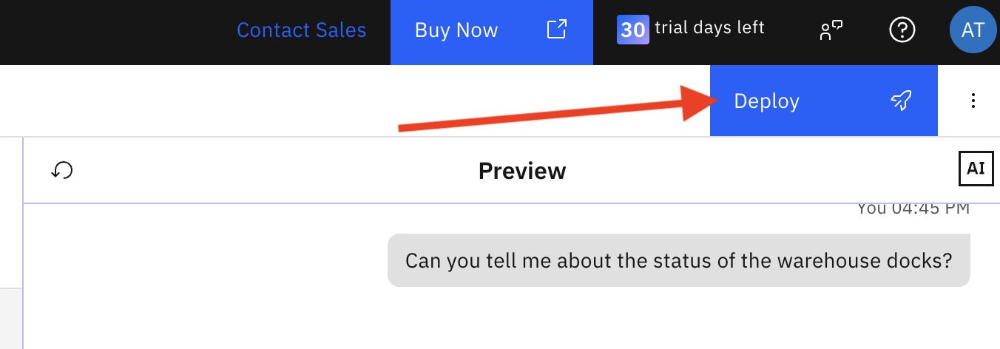

After you hit Save, we are ready to test our agent with the new custom tool. In the preview window, you can type in a question about traffic at a random location, for example: "Tell me about the traffic situation around the Sydney Opera House".

### Deploy your agent

Now that we have tested our agent and it performs to our satisfaction, we can deploy it, which makes it available for external consumption. The system will generate the required LangGraph code and deploy it into a `Deployment Space`. If none exists in your environment, you need to go and create one. You can find the link to Deployments in the 'hamburger menu' on the top left of the watsonx console. In the Deployments view, it will show you any deployment spaces you mgiht have. If there is none, go ahead and create one, by clicking on the `New deployment space` button.

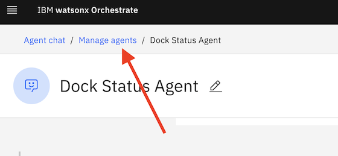

You can give your deployment space any name (must be unique within the account), and select `Development` as the Deployment stage. Make sure that you have a storage service and a watsonx.ai Runtime service selected. Even though the watsonx.ai Runtime field says it is optional, it is not optional for the deployment of our agent. 

Back in the Agent Lab UI, you can now simply click on the `Deploy` button at the top right of the screen. In the following window, if it asks you to create a User API key, use the provided link to create one.

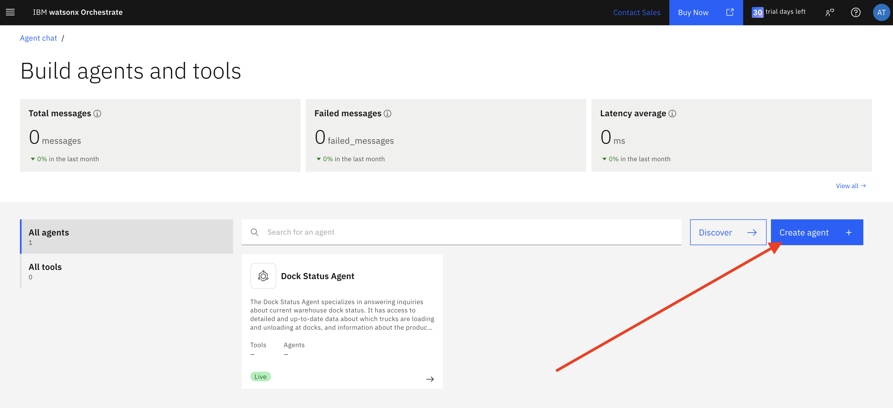

Make sure you have selected the deployment space you created earlier. Click Deploy. Back on the Deployments page, you can now the new deployment being run.


Once the deployment is complete, you cab click on it and see the endpoint URLs under which this agent can now be invoked. You will need this endpoint information later when configuring the agent in watsonx Orchestrate.

Here you can also test your agent to ensure the deployment was done successfully. The easiest way to do that is on the Preview tab. There, you can enter the message you want to send to your agent. 

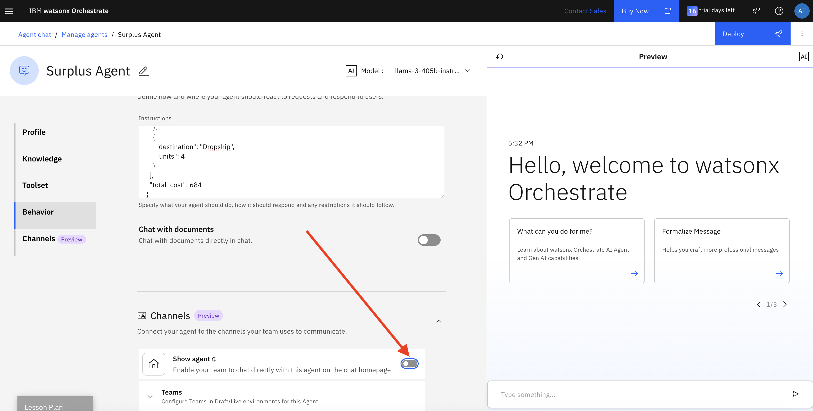

The resulting message should something like what is shown in the picture below.


Your agent is now fully operational! Note that instead of deploying the agent directly into a deployment space, you can also save it into a deployment notebook. This is useful if you want to make manual code changes before deploying the agent.
Once the agent is deployed, you can also see the generated code by clicking on the agent asset in the Assets view of the deployment space.

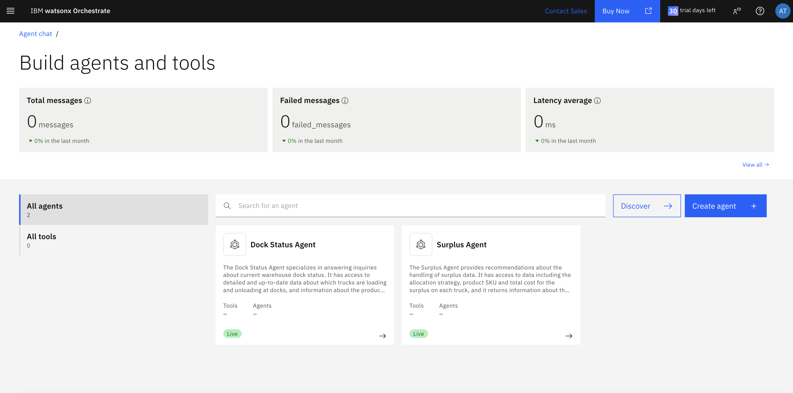

When you select the deployed agent and go to the Code tab, you see the Python code that was generated by Agent Lab under the covers.


## CodeEngine (to be removed later)

Currently, the deployed agent cannot directly be configured as an external agent in watsonx Orchestrate. Instead, we need to deploy an endpoint that satifies requests from watsonx Orchestrate and converts them into the interface required by the agent. We will use the CodeEngine service for this. Instructions for how to do it can be found [here](https://github.com/watson-developer-cloud/watsonx-orchestrate-developer-toolkit/tree/main/external_agent/examples/agent_builder).

Note that this extra step is expected to be removed soon.

## watsonx Orchestrate

In the second stage of building the solution, we build the actual assistant the end user interacts with, and configure it to use the agent we built and deployed above.

### AI agent configuration
In the watsonx Orchestrate console, select `AI agent configuration` and go to the `Agents` tab.


Click on `Add agent` at the top right of the page. Enter information about your agent. Make sure you also add a meaningful description of what your agent does, since that will help the "supervisory agent" to identify your agent as suitable when being asked about traffic details.
Your instructor will give you the endpoint URL you enter. It should end in `/chat/completions`. 

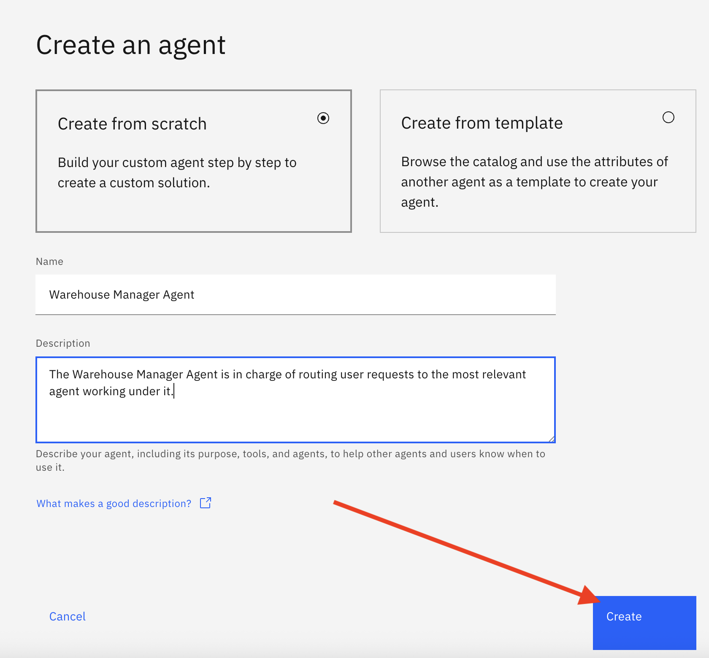

Now let's test it out! Select `Chat` from the hamburger menu at the top left corner of the screen. Then enter a question about traffic information, which should be forwarded to our dpeloyed agent.

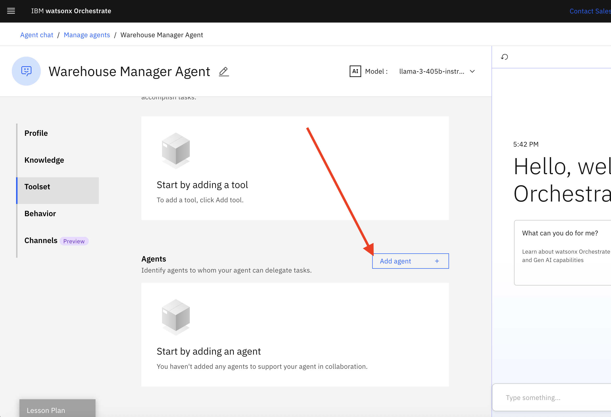

### Assistant Builder

Now let's add more assistants to the system, to handle other inquries and requests that may come from the Warehouse Manager user. In the watsonx Orchestrate console, select `AI assistant builder`. Then select the `View all assistants link to open up the list of all assistants you have defined in your system.


Now click on `Create assistant`. In this section, we will create the Dock Manager assistant that can answer questions about the current status of product arrivals and departures at the warehouse dock. 
Go ahead and give your assistant a name, for example, "Dock Manager". It is always a good idea to add a description, too. 


Click on `Create assistant`. Once the new assistand has been created, you will see a view with lots of information that you should spend some time exploring, if you are not already familiar with it. Most importantly, it gives you an overview of the architecure of your assistant, and you will note that a lot of default behavior has already been filled in. 


Note that there are a number of actions the assistant can take, based on the input it receives. For general questions where no suitable action can be found, it will either route the question to a Large Language Model (a small IBM Granite model by default) or search for content in, say, a Vector Database, if one has been configured. 
If all else fails, the assistant will offer to connect the user with a Live agent, however, by default none is configured.

You might also see an option at the top of the screen offering you to enable watsonx generative AI features. Feel free to select the link and turn those on. This will allow the system to collect information from the user as needed, without the need to explicitly configure it.

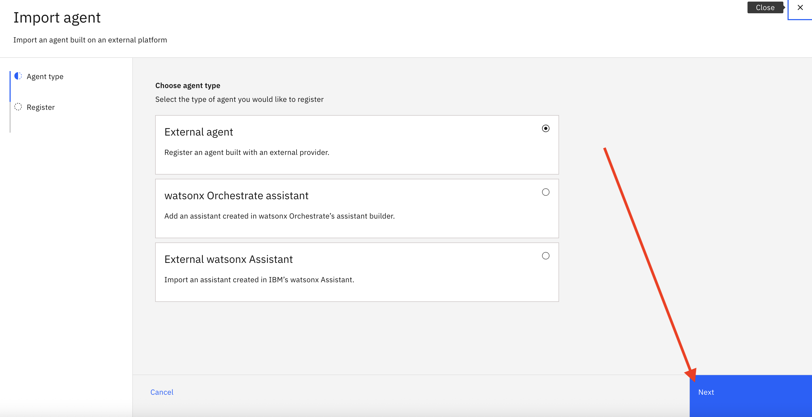

Back in the assistant builder screen, note how you can expand a menu on the left of the screen. Go to the `Actions` page.


Here we will create our first action. Click on `Create Action`.


First, we enter a question that the user might ask, and which will trigger this action to be invoked. We want to create a "Dock Manager" assistant, so the question we enter here could be something like "What's the current status of the warehouse docks?". We can additional variations of questions that will trigger this action later. 
Note how the system picks a default model that is used to answer the request. We will accept the deault setting here, which is an IBM Granite model.
Next, we add some knowledge data that helps the Large Language Model return a good result. In our example, we are shortcutting the connection to the dock status system (assuming it might accessible via API call) and instead hardcode some data into the knowledge section. This would be replaced later to implement a real solution.

For our example, copy and paste this content into the Knowledge section:
```
Current Docks Operations
    {
      "dock_id": 1,
      "trucks": [
        {
          "truck_id": "T001",
          "status": "Unloading",
          "ETA": "2 hours",
          "details": {
            "SKU": "199464599",
            "Payload_Quantity": 250,
            "Surplus_Status": "Received surplus"
          }
        },
        {
          "truck_id": "T002",
          "status": "Unloading",
          "ETA": "1.5 hours",
          "details": {
            "SKU": "226814212",
            "Payload_Quantity": 150,
            "Surplus_Status": "No Surplus"
          }
        },
        {
          "truck_id": "T003",
          "status": "Unloading",
          "ETA": "1 hour",
          "details": {
            "SKU": "404108299",
            "Payload_Quantity": 200,
            "Surplus_Status": "No Surplus"
          }
        }
      ]
    },
    {
      "dock_id": 2,
      "trucks": [
        {
          "truck_id": "T004",
          "status": "Unloading",
          "ETA": "1.5 hours",
          "details": {
            "SKU": "102209199",
            "Payload_Quantity": 50,
            "Surplus_Status": "Received surplus"
          }
        },
        {
          "truck_id": "T005",
          "status": "Unloading",
          "ETA": "2 hours",
          "details": {
            "SKU": "148183199",
            "Payload_Quantity": 80,
            "Surplus_Status": "No Surplus"
          }
        }
      ]
    }
  ]
}
```

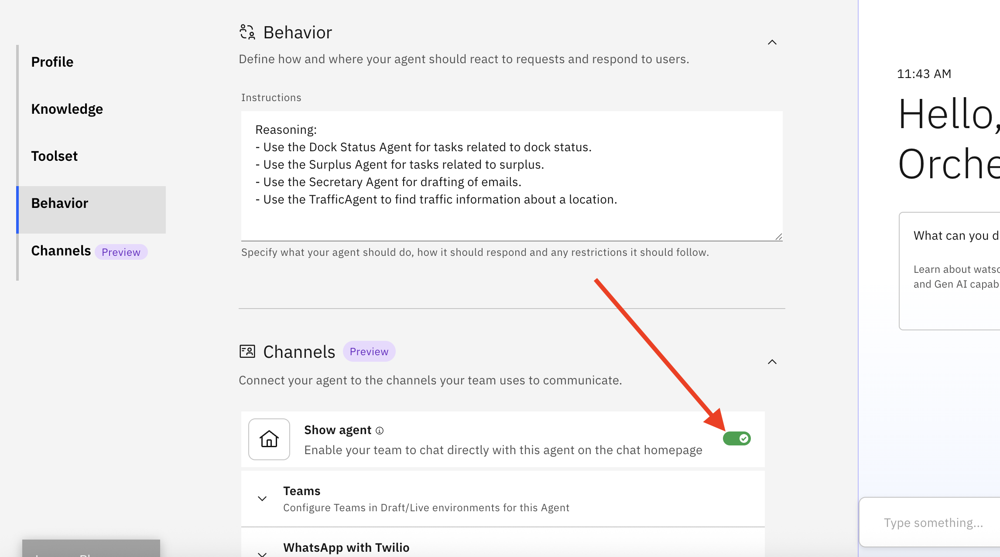

Finally we are ready to enter the actual prompt that is used in the action. For our example, you can use the following prompt:
```
Provide a concise summary of the current warehouse dock operations in a textual format. 
You need to include the the truck payload descriptions as a concise bullet-point list.
```

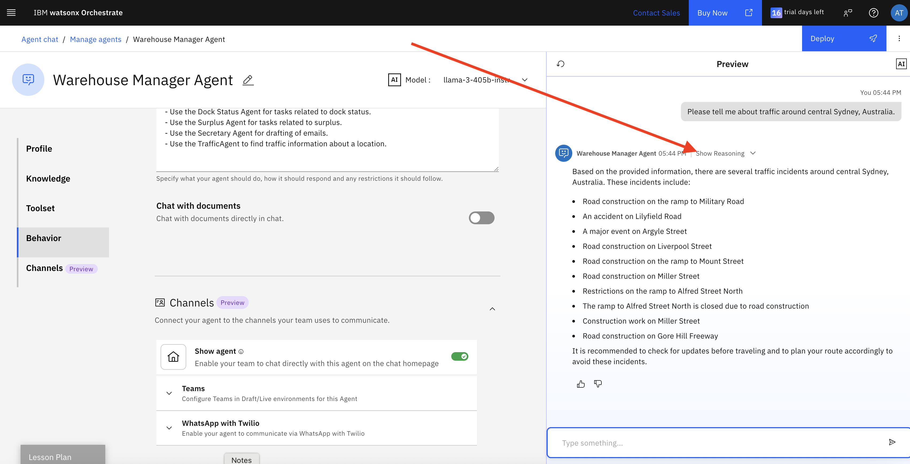

We can easily test our action by selecting the Preview button at the bottom right of the screen. A chat window pops up where we can enter a question and see how the Action reacts.
Try it out by entering the question that we have defined in the `Customer starts with:` section: 
```
What's the current status of the warehouse docks?
```

The result should look like what is shown below. 


Feel free to experiment further with variations of questions and adjust the Prompt Instructions as needed.

Next we want to add a second action to our assistant, this time one that handles requests for recommendations about surplus data. Create a new Action and enter the following:
- Customer starts with: `How can we handle the surplus on T001?`
- Knowledge:
```
Optimized Surplus Allocations Agent:
[
    {
      "truck_id": "T004",
      "SKU": "102209199",
      "total_surplus": 15,
      "allocation": [
        {
          "destination": "Marketing",
          "units": 12
        },
        {
          "destination": "Relocation",
          "units": 3
        }
      ],
      "total_cost": 69
    },
    {
      "truck_id": "T001",
      "SKU": "199464599",
      "total_surplus": 50,
      "allocation": [
        {
          "destination": "Holding",
          "units": 15
        },
        {
          "destination": "Marketing",
          "units": 19
        },
        {
          "destination": "Relocation",
          "units": 12
        },
        {
          "destination": "Dropship",
          "units": 4
        }
      ],
      "total_cost": 684
    }
  ]
}
```
- Prompt Instructions: 
```
You are an assistant for sending report on  optimal allocation of surplus units. Use the provided Optimized Surplus Allocations Agent to answer questions related to each truck.  When asked how to handle surplus, provide a distribution strategy based on allocations unit for each method along with truck id, Product SKU, total cost, surplus unit.
```


Open the Preview window again and test the new action. Note that the preview works for the entire assistant, in other words, it can invoke both of the actions we have created, based on input. So, you could string two questions together. 
Question 1: `What's the status of the warehouse dock?`
Question 2: `How can we handle the surplus on T001?`


Before we can use this assistant in the chat, we need to "publish" it. Go to the left of the screen to expend the side menu and select `Publish`.


The following screen shows you the unpublished content, go ahead and click on the `Publish` button.


Now as an additional exercise, create yet another assistant that handles the notification emails. We won't add the screenshots here, but instead just give you the data to enter. Think of it as a test of your newly acquired skills.

- Assistant name: `Warehouse Secretary`
- Customer starts with: 
  - `Generate a notification email for the dropship team for SKU: 23232464599 of 10 units`
  - `Generate a notification email for the relocation team for SKU: 983244534599 of 20 units`
  - `Generate a notification email for the marketing team for SKU: 8932464599 of 10 units`
  - `Generate a notification email for the holding team for SKU: 549464599 of 15 units`
- Knowledge: 
```
Example1:
Input: 
Generate a notification email for the marketing team for item 223456789 for 25 units
Output:
Subject: Notification of Surplus Units for SKU# 223456789 

Marketing Team,
This email is to inform you that there are 25 surplus units of item 223456789 available. Please review and coordinate any necessary marketing efforts for these additional units.

Warehouse Management

Example2:
Input:  Generate a notification email for the holding team for item 112334343 for  10 units
Output:

Subject: Notification of Surplus Units for SKU#112334343

Holding Team,
This email is to notify you that there are 10 units of item 112334343 in surplus which need to be stored in the inventory. Please take necessary actions.

Warehouse Management

Example3:
Input:  Generate a notification email for the dropship team for SKU: 88245464599 of 10 units
Output:
Subject: Notification of Surplus Units for SKU#88245464599

Dropship Team,
This email is to notify you that there are 10 units of item 88245464599 in surplus. Please review and adjust shipping schedules as needed to accommodate these additional units.

Warehouse Management


Example 4:
Input:   Generate a notification email for the relocation team for SKU: 765004599 of 9 units
Output: 
Subject: Notification of Surplus Units for SKU#765004599

Relocation Team,
This email is to notify you that there are 9 units of item 765004599 in surplus. Please review and coordinate any necessary relocation efforts for these additional units.

Warehouse Management
```
- Prompt: 
```
Write a concise and professional draft email about the surplus in the inventory.  
The email should directly begin with the subject line, followed by the email body without any introductory statements or preambles.
Use your knowledge of email writing as a guide to structure and tone, but do not limit yourself to specific teams or predefined examples. 
Assume the audience and content are general unless specified otherwise. 
Avoid mentioning any knowledge limitations or referencing specific teams unless explicitly required.
```
After you have tested the assistant in the Preview, go ahead and Publish it.

To plug it all together, we will now add the two new assistants to the AI Agent configuration. Select `AI agent configuration` from the hamburger menu. Select `Assistants`.

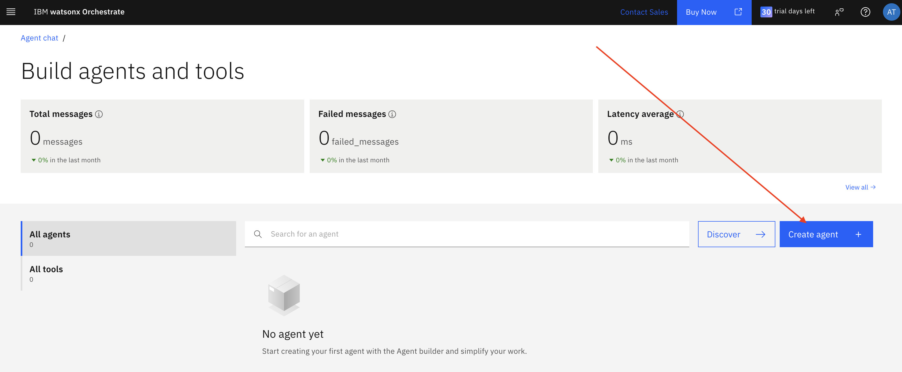

Now click on `Add assistant`.

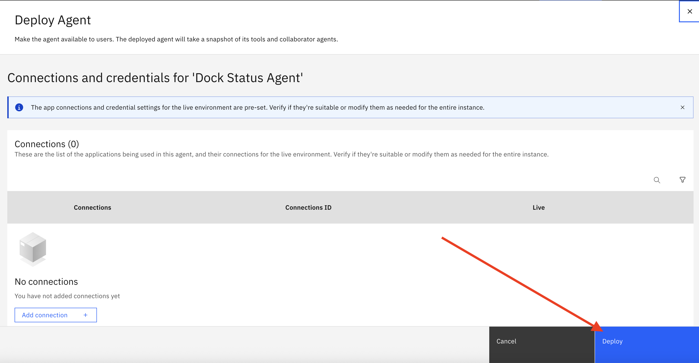

First we'll add the Dock Manager assistant. Make sure you give it a good description, since this description is what helps the AI Agent pick the right assistant for the task. You can enter text like what is shown in the screenshot below. Then click on `Connect`.


Next add the Warehouse Secretaty assistant. Don't forget to give it meaningful description.
You should now see two assistants that have been added.

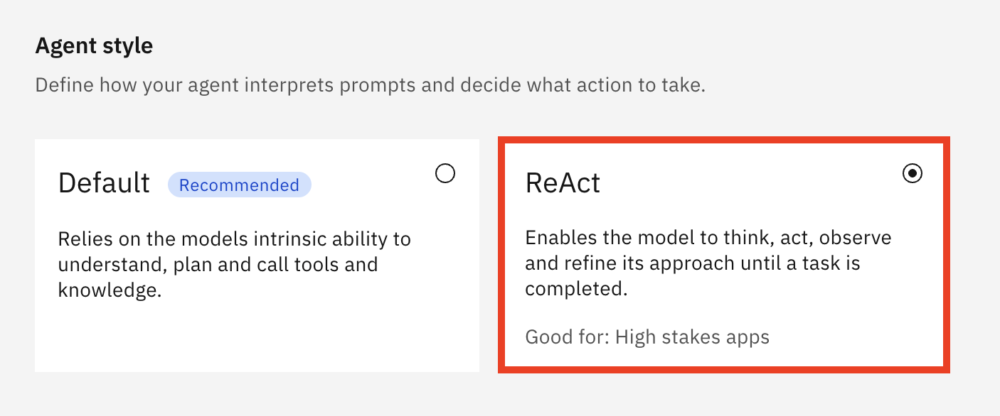

We are now ready to run our agentic solution in the chat. Select `Chat` from the hamburger menu. In the chat window, let's ask some questions to see if the agent picks the right assistant, or forwards the request to the external agent we built in watsonx.ai.


## Summary

In this lab, we went through the use case of an operational manager at a warehouse, which uses an agentic solution to handle arriving and possibly surplus products. We started by building an agent based on the LangGraph framework, using Agent Lab in watsonx.ai. The agent utilizes a tool that makes an external API call to retrieve up to date traffic information. Once deployed, we could configure it as an external agent in watsonx Orchestrate. There, we also defined a couple of assistants, both of which use a large language model. 
After we had all configured to be used by the AI Agent chat, we can interact with the solution through a chat interface, and the system will delegate to he right place.

Note that the intention of this exercise is to provide you with a starting point. Some parts of this solution are simulated, and would have to be fully implemented for a real solution. Moreover, a true agentic solution would add a reasoning layer on top of what you have built here, which allows coming up with a plan for handling, in this case, warehouse situation autonomously, making its own decisions along the way. We believe that those solutions are yet to become real.

But hopefully it triggered some ideas for you about how to make it work in your business environment.