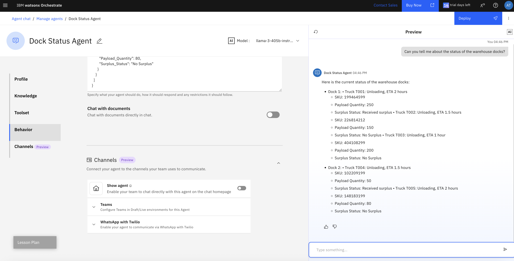
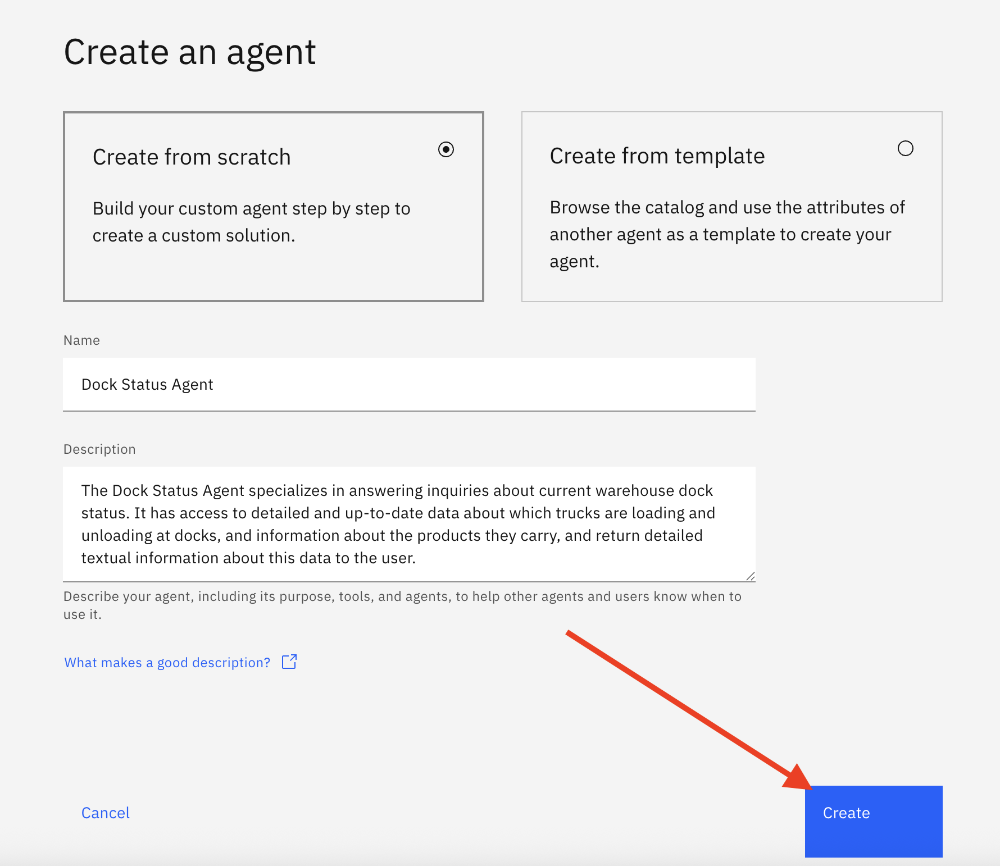

# Use case: Intelligent AI Assistant

This use case describes a scenario where a user leverages an AI assistant via chat / natural language interface, to help with the execution of tasks that require the selection of the right agent to satisfy each request.

Agents can be configured in the system and will be selected if they satisfy the taks at hand, based on their description.

Each agent, in turn, is connected with an LLM that support function calling, so that it can leverage one or more tools, again based on each tool's description.

We will show you how to build a sample of this scenario in two stages:
1. Use the watsonx.ai Agent Lab low-code tool to define an agent that leverages a set of tools. One of the tools is a custom tool for which we will add Python code that implements its function (which is calling a REST API to a public service on the Internet). We then deploy this agent in watsonx.ai, so that it can be invoked from the AI assistant, which we build in Stage 2.
2. Use the watsonx Orchestrate Assistant Builder tool to define an assistant that gets exposed as a chat frontend. We will also define one or more agents that the assistant can use to answer the user's request.

Even though we will take you through a complete and working example, you should also consider making changes that fit your desired use case better, and only take this description as a reference point that guides you along your own implementation.

## Sample Use case description

In our example, we are looking at the persona of a warehouse manager who wants to manage arrivals and departures of product at the docks of a particular warehouse. 

We envision two phases in which this can be rolled out: in the first phase, the user actively guides the system along the intended path of action. For example, we can ask the system about the status of a specific dock, to retrieve the current number and ID of trucks loading and unloading, as well as details about the products they contain. As a next step, we ask the system to make recommendations about the handling of a certain product that is in surplus. In response, the system will make a recommendation that is most cost effective. The user can then instruct the system to follow the recommendation - or take any other action, of course. The system will notify the user when the change has been made, other stakeholders have been notified (say, by email), and update the overall status of the warehouse inventory. 

There is an argument to be made that a truly agentic solution would show a higher degree of autonomy. To address a particular problem, or ask, an agentic solution will make a plan, then start executing this plan, checking its effectiveness towards a good outcome nad possibly revise the plan accordingly, all in an automated fashion and without human intervention. Applying that to the scenario described above, we simply take out the "human in the loop", by letting the system analyze the status of the dock, decide what to do with surplus product, notify stakeholders of the decision (say, return surplus to original warehouse), and update systems of record. The flow will fundamentally be the same, and it can use the same set of agents, but will add a controller of sorts on top.

In this exercise, we will take you through a rudimentary implementation of the first stage, because we believe that is realistically what enterprises will do in the near future. But it provides a path to mature to the second phase.

## Agent Lab - Creating your first agent

For the first stage of implementation of our agentic solution, we use the watsonx.ai Agent Lab tool. 
> Note that this feature is currently in beta, so its design may change from the screenshots you see below.

We assume you are logged into your watsonx.ai environment, and created a project that will hold the assets you create. If you haven't done so, go ahead and create a project - and don't forget to associate it with your watsonx.ai Runtime instance.

An agent built with Agent Lab is stored in the project as an asset. Thus, to create a new agent, click on the `New Asset` button in the Assets view of the project. Find and select the tile saying `Build an AI agent to automate tasks`.

This opens up the Agent Lab user interface. To make sure you won't forget later, and also to make sure things are saved in case you get logged out of the system unexpectedly, we recommend you immediately go and save the asset, even though you haven't made any changes yet. Click on the `Save as` option at the top right of the screen.

At this point, we will not generate any notebook form it, since we are only just starting. So, save it as an Agent. Note how it will not let you pick a name for your asset, it will be listed as `watsonx Agent` in your project.

After saving it, you will see that the `Autosave on` option is enabled. his ensures none of the changes you are making will get lost.
Now you can study what the tool offers: 
- In the Setup section, you can change the name of your agent and add a meaningful description. We recommend you do change the name. Since we are typically working in shared environments, even if within your own personal project, it is a good practice to give the asset a somewhat unique name, for example, by prefixing it with your name.
- Other elements in the Setup section are not relevant in our case, since we will use this agent from within an AI Assistant running in watsonx Orchestrate.
- In the Configuration section you can choose the architecture and framework for this agent. At the moment, there is only one option for each. Note that the framework we use to implement the agent is LangGraph. We will later see the LangGraph based code that is generated by the tool.
- In the model dropdown list, you can select the model used by the agent. It has to be a model supporting function calling. Please select the `llama-3-3-70b-instruct` model if it is not already selected. 
- In the Tools section, Google Search is preselected by default.
- In the Model parameters section, you see additional settings that influence the behavir of the agent. We will leave these at their default settings.

Let's explore the environment a bit further. To start, remove the Google search tool from the agent, by clicking on the trash bin icon.
In the Agent preview window, type in a question about something the model has most likely not been trained with. For example, enter "What is the current exchange rate between US dollars and Euro?" The response will look similar to what is shown in the screenshot below.

Now let's add the Google search tool back. Click on `Add a tool`, clear the chat, and add the tool back to your agent. Now ask the same question as before in the previw window. This time, the agent will realize the model has not been trained with this information, so it will call the tool to retrieve it. If you expand the "How did I get this answer?" section, you can find details about the steps the agent took.

You have now built your first agent! This agent can answer questions and will rach out to Google to find information the model doesn't have. 

### Define a custom tool

Next we will add a custom tool to our agent, that is, a tool calling an API, for which no tool already exists in the catalog. In our example, we call an API providing current traffic information for a specific location, using a service called 
...

## watsonx Orchestrate

In the second stage of building the solution, we build the actual assistant the end user interacts with, and configure it to use the agent we built in Step 1.