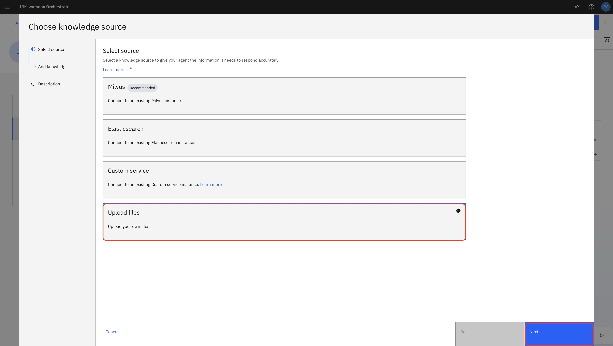
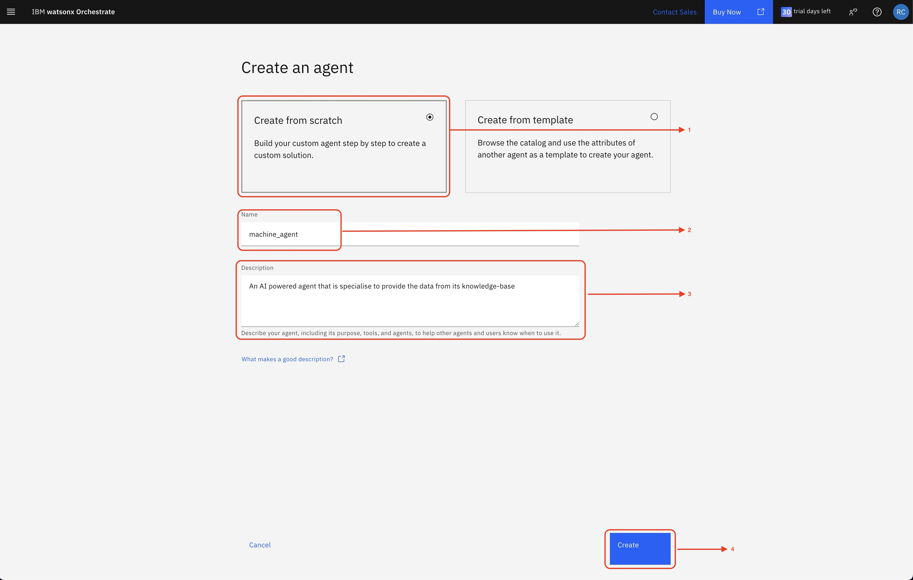

# 👨🏻‍💻 Use case: Manufacturing Operation Automation

# Table of Contents

1. [Architecture Overview](#architecture-overview)
2. [Components and Agents](#components-and-agents)

   * [1. Master Agent](#1-master-agent)
   * [2. Machine Agent \[WXO RAG\]](#2-machine-agent-wxo-rag)
   * [3. Error Agent \[WXO RAG\]](#3-error-agent-wxo-rag)
   * [4. Log Agent](#4-log-agent)
3. [User Input](#user-input)
4. [Cumulative Output](#cumulative-output)
5. [Prerequisites](#prerequisites)

   * [Knowledge Base Files](#knowledge-base-files)
   * [Tool Configuration](#tool-configuration)
6. [Setup Instructions](#step-1-create-master-agent)

   * [Step 1: Create Master Agent](#step-1-create-master-agent)
   * [Step 2: Create Error Agent](#step-2-create-error-agent)
   * [Step 3: Create Machine Agent](#step-3-create-machine-agent)
   * [Step 4: Create Log Agent](#step-4-create-log-agent)
   * [Step 5: Configure Master Agent Collaborators](#step-5-configure-master-agent-collaborators)
   * [Step 6: Deploy the System](#step-6-deploy-the-system)
   * [Step 7: Test the System](#step-7-test-the-system)

## Architecture Overview

The system receives an input (Error Code or Incident with Machine Name) from the user and processes it using Watsonx-based agents. Each agent specializes in a specific domain and contributes to generating a comprehensive answer.


## Components and Agents

### 1. **Master Agent**

* **Role:** Central coordinator.
* **Function:** Aggregates responses from all agents and prepares a well-decorated, final cumulative answer.
* **Output Includes:**

  * Error Description
  * Machine Description
  * Recent Logs
  * Similar Logs (Top 5)
  * Suggested Solution (via LLM)

### 2. **Machine Agent** `[WXO RAG]`

* **Function:** Retrieves machine details based on the input machine name.
* **Data Source:** CSV-based **Machines Knowledge-base**
* **Technology:** Watsonx Retrieval-Augmented Generation (RAG)

### 3. **Error Agent** `[WXO RAG]`

* **Function:** Looks up error code to fetch the detailed error description.
* **Data Source:** CSV-based **Errors Knowledge-base**
* **Technology:** Watsonx Retrieval-Augmented Generation (RAG)

### 4. **Log Agent**

* **Function:** Collects log-related insights from two external tools.

  * 🔧 **Tool-1:** Retrieves most recent log changes
  * 🧠 **Tool-2:** Fetches Top-5 similar logs from historical data

## User Input

The user provides:

* An error code or
* A machine name or incident description

## Cumulative Output

A structured and intelligent answer is generated containing:

1. **Error Description** (from Error Agent)
2. **Machine Description** (from Machine Agent)
3. **Recent Log Changes** (via Tool-1)
4. **Top-5 Similar Logs** (via Tool-2)
5. **LLM-Based Suggested Fix**

## Prerequisites

- Access to Watsonx Orchestrate

### Knowledge Base Files:
- [`error_codes_updated.csv`](./assets/error_codes_updated.csv): Contains ErrorID, Description, Severity, Category, TypicalCause, AffectedMachineTypes
- [`machine_codes_updated.csv`](./assets/machine_codes_updated.csv): Contains MachineID, Description, MachineType, ProductionLine, MaintenanceLevel, ErrorCodes, OperationalComplexity

### Tool Configuration:
- [`openapispec.json`](./assets/opeanapi_spec_manufacturing_usecase.json): External tool specification for log data retrieval

## Step 1: Create Master Agent

1. Navigate to Orchestrate home page, click hamburger menu (☰) → Build → Agent Builder


2. Click **Create Agent**


3. Configure Master Agent:
   - **Name**: `master_agent`
   - **Description**:
     ```
     You are a master agent responsible for coordinating a structured multi-agent system to answer user queries accurately and efficiently.
     Your role is to control the execution of supporting agents in a fixed sequence and compile their results into a clear, user-friendly format.
     ```


4. Set configuration:
   - **Model**: `llama-3-405b-instruct`
   - **Style**: Default


5. Add behavior instructions:
   ```
   You are responsible for handling all user queries by executing agents in the following strict order. Do not alter this sequence under any circumstances.
   1. Error Agent: Extract ErrorID, Description, Severity, Category, TypicalCause, AffectedMachineTypes
   2. Machine Agent: Collect MachineID, Description, MachineType, ProductionLine, MaintenanceLevel, ErrorCodes, OperationalComplexity
   3. Log Agent: Retrieve all relevant log data for the specified MachineID and ErrorID
   4. Suggested Solution: Generate solution using insights from Top 5 Similar Issues and Top Recent Incident
   5. Result Compilation: Present consolidated output in GitHub-style markdown table
   6. Important: Maintain logical flow and clarity; do not change agent execution order, rename sections, ask follow-up questions, or break logical connection
   ```

6. Click **Manage Agents** (we'll return to configure collaborators later)


## Step 2: Create Error Agent

7. Click **Create Agent** → Create from scratch
8. Configure Error Agent:
   - **Name**: `error_agent`
   - **Description**: 
   ```
   An AI powered agent that specializes in providing error data from its knowledge-base
   ```


9. Set configuration:
   - **Model**: `llama-3-405b-instruct`
   - Go to Knowledge section → Click **Choose Knowledge**

   - Select →  **Upload Files**
      
   - Upload `error_codes_updated.csv` and click **Next**
      
   - Add Description →  **Click Next**
      ```
      Troubleshooting reference for packaging-line error codes across conveyors, packaging machines, fillers, labelers, cappers, and mixers. Includes code descriptions, severity, categories, typical causes, and affected machines to support quick diagnosis and proper escalation.
      ```
      
10. This is how the knowledge Source looks like


11. Add behavior instructions:
    ```
    Always respond strictly using the information available in the knowledge base, including fields such as ErrorID, Description, Severity, Category, TypicalCause and AffectedMachineTypes. Do not modify, infer, or add any content. If the necessary data is missing, reply with "No information available in the knowledge base."
    ```
    Click **Manage Agents**


## Step 3: Create Machine Agent

12. Click **Create Agent** → Create from scratch
13. Configure Machine Agent:
    - **Name**: `machine_agent`
    - **Description**: `An AI powered agent that specializes in providing machine data from its knowledge-base`


14. Set configuration:
    - **Model**: `llama-3-405b-instruct`
   - Go to Knowledge section → Click **Choose Knowledge**

   - Select →  **Upload Files**
      
   - Upload `machine_codes_updated.csv` and click **Next**
      
   - Add Description →  **Click Next**
      ```
      Troubleshooting reference for packaging-line error codes across conveyors, packaging machines, fillers, labelers, cappers, and mixers. Includes code descriptions, severity, categories, typical causes, and affected machines to support quick diagnosis and proper escalation.
      ```
      

15. This is how the knowledge Source looks like


16. Add behavior instructions:
    ```
    Always respond strictly based on the information available in the knowledge base, including fields such as MachineID, Description, MachineType, ProductionLine, MaintenanceLevel, ErrorCodes and OperationalComplexity. Do not modify, infer, or add any content. If the required data is missing, reply with "No information available in the knowledge base."
    ```
    Click **Manage Agents**


## Step 4: Create Log Agent

17. Click **Create Agent** → Create from scratch
18. Configure Log Agent:
    - **Name**: `log_agent`
    - **Description**: `This agent helps to get all types of log data`


19. Set configuration:
    - **Model**: `llama-3-405b-instruct`
    - Go to Tools section → Click **Add Tools**


20. Select **Import as an external tool**


21. Choose **Import From a File**


22. Upload `openapispec.json`, wait for validation success, click **Next**


23. Select all tools (check checkbox before Name) and click **Done**


24. Add behavior instructions:
    ```
    You are a specialized log information extraction agent. The user will always provide an Error ID and a Machine ID in their query. Pass only these parameters: query, machine_id, and error_code to trigger the tools.
    Follow the steps strictly:
    1. Run Tool-1 {Search for past similar incidents}
    2. Then run Tool-2 {Search recent changes to the machine}
    Execute the tools sequentially in the order above.
    After collecting the data, present only the final structured table with the extracted information with top 5 past similar incidents and recent changes. Do not show intermediate results.
    ```
    Click **Manage Agents**


## Step 5: Configure Master Agent Collaborators

25. Select the **Master Agent** from the agent list


26. Scroll to **Agents** section → Click **Add Agent**


27. Select **Add from local instance**


28. Select all created agents (`error_agent`, `machine_agent`, `log_agent`) → Click **Add Agent**


## Step 6: Deploy the System

29. Click **Deploy** button (top right corner)


30. On deployment page, click **Deploy**


## Step 7: Test the System

31. Click hamburger menu (☰) → **Chat**


32. In the chat add the query you want to ask.
```bash
I'm facing an issue with Error ID: E032 and Machine ID: M002. Please give me all the details?
```


