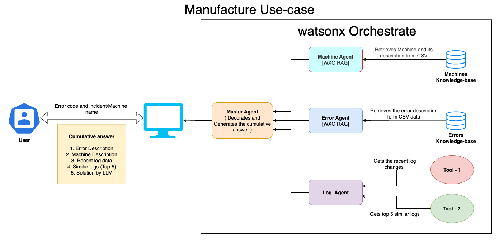

# 🏭 Manufacturing Operation Automation

## 🤔 The Problem

XYZ Motors, a car manufacturer, spends a significant amount of time with handling equipment malfunction which slows situational awareness, widens quarantines, and drags out root-cause hunts, so every alarm costs time and yield.

## 🎯 Objective

XYZ Motors' manufacturing division faced persistent delays in resolving equipment malfunctions across their production lines. These disruptions often led to extended downtime, increased scrap, and slower recovery cycles. Key issues included:

* Manual fault diagnosis delayed resolution and reduced operational efficiency.
* Lack of contextual insights limited root-cause visibility.
* Broader quarantines occurred due to insufficient traceability and real-time data.

To address these challenges, XYZ Motors implemented an AI-powered fault management system driven by cooperating agents that streamline fault detection, analysis, and documentation.

## 📈 Business Value

* **Reduced Downtime** – Faster fault isolation and guided troubleshooting shorten repair cycles.
* **Lower Scrap and Rework** – Genealogy tracking restricts containment to only the impacted batch.
* **Knowledge Retention** – Auto-documentation preserves institutional knowledge.

## 🏛 Architecture

To streamline fault diagnosis and resolution across production lines, XYZ Motors has developed a **Multi-Agent AI Fault Management System** that intelligently processes machine-related incidents in real time. This system leverages a collaborative multi-agent framework powered by **Watsonx Orchestrate** and **Watsonx.ai**, allowing operational teams to respond faster, minimize downtime, and retain critical knowledge.

The architecture consists of specialized AI agents, each designed to handle specific tasks, working together to deliver an intelligent, structured, and actionable response to equipment failures.

This system processes user input—such as an error code or incident description—and activates agents that retrieve and analyze machine and error data, fetch real-time logs, and suggest root-cause fixes using LLMs. The collaboration between agents ensures a seamless flow of information and enables accurate and automated fault resolution.

* **Master Agent** : 
The central coordinator that receives partial outputs from specialized agents and assembles them into a unified, structured response. It ensures clarity, removes redundancy, and presents insights in an easy-to-digest format
* **Machine Agent** `[watsonx Orchestrate RAG]` : 
Retrieves technical and operational details about a specific machine using a CSV-based machine knowledge base. Provides context such as specifications, location, and the machine's role.
* **Error Agent** `[watsonx Orchestrate RAG]`: Decodes error codes by querying the errors knowledge base. Returns detailed descriptions, severity levels, and possible causes for each error code.
* **Log Agent**:
Retrieves log-based insights using two external tools:
    * **Tool-1**: Fetches recent log events for the specified machine
    * **Tool-2**: Finds top-5 similar historical log incidents based on pattern similarity

## 📝 Step-by-step Hands-on Lab
You can find step-by-step instructions here :

[Step-by-step hands-on guide](https://github.ibm.com/skol/agentic-ai-client-bootcamp/blob/release/v3.0.0/usecases/manufacturing/Manufacture_Hands_on.md)

## Demo Video
A video demo of the solution is below:

https://github.ibm.com/skol/agentic-ai-client-bootcamp/assets/453165/88ff3a77-0b52-4a31-9b62-f277fb071e31

