# Use case: Retail shelf analysis

## Table of contents
- [Use case: Retail shelf analysis](#use-case-retail-shelf-analysis)
  - [Table of contents](#table-of-contents)
  - [Introduction](#introduction)
    - [Pre-requisites](#pre-requisites)
  - [watsonx Orchestrate ADK](#watsonx-orchestrate-adk)
  - [The tools](#the-tools)
    - [Image to text tool](#image-to-text-tool)
      - [Connections](#connections)
      - [Langchain](#langchain)
      - [The @tool annotation](#the-tool-annotation)
      - [Local test](#local-test)
      - [Importing the tool](#importing-the-tool)
    - [Web search tool](#web-search-tool)
  - [The agents](#the-agents)
    - [The Internet Research Agent](#the-internet-research-agent)
    - [The Market Analyst Agent](#the-market-analyst-agent)
    - [The Retail Market Agent](#the-retail-market-agent)
  - [Final test and Summary](#final-test-and-summary)

## Introduction
This use case describes a scenario where a user can submit an image, i.e. a photograph that contains a shelf of products. Products are expected to be consumer products, that is, shoes, clothing, food, household supplies etc. The system will analyze the content of the image, i.e. identify the products shown, retrieve market trends for those products via web search, and finally develop recommendations and an action plan for how to reorganize the shelf to align with those market trends. 

The solution consists of several agents who are working together to address the problem at hand:
- The `Internet Research Agent` 
- The `Market Analyst Agent` 
- The `Retail Market Agent` 

Details about each agent and their purpose will be covered below. We will use the [IBM watsonx Orchestrate Agent Developer Kit (ADK)](https://developer.watson-orchestrate.ibm.com/) to create the solution.

### Pre-requisites
- Check with your instructor to make sure **all systems** are up and running before you continue.
- Make sure you have an instance of the watsonx Orchestrate ADK up and running, either on your own laptop or in a virtual machine provided to you by your instructor.
- If you're an instructor running this lab, check the **Instructor's guides** to set up all environments and systems.

## watsonx Orchestrate ADK
As mentioned above, we will use the ADK to develop and test the solution. The ADK consists of the following elements:
- a set of containers that run the core elements of the watsonx Orchestrate server, all orchestrated as a single set via docker-compose. 
- a container hosting the UI element, which lets you create and manage agents, as well as testing them via chat interface.
- a CLI that allows simple interactions with watsonx Orchestrate (both the locally running server as well as any SaaS instance), including importing of agents and tools, starting and stopping the server, and more.
  
We will assume here that as part of the setup, you have gained access to an environment (which could be your own laptop) that lets you access the server via browser window, as well as giving you a command line terminal in which you can enter CLI commands. Moreover, we will do the code development in an instance of VS Code. 

You can decide to which level of detail you want to explore this use case. You can take the code and the related configuraton as is and simply deploy and run them. Or, you can change some of the details and see what the impact of your change is. For example, change the prompts you are using, or switch the model to a different one. And you can tinker with the code, too! Think of the ADK environment as a developer environment in which you can develop and test before uploading the solution to a shared SaaS environment. 

> Note that the screenshots below may vary slightly, depending on which environment you are using, but the exact same functionality is offered regardless of which environment you choose.

## The tools
As part of the solution, we will create two tools:
1. a tool that utilizes a watsonx.ai vision model to create a description of the picture that was submitted by the user, and
2. a tool that can search the web.

### Image to text tool
This tool takes the URL of an image hosted on the Internet as input, and returns the description of that image. 

> Why a URL? Ideally, the user interface would allow simply attaching an image file to the interaction, and the agent would pass that image content to the tool. Such an interface is on the roadmap for watsonx Orchestrate, in the interim, we are simply using a workaround, naemly passing a URL.

The code for this tool is in [this Python file](./src/tools/generate_description_from_image.py). Feel free to open this file in your VS Code environment to follow along our explanation of the code. Rather than going through it line by line, we will point out those sections of the code that we want to take a closer look at.

The code starts with a set of import statements. To run the code, either within watsonx Orchestrate or on the command line, you need to make sure a set of packages are installed. The [requirements.txt](./src/tools/requirements.txt) file lists all of the required packages. To run it locally, you need to run `pip install -r requirements.txt` with this file. When using this code inside a tool, we can impport this file together with the code, and the server will install the listed packages into the runtime the first time the tool is called. 

Next you will find this line:
```
CONNECTION_WATSONX_AI = 'watsonxai'
```

#### Connections
watsonx Orchestrate uses a concept called "connections" to allow passing in certain runtime values, for example, API keys, separately from the code, so that they don't have to be hardcoded in the code. A `Connection` is a separately created and maintained entity that binds values to their respective keys, and the tool can resolve those values at runtime. 
Since this tool uses watsonx.ai to retrieve the image description, we need to fill some variables with required values:
- The model ID of the model we will use. It has to be a model capable of interpreting images, for example, `meta-llama/llama-3-2-90b-vision-instruct`.
- The API key of the IBM cloud account your watsonx.ai instance is running in.
- The project ID of a watsonx.ai project that is associated with a runtime. 

Further down in the code, you can see how we are resolving the value for a certain key:
```
model_id = connections.key_value(CONNECTION_WATSONX_AI)['modelid']
```

You can find more information about connections in the [watsonx Orchestrate ADK documentation](https://developer.watson-orchestrate.ibm.com/connections/build_connections).

The code in the tool was written in a way that also allows it to be called from the command line. When running it this way, it doesn't have access to `Connections` objects. You will see in the code, towards the bottom of the file, that in the main function (which is only called when running from the command line), it uses the `load_dotenv()` function to set the required environment variables.

#### Langchain
In the import section of the code, you will see the following line:
```
from langchain_ibm import ChatWatsonx
```
This indicates that we are using the [IBM watsonx extension to Langchain](https://python.langchain.com/api_reference/ibm/index.html), and specifically, its `ChatWatsonx` model. This class allows simple interactions with the watsonx.ai backend. You set it up with a set of parameters (the code below is from the `generate_description_from_image()` function:
```
    watsonx_model = ChatWatsonx(
                        model_id=model_id,
                        url="https://us-south.ml.cloud.ibm.com",
                        apikey=api_key,
                        project_id=project_id,
                        params={
                            GenParams.TEMPERATURE: 0.5,
                            GenParams.MAX_NEW_TOKENS: 1000
                        }
    )
```
The message we will send to that model object is of type `HumanMessage`, which is imported from `langchain_core.messages`. The creation of the message is located in the `contruct_message()` function:
```
    message = HumanMessage(
        content=[
            {"type": "text", "text": prompt_text},
            {"type": "image_url",
             "image_url": {"url": f"data:image/{image_format};base64,{image_data}"}}
        ]
```
Note how the message contains both a text prompt and an image. The image is encoded in base64 format. In the code, the retrieval of the image from the passed in URL, and its encoding into base64, happens in the `encode_image_to_base64()` function:
```
def encode_image_to_base64(image_url: str) -> Optional[str]:
    headers = {"User-Agent": "Mozilla/5.0"}
    response = requests.get(image_url, headers=headers)
    response.raise_for_status()  # Raise an error for bad responses
    image_bytes = response.content
    encoded = base64.b64encode(image_bytes).decode('utf-8')
    return encoded
```        
#### The @tool annotation
The overall flow of the tool is like this:
- invoke generate_description_from_image(), pass in image URL
  - create ChatWatsonX model instance
- use encode_image_to_base64() to retrieve image content
- use construct_message to create HumanMessage instance
- call `model.invoke()` to return description of image content

Note that the main entry point for the tool is the `generate_description_from_image()` function. This is indicated by the `@tool~ annotation that prefixes the function declaration, paired with an indication of the `Connection` that is being used:
```
@tool(
        {"app_id": CONNECTION_WATSONX_AI, "type": ConnectionType.KEY_VALUE}
)
def generate_description_from_image(image_url: str) -> str:
    """
    Takes an image URL, encodes it to base64, and generates a description using Watsonx.ai.

    Parameters:
    image_url (str): The URL of the image file.

    Returns:
    str: The generated description of the image.
    """
```

Another important element of the code extract above is the description. This description is what the agent uses to determine whether the tool is right for the task at hand. Therefore, it is critically important to include a crisp and detailed description of the functionality of the tool. There is no other place where this is described! 

#### Local test
As mentioned above, you can run this tool from the command line to test the code. Note, however, that it is expecting a file named `.env` to be available in the same folder as where you start the Python interpreter from. You will see later that the watsonx Orchestrate ADK also requires a .env file when being started. You can reuse the same file for both purposes. Note that because of the reuse, the actual file has more entries than shown below.
```
MODEL_ID=meta-llama/llama-3-2-90b-vision-instruct
WATSONX_APIKEY=oj5BW-...... [insert your API key here]
WATSONX_PROJECT_ID=186ac9b7-35ec....... [insert your project ID here]
```
You call the tool from the command line like this (again, make sure you are in the right folder that has both the .py file and the .env file):
`python generate_description_from_image.py --url https://i.imgur.com/qfiugNJ.jpeg`

#### Importing the tool
The easiest way to import the tool into your ADK instance is to use the CLI. Remember that we are using the concept of a `Connection` to insert the right values for API key etc? Before we can import the tool, we need to create the Connection instance (the import will fail otherwise).
We can store the Connection details in a [YAML file named watsonxai.yaml](./src/connections/watsonxai.yaml): 
```
spec_version: v1
kind: connection
app_id: watsonxai
environments:
    draft:
        kind: kv
        type: team
```
Create the Connection instance with the CLI like this:
`orchestrate connections import -f watsonxai.yaml`

Next, we need to set the actual values for model ID, API key and project ID. Note that these values need to be added in one call, in other words, whenever you call the `set-credentials` subcommand, it will overwrite what had been defined before.
Below is a script that shows how you can use the same .env file we used earlier to set up the Connections object:
```
#!/bin/bash

# Load variables from .env
set -o allexport
source .env
set +o allexport

# Use the environment variables in a command
orchestrate connections set-credentials -a watsonxai --env draft -e "modelid=${MODEL_ID}" -e "projectid=${WATSONX_PROJECT_ID}" -e "apikey=${WATSONX_APIKEY}"
```
After this, you are finally ready to import the tool. On the command line, enter the following command to do so (make sure you are in the right folder when calling it):
```
orchestrate tools import -k python -f generate_description_from_image.py -r requirements.txt -a watsonxai
```
You can make sure that the tool was successfully imported by running the following command on the command line:
```
orchestrate tools list
```

We will test this tool via an agent further below, but first let's create and import the second tool of this use case.

### Web search tool

This tool is executing a simple web search, using a service called [Tavily](https://www.tavily.com/). There is good integration with this tool via the Langchain Community Tools library, which we will take advantage of here.

Here you will practice your coding skills! The [provided Python file](./src/tools/web_search.py) is incomplete, and we are asking you to fill in the blanks, so to speak. You can use [the image description tool](#image-to-text-tool) discussed above as a reference example for what the code should look like.

The required import statements are already filled into the file. Note how it declares a variable called `CONNECTION_TAVILY`; this represents the name of the connection that is used to retrieve the Tavily API key. You can find sample code showing how to retrieve the value from the connection in the image description tool.

The tool contains one function called web_search. In the @tool declaration, add the definition of the connection so that it is available in the body of the function.
The function itself should leverage the [langchain.community.tools.tavily_search.tool.TavilysearchResults](https://python.langchain.com/api_reference/community/tools/langchain_community.tools.tavily_search.tool.TavilySearchResults.html) class to execute the actual search.

Feel free to add a "\_\_main\_\_" function for testing, again using the image description tool as an example for what that looks like. 

Once you have verified that the code is working as expected, we can import the tool into watsonx Orchestrate. However, before we do so, we need to create yet another `Connection` object, namely one that contains the Tavily API key. The details of that connection are stored in the [tavily.yaml](./src/connections/tavily.yaml) file:
```
spec_version: v1
kind: connection
app_id: tavily
environments:
    draft:
        kind: kv
        type: team
```

Create the new object by entering the following on the command line:
```
orchestrate connections import -f tavily.yaml
```

And as before, we use the `set-credentials` subommand to set the actual value of the Tavily API key that is used by the tool. We can use a slightly modified version of the script we used before:
```
#!/bin/bash

# Load variables from .env
set -o allexport
source .env
set +o allexport

# Use the environment variables in a command
orchestrate connections set-credentials -a tavily --env draft -e "apikey=${TAVILY_API_KEY}"
```

The final step is to import the tool:
```
orchestrate tools import -k python -f web_search.py -r requirements.txt -a tavily
```

Verify that the second tool was successfully imported by using the `orchestrate tools list` command.
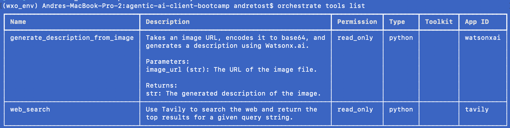

## The agents

We will create three agents to implement this use case:
- The Internet Research Agent handles the interpretation of any images that are submitted by the user, and runs web searches to identify market trends related to the relevant products.
- The Market Analyst Agent will analyze market trends and develop related recommendations and create an action plan.
- The Retail Market Agent is the supervisory agent that interacts with the user and collaborates with other agents, i.e. the two agents listed above, to create the final answer for the user.

Each agent will be defined inside a YAML file that we can easily import into watsonx Orchestrate for testing, but we will also take you through the UI-based Agent Builder tool.

### The Internet Research Agent

This agent will leverage both tools we defined and imported earlier to help answer requests. The main intended use of this agent is to take an image of a product shelf as input, and return both a description of the displayed products as well as related market trends to the user. The first part uses the image to text tool, the second part uses the web search tool.

In this case, we will define this agent interactively in the UI of watsonx Orchestrate. It offers an easy-to-use interface to enter all the relevant fields.
Start out by making sure the local UI server is started, if you haven't already done so:
```
orchestrate chat start --env-file .env
```

This will open the browser window with the watsonx Orchestrate homepage.


Click on the `Create new agent` link at the bottom right corner of the page.

In the next window, leave the `Create from scratch` option selected. Enter "internet_research_agent" as the name of the new agent, and enter the following description:
```
The Internet Research Agent assists with identifying market trends for products that can be found on images.
```
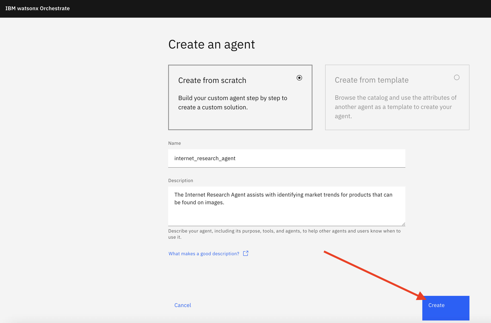

Click on `Create`.

On the next page, scroll down to the `Toolsets` section and click on `Add tool`.

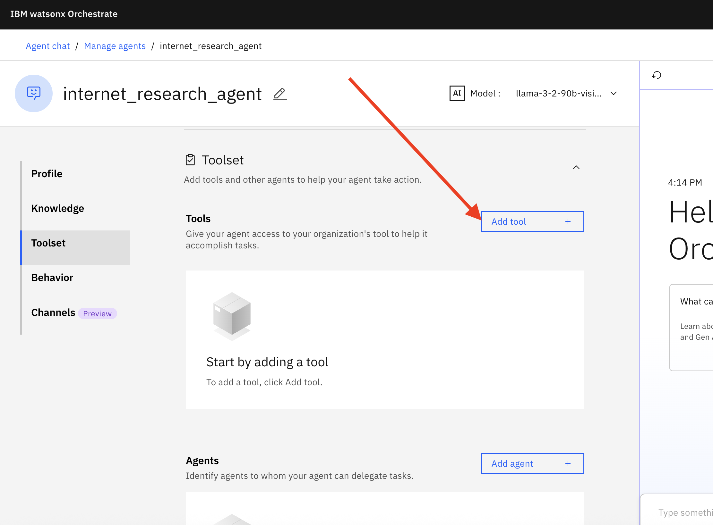

Since we already imported the tools we need, you can click on on `Add from local instance`:

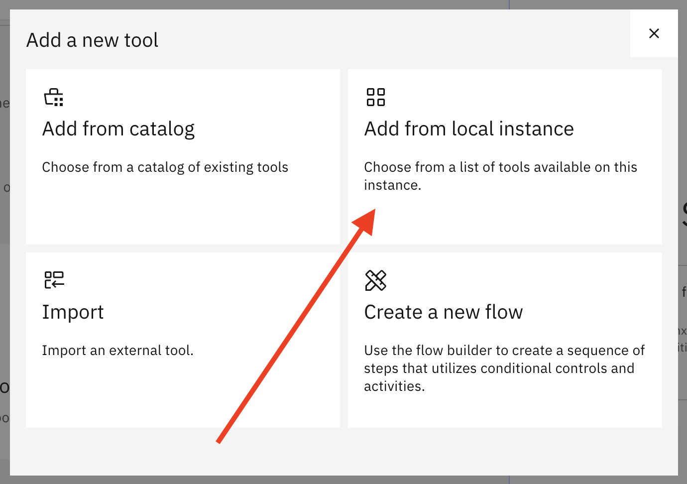

In the following window, select the two tools we created earlier and click on `Add to agent`.


Next is a really important part: we need to explain to the agent when and how to use the tools we added. This is done in the `Behavior` section further down the page. Besides the specifics of the tools, this also includes general instructions about how we want the agent to behave. Think of this as defining the agent's 'system prompt'. 

Enter the following text into the `Instructions` field:
```

Persona:
    - Your purpose is to show me market trends for products based on an image of a product shelf. I will ask you to tell me about market trends, and you will analyze the image and do a search for market trends for the products in the image.

  Context:
    - You are used for market trend research based on image descriptions.
    - Use detailed language to describe the content.

  Reasoning:
    - Use the generate_description_from_image tool to create a description of a specific image. Pass in the URL of the image the description is requested for. 
    - Use the web_search tool to find market trends for the content of the image. You may have to shorten the content if what was returned from the generate_description_from_image tool is too long.
```

Note how we divided the instructions into separate sections for persona, context and reasoning. The reasoning part contains instructions about the tools.

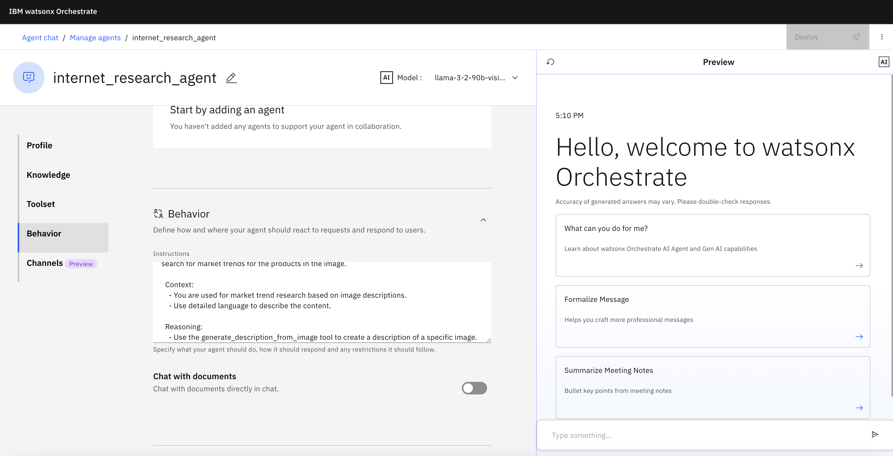

The `Show agent` switch controls whether or not the agent will be visible on the main watsonx Orchestrate page. We will leave this on for now, but eventually we will switch it off, because we want users to only use the supervisory agent (which we will create below).

We can now test our new agent right here in this page, using the `Preview` window. Let's test if both tools are properly invoked if we give the agent the right task. For example, we can give the agent a URL with the image, and then ask it to tell us about related market trends, like this:
```
Please look at the image at https://i.imgur.com/qfiugNJ.jpeg, and give me current market trends based on the products shown in the image.
```

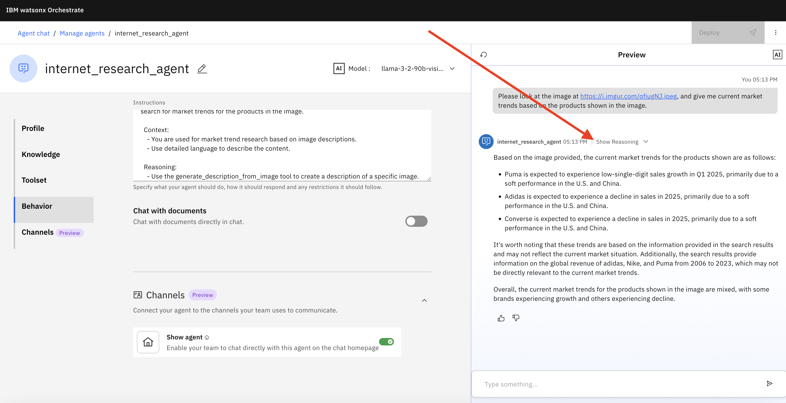

Note how you can expand the `Show reasoning` link in the Preview window to see the individual steps that were taken, including the calls to the two tools.

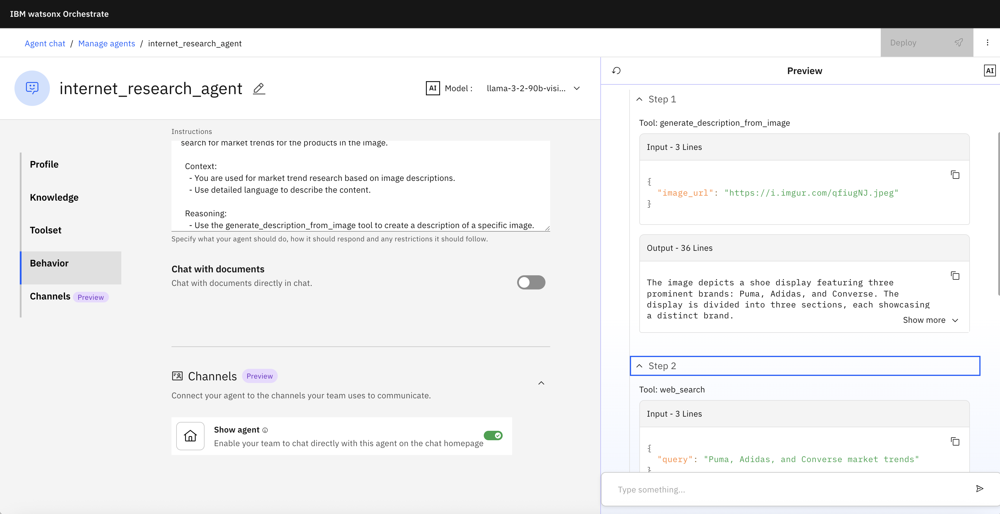

We can now export the metadata for this agent into a YAML file. This allows us to easily import the same agent in any watsonx Orchestrate environment, including a SaaS instance in IBM Cloud. To do so, we simply enter the following command on the command line:
```
orchestrate agents export -n internet_research_agent -k native --agent-only -o internet_research_agent.yaml
```
Feel free to study the content of the created YAML file. It has all the same content as what we typed into the Agent Builder UI before. Another interesting detail is the `llm` section. It shows which model is being used by this agent - the UI did not offer that.

### The Market Analyst Agent

Next we will define the `Market Analyst Agent`. Unlike in the previous example, we will simply import [a YAML file](./src/agents/market_analyst_agent.yaml) that includes all the settings for this agent. Let's take a look at the content of that file:

```
spec_version: v1
style: react
name: market_analyst_agent
llm: watsonx/meta-llama/llama-3-2-90b-vision-instruct
description: >
  The Market Analyst Agent makes recommendations for product shelf rearrangement based on a description of the existing shelf, and on market trends for the product.
instructions: >
  Persona:
    - Your purpose is to make recommendations based on product market trends and recommendations. I will give you product market trends and a description of a current product shelf , and you will create recommendations for the potential rearrangement of the products.

  Context:
    - You are used for product shelf arrangement based on market trends.
hidden: false  
```

Note that the `instructions` section has a similar structure to the one in the internet research agent, but it is missing the reasoning part, because there are no additional tools this agent can use. 

We can import the agent into our watsonx Orchestrate instance by entering the following command:
```
orchestrate agents import -f market_analyst_agent.yaml
```

Once imported, we can see and test the agent in the UI. Go back to your browser and click on the `Manage agents` link.

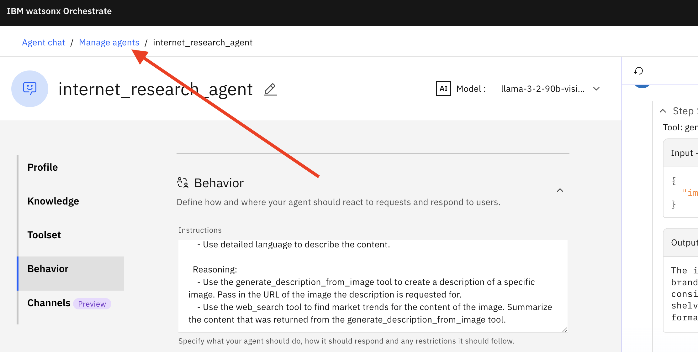

The new agent is now listed next to the first agent we deployed. Instad of testing this new agent individually, we will go ahead and define (and then test) the superviroy agent that puts it all together.

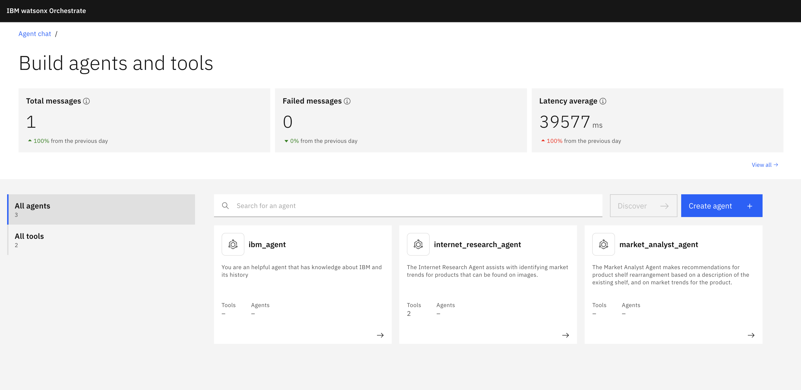

### The Retail Market Agent

This agent is the user-facing agent, so to speak, that all requests go to. It will engage the other agents to address the task at hand. 
We will import it the same way as the previous agent, namely by [YAML file](./src/agents/retail_market_agent.yaml). But let's first take a look at the content of that file:
```
spec_version: v1
style: react
name: retail_market_agent
llm: watsonx/meta-llama/llama-3-2-90b-vision-instruct
description: >
  The Retail Market Agent assists with identifying market trends for products that can be found on images, and deriving recommendations for rearrangement of products based on those trends.
instructions: >
  Persona:
    - Your purpose is to show me market trends for products based on an image, and make recommendations for the rearrangement of those products. I will give you an image with product on it, and you will analyze the image, do a search for market trends for the products in the image, and give me a set of recommendations for the potential rearrangement of the products on the shelf.

  Context:
    - You are used for market trend research and analysis based on image descriptions.
    - Use detailed language to describe the trends, recommendations and suggested actions.

  Reasoning:
    - Use the internet_research_agent agent to retrieve market trends based on an image reference.
    - Use the market_analysis_agent agent to develop suggestions for rearrangement based on market trends and the current arrangement of products on the shelf.
collaborators:
  - internet_research_agent
  - market_analyst_agent
```

Here, we have a section with `collaborators`. Those are the agents this one has at its disposal, and which we created earlier. The instructions have a reasoning part that tells this agent which other agent to use for which purpose. 

We import this agent just like the previous one:
```
orchestrate agents import -f retail_market_agent.yaml
```

Back in the `Manage agents` view in the UI, you can reload the page and see the new agent listed next to the other ones.

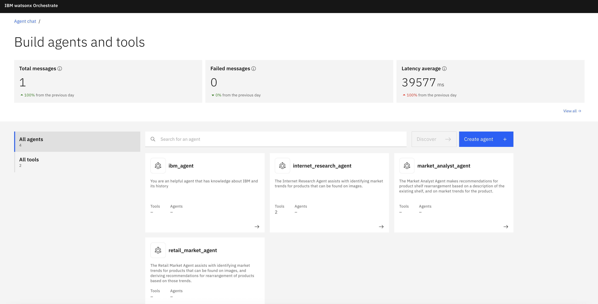

## Final test and Summary

Since you have successfully created all the tools and agents you needed, you can finally test the solution end to end. We want end users to only interact with the supervisory agent, so we will turn the `Show agent` flag off for both the internet_research_agent and the market_analysis_agent. To do so, click on the internet_research_agent, scroll down to the very bottom and turn off the switch.

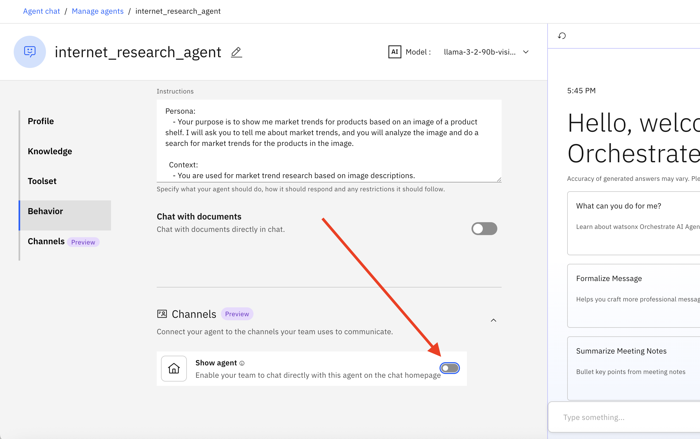

Repeat the same for the market_analysis_agent. Now click on `IBM watsonx Orchestrate` at the top left of the browser window to return to the main page.

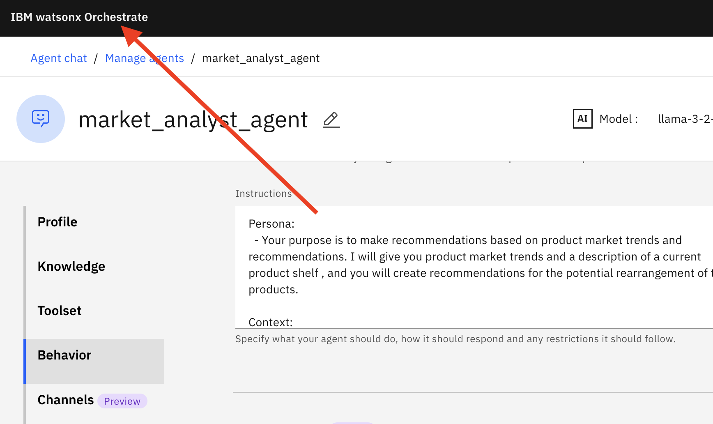

Note how in the main window, you are only offered one agent to chat with, namely the retail_market_agent. Which is exactly what we wanted, of course.

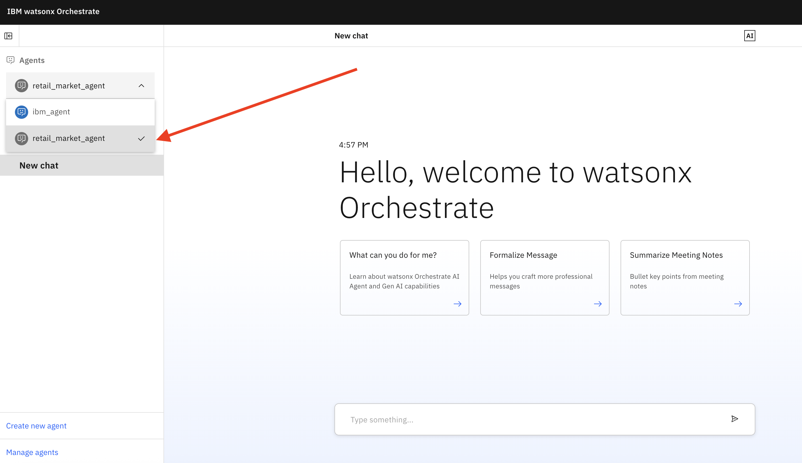

Let's test the agent by entering the following into the chat:
```
Please look at the image at https://i.imgur.com/qfiugNJ.jpeg. Based on market trends for the products in the image, can you make recommendations for any rearrangement of the products on the shelf?
```

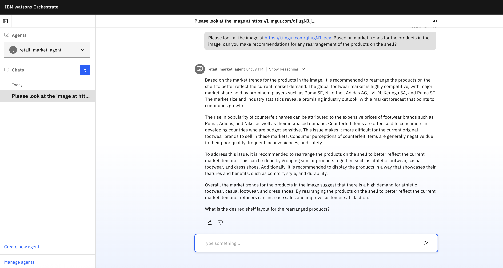

Voila! The supervisory agent used the collaborator agents to answer the user's question. One of the collaborator agents, namely the internet_research_agent, used two tools to convert the image into text and then do a web search for market trends.
Here are a couple more questions you can ask the agent:
```
Please look at the image at https://i.imgur.com/WzMC1LJ.png, and give me current market trends based on the products shown in the image. Based on those trends, can you make recommendations for the rearrangement of the products on the shelf?
```
```
How should the products shown in this image (https://i.imgur.com/Pb2Ywxv.jpeg) be rearranged given current market trends?
```

Feel free to explore further, by changing descriptions and instructions, to see what the impact on the solution is.